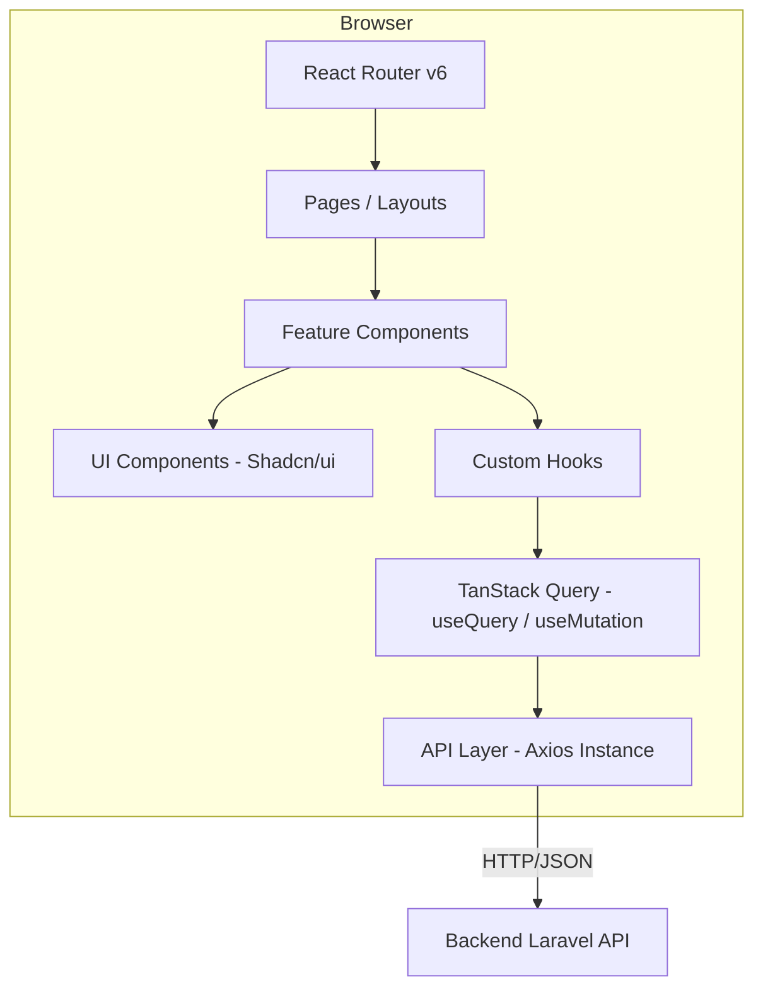
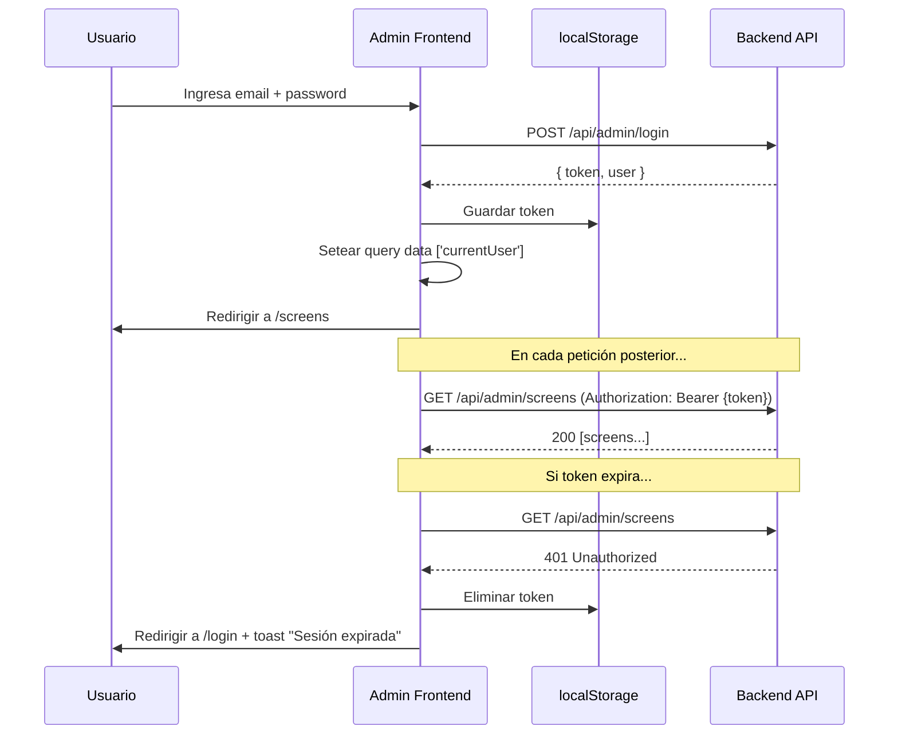
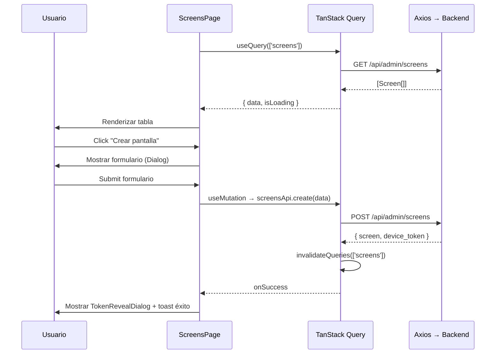
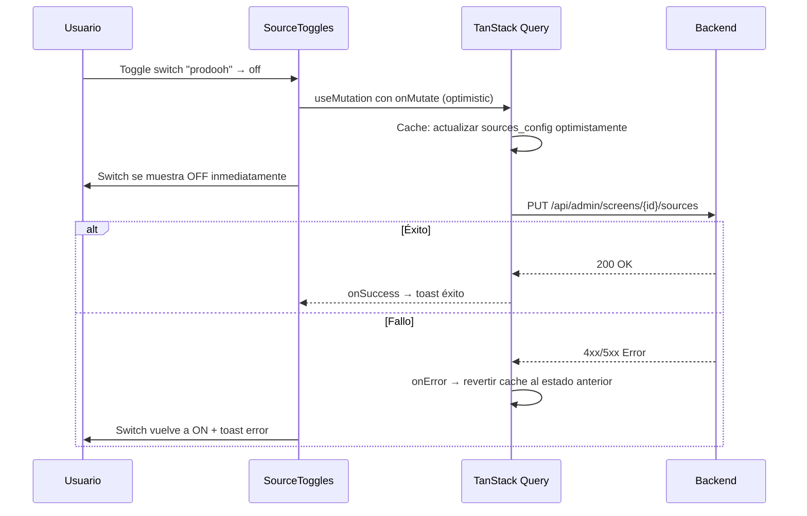

# Diseño Técnico — Admin Frontend

## Overview

El Admin Frontend es una Single Page Application (SPA) construida con React 18, Vite y TypeScript que vive en `admin-frontend/` en la raíz del repositorio. Consume exclusivamente la API REST del backend Laravel existente y es completamente independiente del código del player y del backend.

La arquitectura sigue un patrón de capas claras: **UI → Hooks (TanStack Query) → API Client (Axios) → Backend REST**. No se usa `useEffect` para fetching ni estado derivado; toda la comunicación con el servidor pasa por TanStack Query y toda la lógica de formularios por React Hook Form + Zod.

---

## Architecture

### Diagrama de capas



### Decisiones arquitectónicas clave

| Decisión | Justificación |
|----------|---------------|
| TanStack Query como única fuente de server state | Elimina la necesidad de useEffect, proporciona cache, invalidación, retry, y deduplicación automática |
| Axios con interceptors centralizados | Agrega token automáticamente, maneja 401 globalmente, configura headers base |
| React Hook Form + Zod | Validación declarativa, sin re-renders innecesarios, esquemas reutilizables |
| Feature-based folder structure | Cada módulo (screens, playlists, etc.) encapsula sus páginas, hooks y tipos |
| No useEffect para fetching ni estado derivado | Según restricción del proyecto — todo se calcula en render o vive en TanStack Query |

---

## Components and Interfaces

```
admin-frontend/
├── index.html
├── vite.config.ts
├── tailwind.config.ts
├── tsconfig.json
├── package.json
├── .env.example                    # VITE_API_BASE_URL=http://localhost:8000/api
├── src/
│   ├── main.tsx                    # Entry point: React DOM render
│   ├── App.tsx                     # Providers + Router
│   ├── routes.tsx                  # Definición centralizada de rutas
│   ├── lib/
│   │   ├── axios.ts               # Instancia Axios + interceptors
│   │   ├── query-client.ts        # TanStack Query client config
│   │   └── utils.ts               # cn(), formatDate(), etc.
│   ├── hooks/
│   │   └── use-auth.ts            # Hook de autenticación global
│   ├── types/
│   │   ├── api.ts                 # Tipos de respuesta del backend
│   │   ├── models.ts              # Interfaces de modelos (Screen, Tenant, etc.)
│   │   └── auth.ts                # AuthUser, LoginCredentials
│   ├── schemas/
│   │   ├── screen.schema.ts       # Zod schemas para pantallas
│   │   ├── tenant.schema.ts
│   │   ├── playlist.schema.ts
│   │   ├── group.schema.ts
│   │   └── content.schema.ts
│   ├── components/
│   │   ├── ui/                    # Componentes Shadcn/ui (Button, Dialog, etc.)
│   │   ├── layout/
│   │   │   ├── AppLayout.tsx      # Layout principal: Header + Sidebar + Content
│   │   │   ├── Header.tsx         # Header navy con nav + logout
│   │   │   └── ProtectedRoute.tsx # Guard de autenticación
│   │   ├── shared/
│   │   │   ├── DataTable.tsx      # Wrapper genérico de TanStack Table
│   │   │   ├── ConfirmDialog.tsx  # Diálogo de confirmación reutilizable
│   │   │   ├── LoadingState.tsx   # Skeleton/spinner para queries
│   │   │   ├── ErrorState.tsx     # Mensaje de error + botón reintentar
│   │   │   └── TokenRevealDialog.tsx # Modal para mostrar token una sola vez
│   │   └── forms/
│   │       └── FormField.tsx      # Wrapper de campo con label + error
│   ├── features/
│   │   ├── auth/
│   │   │   ├── pages/
│   │   │   │   └── LoginPage.tsx
│   │   │   ├── api.ts            # loginRequest, logoutRequest, getCurrentUser
│   │   │   └── hooks.ts          # useLogin, useLogout
│   │   ├── tenants/
│   │   │   ├── pages/
│   │   │   │   └── TenantsPage.tsx
│   │   │   ├── components/
│   │   │   │   └── TenantForm.tsx
│   │   │   ├── api.ts
│   │   │   └── hooks.ts
│   │   ├── screens/
│   │   │   ├── pages/
│   │   │   │   ├── ScreensPage.tsx
│   │   │   │   └── ScreenDetailPage.tsx
│   │   │   ├── components/
│   │   │   │   ├── ScreenForm.tsx
│   │   │   │   ├── LoopEditor.tsx
│   │   │   │   ├── SourceToggles.tsx
│   │   │   │   └── ScreenshotGallery.tsx
│   │   │   ├── api.ts
│   │   │   └── hooks.ts
│   │   ├── groups/
│   │   │   ├── pages/
│   │   │   │   ├── GroupsPage.tsx
│   │   │   │   └── GroupDetailPage.tsx
│   │   │   ├── components/
│   │   │   │   ├── GroupForm.tsx
│   │   │   │   └── AssignScreensDialog.tsx
│   │   │   ├── api.ts
│   │   │   └── hooks.ts
│   │   ├── playlists/
│   │   │   ├── pages/
│   │   │   │   └── PlaylistsPage.tsx
│   │   │   ├── components/
│   │   │   │   ├── PlaylistForm.tsx
│   │   │   │   ├── PlaylistItemEditor.tsx
│   │   │   │   └── AssignScreensDialog.tsx
│   │   │   ├── api.ts
│   │   │   └── hooks.ts
│   │   ├── content/
│   │   │   ├── pages/
│   │   │   │   └── ContentPage.tsx
│   │   │   ├── components/
│   │   │   │   ├── UploadDropzone.tsx
│   │   │   │   ├── ContentPreview.tsx
│   │   │   │   └── RotateMenu.tsx
│   │   │   ├── api.ts
│   │   │   └── hooks.ts
│   │   └── analytics/
│   │       ├── pages/
│   │       │   └── AnalyticsPage.tsx
│   │       ├── api.ts
│   │       └── hooks.ts
│   └── styles/
│       └── globals.css            # Tailwind directives + custom CSS vars
```

---

## Enrutamiento (React Router v6)

### Definición de rutas

```tsx
// src/routes.tsx
<Routes>
  {/* Ruta pública */}
  <Route path="/login" element={<LoginPage />} />

  {/* Rutas protegidas */}
  <Route element={<ProtectedRoute />}>
    <Route element={<AppLayout />}>
      {/* Solo super_admin */}
      <Route element={<RoleGuard roles={['super_admin']} />}>
        <Route path="/tenants" element={<TenantsPage />} />
      </Route>

      {/* super_admin + tenant_admin */}
      <Route path="/screens" element={<ScreensPage />} />
      <Route path="/screens/:id" element={<ScreenDetailPage />} />
      <Route path="/groups" element={<GroupsPage />} />
      <Route path="/groups/:id" element={<GroupDetailPage />} />
      <Route path="/playlists" element={<PlaylistsPage />} />
      <Route path="/content" element={<ContentPage />} />
      <Route path="/analytics" element={<AnalyticsPage />} />

      {/* Redirect raíz a pantallas */}
      <Route path="/" element={<Navigate to="/screens" replace />} />
    </Route>
  </Route>

  {/* 404 */}
  <Route path="*" element={<Navigate to="/login" replace />} />
</Routes>
```

### Componentes de guard

- **ProtectedRoute**: Verifica que exista un token en localStorage y que el query `useCurrentUser()` haya resuelto. Si no hay token, redirige a `/login`. Usa `<Outlet />` para renderizar rutas hijas.
- **RoleGuard**: Recibe un array de roles permitidos. Si el rol del usuario actual no está en la lista, redirige a `/screens` y muestra un toast de acceso denegado.

---

## Gestión de estado

### Server State — TanStack Query

Toda la data del servidor se gestiona exclusivamente con TanStack Query. No existe un store global (Redux, Zustand) porque no hay client state complejo que lo justifique.

**Configuración del QueryClient:**

```tsx
// src/lib/query-client.ts
import { QueryClient } from '@tanstack/react-query';

export const queryClient = new QueryClient({
  defaultOptions: {
    queries: {
      staleTime: 30_000,          // 30s antes de considerar stale
      retry: 1,                   // Max 1 reintento automático (Req 13.5)
      refetchOnWindowFocus: false,
    },
    mutations: {
      retry: 0,                   // Sin reintentos en mutaciones (Req 13.5)
    },
  },
});
```

**Patrón de query keys:**

```ts
// Convención: ['recurso', filtros?]
['screens']                       // Lista de pantallas
['screens', screenId]             // Detalle de pantalla
['screens', screenId, 'screenshots']  // Screenshots de una pantalla
['tenants']                       // Lista de tenants
['groups']                        // Lista de grupos
['playlists']                     // Lista de playlists
['content']                       // Biblioteca de contenido
['analytics', { startDate, endDate }] // Analytics con filtros
['currentUser']                   // Usuario actual
```

**Patrón de invalidación post-mutación:**

```tsx
const createScreen = useMutation({
  mutationFn: (data: CreateScreenInput) => api.screens.create(data),
  onSuccess: () => {
    queryClient.invalidateQueries({ queryKey: ['screens'] });
    toast.success('Pantalla creada exitosamente');
  },
  onError: (error: AxiosError<ApiError>) => {
    toast.error(error.response?.data?.message ?? 'Error al crear pantalla');
  },
});
```

### Client State

El estado local del cliente es mínimo y se maneja con:
- **React Hook Form**: Estado de formularios (no se almacena en ningún store)
- **useState local**: Modales abiertos/cerrados, filtros temporales de UI
- **Variables calculadas en render**: Estado derivado (e.g., `isOnline = differenceInMinutes(now, lastHeartbeat) <= 2`)

---

## Capa API (Axios)

### Instancia centralizada

```tsx
// src/lib/axios.ts
import axios from 'axios';

const TOKEN_KEY = 'admin_token';

export const api = axios.create({
  baseURL: import.meta.env.VITE_API_BASE_URL,
  headers: {
    'Accept': 'application/json',
    'Content-Type': 'application/json',
  },
});

// Request interceptor: agrega Authorization header
api.interceptors.request.use((config) => {
  const token = localStorage.getItem(TOKEN_KEY);
  if (token) {
    config.headers.Authorization = `Bearer ${token}`;
  }
  return config;
});

// Response interceptor: maneja 401 → logout automático
api.interceptors.response.use(
  (response) => response,
  (error) => {
    if (error.response?.status === 401) {
      localStorage.removeItem(TOKEN_KEY);
      window.location.href = '/login';
    }
    return Promise.reject(error);
  }
);
```

### Módulos de API por feature

Cada feature expone un objeto con sus funciones de API tipadas:

```tsx
// src/features/screens/api.ts
import { api } from '@/lib/axios';
import type { Screen, CreateScreenInput, UpdateScreenInput } from '@/types/models';

export const screensApi = {
  list: () => api.get<Screen[]>('/admin/screens').then(r => r.data),
  get: (id: string) => api.get<Screen>(`/admin/screens/${id}`).then(r => r.data),
  create: (data: CreateScreenInput) => api.post<{ screen: Screen; device_token?: string }>('/admin/screens', data).then(r => r.data),
  update: (id: string, data: UpdateScreenInput) => api.put<Screen>(`/admin/screens/${id}`, data).then(r => r.data),
  regenerateToken: (id: string) => api.post<{ device_token: string }>(`/admin/screens/${id}/regenerate-token`).then(r => r.data),
  updateLoop: (id: string, slots: LoopSlot[]) => api.put(`/admin/screens/${id}/loop`, { slots }).then(r => r.data),
  updateSources: (id: string, sources: SourcesConfig) => api.put(`/admin/screens/${id}/sources`, sources).then(r => r.data),
  getScreenshots: (id: string) => api.get<Screenshot[]>(`/admin/screens/${id}/screenshots`).then(r => r.data),
};
```

---

## Data Models

### Interfaces principales

```ts
// src/types/models.ts

export interface Tenant {
  id: string;
  name: string;
  default_duration_seconds: number | null;
  default_timezone: string | null;
  created_at: string;
  updated_at: string;
  screens_count?: number;
}

export interface Screen {
  id: string;
  tenant_id: string;
  group_id: string | null;
  venue_id: string;
  name: string;
  status: string;
  orientation: 'landscape' | 'portrait';
  resolution_width: number;
  resolution_height: number;
  duration_seconds: number;
  loop_config: LoopSlot[];
  sources_config: SourcesConfig;
  last_heartbeat: string | null;
  created_at: string;
  updated_at: string;
  // Relaciones incluidas en respuestas
  screen_group?: ScreenGroup;
  tenant?: Tenant;
  playlists?: Playlist[];
}

export interface LoopSlot {
  position: number;
  source: 'prodooh' | 'gam' | 'url' | 'playlist';
  duration: number;
}

export interface SourcesConfig {
  prodooh: boolean;
  gam: boolean;
  url: boolean;
  playlist: boolean;
}

export interface ScreenGroup {
  id: string;
  tenant_id: string;
  name: string;
  duration_seconds: number | null;
  orientation: 'landscape' | 'portrait' | null;
  resolution_width: number | null;
  resolution_height: number | null;
  created_at: string;
  screens_count?: number;
  screens?: Screen[];
}

export interface Playlist {
  id: string;
  tenant_id: string;
  name: string;
  version: number;
  created_at: string;
  updated_at: string;
  playlist_items?: PlaylistItem[];
  items_count?: number;
}

export interface PlaylistItem {
  id: string;
  playlist_id: string;
  content_id: string | null;
  type: 'content' | 'url';
  url: string | null;
  duration_seconds: number;
  position: number;
  refresh_interval: number | null;
  content?: Content;
}

export interface Content {
  id: string;
  tenant_id: string;
  filename: string;
  mime_type: string;
  storage_path: string;
  file_size_bytes: number;
  width: number;
  height: number;
  duration_seconds: number | null;
  orientation: string;
  rotation: number;
  created_at: string;
}

export interface Screenshot {
  id: string;
  screen_id: string;
  storage_path: string;
  captured_at: string;
}

export interface PlaybackAnalytics {
  start_date: string;
  end_date: string;
  data: AnalyticsEntry[];
}

export interface AnalyticsEntry {
  screen_id: string;
  screen_name: string;
  source: string;
  total_plays: number;
  total_duration_seconds: number;
}
```

### Tipos de Auth

```ts
// src/types/auth.ts

export interface AuthUser {
  id: string;
  email: string;
  role: 'super_admin' | 'tenant_admin';
  tenant_id: string | null;
  created_at: string;
}

export interface LoginCredentials {
  email: string;
  password: string;
}

export interface LoginResponse {
  token: string;
  user: AuthUser;
}
```

### Tipos de input para formularios

```ts
// Los input types se derivan de los Zod schemas
// Ejemplo:
export type CreateScreenInput = z.infer<typeof createScreenSchema>;
export type UpdateScreenInput = z.infer<typeof updateScreenSchema>;
export type CreateTenantInput = z.infer<typeof createTenantSchema>;
```

---

## Interfaces de componentes

### DataTable genérica

```tsx
interface DataTableProps<T> {
  columns: ColumnDef<T>[];
  data: T[];
  isLoading?: boolean;
  onRowClick?: (row: T) => void;
}
```

Utiliza TanStack Table internamente con sorting habilitado por defecto en todas las columnas (Req 14.3).

### LoopEditor

```tsx
interface LoopEditorProps {
  screenId: string;
  initialSlots: LoopSlot[];
}
```

Editor visual de slots con:
- Lista ordenada de slots con selector de fuente + input numérico de duración
- Botón "Agregar slot" (appende al final)
- Botón "Eliminar" por slot (mínimo 1 slot)
- Botón "Guardar loop" que dispara la mutación

### SourceToggles

```tsx
interface SourceTogglesProps {
  screenId: string;
  config: SourcesConfig;
}
```

Cuatro switches con mutación optimista:
- Al cambiar un switch, se envía PUT inmediatamente
- Si falla, se revierte el switch al estado anterior (optimistic update revert)
- Toast de confirmación o error

### PlaylistItemEditor

```tsx
interface PlaylistItemEditorProps {
  items: PlaylistItem[];
  onChange: (items: PlaylistItem[]) => void;
  contentList: Content[];
}
```

Lista ordenable (drag-and-drop o botones ↑↓) donde cada ítem permite seleccionar tipo (content/url), contenido de la biblioteca o URL, y duración.

### UploadDropzone

```tsx
interface UploadDropzoneProps {
  onUploadSuccess: () => void;
}
```

Zona de drag-and-drop con:
- Soporte multipart/form-data via Axios
- Barra de progreso usando `onUploadProgress` de Axios
- Toast de error si la validación del backend falla

---

## Flujo de datos

### Flujo de autenticación



### Flujo CRUD típico (ejemplo: Pantallas)



### Flujo de toggle de fuentes (optimistic update)



---

## Error Handling

### Estrategia por capas

| Capa | Mecanismo | Comportamiento |
|------|-----------|----------------|
| Interceptor Axios (401) | Redirect global a `/login` | Elimina token, redirige, toast "Sesión expirada" |
| Query error (TanStack Query) | `ErrorState` component | Muestra mensaje + botón "Reintentar" en la zona del componente |
| Mutation error | `onError` callback | Toast con `error.response.data.message`, formulario intacto |
| Validación de formulario (Zod) | React Hook Form | Errores inline bajo cada campo antes de enviar |

### Formato de error del backend

```ts
interface ApiError {
  message: string;
  errors?: Record<string, string[]>; // Validación Laravel
}
```

### Manejo de estados de botones en mutaciones

Durante una mutación en progreso:
- El botón de submit se deshabilita (`disabled`)
- Se muestra un spinner dentro del botón
- Esto previene envíos duplicados (Req 13.3)

---

## Testing Strategy

### Por qué NO se aplica Property-Based Testing

Este proyecto es un frontend SPA que consiste principalmente en:
- **UI rendering**: Componentes React que renderizan datos del servidor
- **CRUD operations**: Formularios que envían datos al backend sin transformación compleja
- **Side effects**: Llamadas HTTP, navegación, toasts

No hay funciones puras con lógica de dominio compleja ni transformaciones de datos donde las propiedades universales agreguen valor sobre tests con ejemplos concretos. Las operaciones son deterministas y dependientes del estado del servidor.

### Enfoque de testing recomendado

| Tipo | Herramienta | Alcance |
|------|-------------|---------|
| Unit tests | Vitest + React Testing Library | Componentes individuales, hooks, utilidades |
| Integration tests | Vitest + MSW (Mock Service Worker) | Flujos completos: login, CRUD, navegación |
| E2E tests (futuro) | Playwright | Flujos críticos end-to-end |

### Casos de test prioritarios

1. **Auth flow**: Login exitoso/fallido, 401 redirect, logout
2. **ProtectedRoute/RoleGuard**: Redirección correcta según rol
3. **CRUD de cada entidad**: Crear, editar, eliminar con invalidación de cache
4. **LoopEditor**: Agregar/eliminar slots, validación mínimo 1 slot
5. **SourceToggles**: Optimistic update + rollback en error
6. **Upload con progreso**: Barra de progreso, manejo de error de validación
7. **DataTable**: Sorting, renderizado con datos vacíos y con datos

### Configuración de tests

```json
// vitest.config.ts
{
  "test": {
    "environment": "jsdom",
    "setupFiles": ["./src/test/setup.ts"],
    "globals": true
  }
}
```

MSW se configura para interceptar peticiones HTTP y simular respuestas del backend en tests de integración, evitando dependencia del backend real.

---

## Configuración de entorno

```env
# .env.example
VITE_API_BASE_URL=http://localhost:8000/api
```

### Tailwind — Custom theme

```ts
// tailwind.config.ts (colores de marca)
{
  theme: {
    extend: {
      colors: {
        navy: '#0f1623',
        primary: '#e8403a',
        'gray-dark': '#374151',
      }
    }
  }
}
```

---

## Dependencias principales

```json
{
  "dependencies": {
    "react": "^18.3.0",
    "react-dom": "^18.3.0",
    "react-router-dom": "^6.28.0",
    "axios": "^1.7.0",
    "@tanstack/react-query": "^5.60.0",
    "@tanstack/react-table": "^8.20.0",
    "react-hook-form": "^7.53.0",
    "@hookform/resolvers": "^3.9.0",
    "zod": "^3.23.0",
    "sonner": "^1.7.0",
    "tailwindcss": "^3.4.0",
    "class-variance-authority": "^0.7.0",
    "clsx": "^2.1.0",
    "tailwind-merge": "^2.5.0",
    "lucide-react": "^0.460.0",
    "date-fns": "^4.1.0"
  },
  "devDependencies": {
    "vite": "^6.0.0",
    "typescript": "^5.6.0",
    "@types/react": "^18.3.0",
    "@types/react-dom": "^18.3.0",
    "vitest": "^2.1.0",
    "@testing-library/react": "^16.0.0",
    "msw": "^2.6.0",
    "jsdom": "^25.0.0",
    "autoprefixer": "^10.4.0",
    "postcss": "^8.4.0"
  }
}
```
