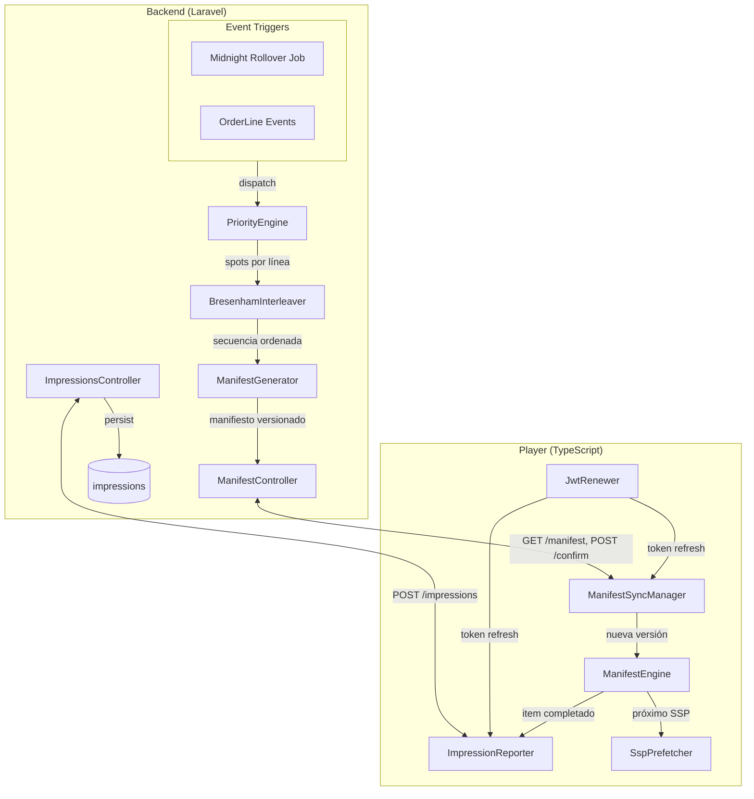
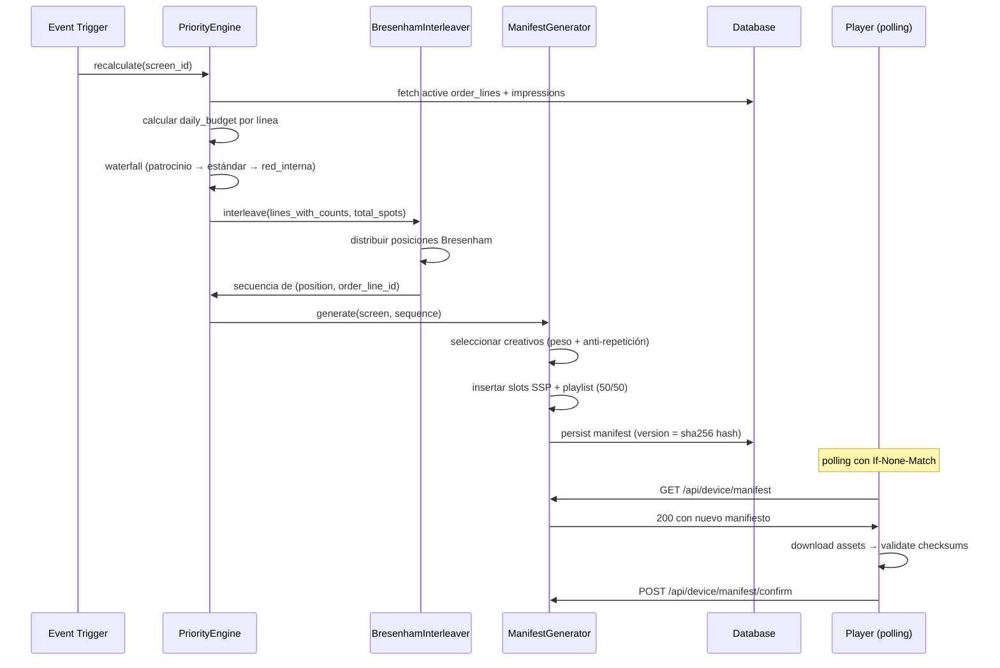
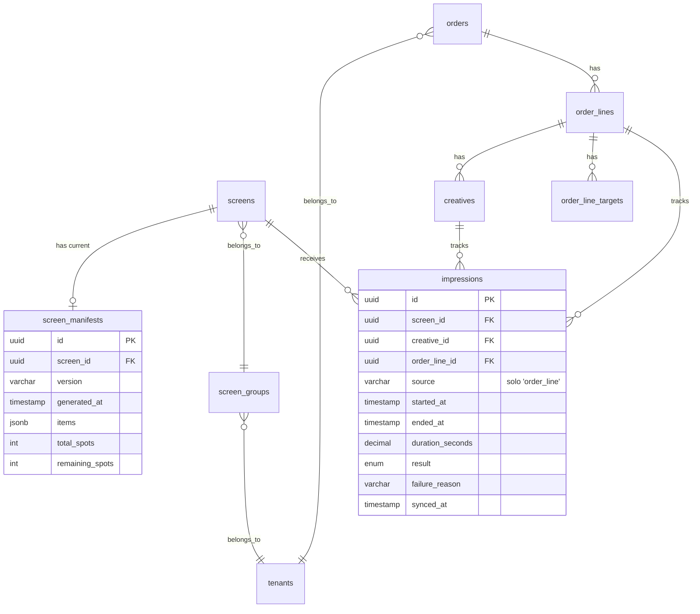

# Design Document

## Overview

Este diseño cubre la implementación del Motor de Prioridad y Manifiesto que reemplaza al sistema de Loop de slots fijos. El sistema se compone de tres capas principales:

1. **Backend — Motor de Prioridad**: Algoritmo de resolución diaria (waterfall por nivel de prioridad + entrelazado Bresenham) que genera una secuencia concreta y ordenada de ítems para cada pantalla.
2. **Backend — API de Dispositivo**: Nuevos endpoints (`manifest`, `manifest/confirm`, `impressions`) que reemplazan a los endpoints del modelo antiguo (`playlist`, `config`, `loop`, `sources`).
3. **Player — ManifestEngine**: Motor de ejecución que consume la secuencia pre-resuelta, reproduce en loop, gestiona prefetch (incluyendo SSP con margen extendido), reporta impresiones, y renueva JWT automáticamente.

### Decisiones de diseño clave

| Decisión | Justificación |
|----------|---------------|
| Secuencia pre-resuelta (no reglas) | El player no decide prioridad — simplifica el firmware y centraliza la lógica en el backend |
| Entrelazado global Bresenham | Distribución proporcional anti-bloque; garantiza presencia constante de cada marca |
| ETag/304 para polling | Reutiliza mecanismo existente y funcional, minimiza tráfico |
| Impresiones solo de `order_line` | SSP lleva su propio conteo; playlist no genera registros — decisión previa |
| Confirmación sin rollback | Mantener manifiesto nuevo aunque falle POST de confirm — decisión deliberada ya validada |
| Recálculo event-driven + rollover diario | No se recalcula por cada polling, sino por eventos relevantes |

## Architecture



### Flujo de recálculo del manifiesto



## Components and Interfaces

### Backend Components

#### 1. `PriorityEngine` (Service)

**Ubicación**: `backend/app/Services/PriorityEngine.php`

Orquestador principal que ejecuta el algoritmo completo para una pantalla dada.

```php
interface PriorityEngineInterface
{
    /**
     * Recalcula el manifiesto para una pantalla.
     * Usa total_daily_spots en rollover diario, o capacidad_restante en recálculo intra-día.
     */
    public function recalculate(string $screenId, bool $isIntraDay = false): ManifestResult;
    
    /**
     * Calcula total_daily_spots para una pantalla.
     */
    public function calculateTotalDailySpots(Screen $screen): int;
    
    /**
     * Calcula daily_budget para una línea de pedido.
     */
    public function calculateDailyBudget(OrderLine $line): ?int;
}
```

#### 2. `BresenhamInterleaver` (Service)

**Ubicación**: `backend/app/Services/BresenhamInterleaver.php`

Implementa el algoritmo de distribución proporcional anti-bloque.

```php
interface BresenhamInterleaverInterface
{
    /**
     * @param array<array{order_line_id: string, count: int}> $entries
     * @param int $totalSlots
     * @return array<array{position: int, order_line_id: string}>
     */
    public function interleave(array $entries, int $totalSlots): array;
}
```

#### 3. `ManifestGenerator` (Service)

**Ubicación**: `backend/app/Services/ManifestGenerator.php`

Transforma la secuencia de posiciones en un manifiesto completo con creativos resueltos y slots SSP/playlist.

```php
interface ManifestGeneratorInterface
{
    /**
     * Genera el manifiesto completo a partir de la secuencia del interleaver.
     */
    public function generate(Screen $screen, array $sequence, int $sspSlots, int $playlistSlots): Manifest;
}
```

#### 4. `CreativeSelector` (Service)

**Ubicación**: `backend/app/Services/CreativeSelector.php`

Selección de creativo por turno con peso ponderado y regla anti-repetición.

```php
interface CreativeSelectorInterface
{
    /**
     * Selecciona el creativo para un turno dado de una línea.
     * Respeta pesos y regla anti-repetición (ventana de min(pool_size-1, 5)).
     */
    public function select(OrderLine $line, array $recentHistory): Creative;
}
```

#### 5. `ManifestController` (Controller)

**Ubicación**: `backend/app/Http/Controllers/Device/ManifestController.php`

```php
class ManifestController extends Controller
{
    // GET /api/device/manifest — sirve manifiesto con soporte ETag/304
    public function show(Request $request): JsonResponse;
    
    // POST /api/device/manifest/confirm — confirma adopción
    public function confirm(Request $request): JsonResponse;
}
```

#### 6. `ImpressionsController` (Controller)

**Ubicación**: `backend/app/Http/Controllers/Device/ImpressionsController.php`

```php
class ImpressionsController extends Controller
{
    // POST /api/device/impressions — recibe batch de impresiones
    public function store(Request $request): JsonResponse;
}
```

#### 7. `RecalculateManifestJob` (Job)

**Ubicación**: `backend/app/Jobs/RecalculateManifestJob.php`

Job dispatchable para recalcular el manifiesto de una pantalla. Se despacha por eventos o por el cron de medianoche.

#### 8. `MidnightRolloverCommand` (Command)

**Ubicación**: `backend/app/Console/Commands/MidnightRolloverCommand.php`

Artisan command ejecutado por scheduler a medianoche que despacha recálculo para todas las pantallas activas.

### Player Components

#### 1. `ManifestEngine` (Engine)

**Ubicación**: `player/src/engine/ManifestEngine.ts`

Reemplazo directo del `LoopEngine`. Ejecuta la secuencia en loop continuo.

```typescript
interface ManifestItem {
  position: number;
  type: 'order_line_creative' | 'prodooh_ssp_call' | 'playlist_item';
  duration_seconds: number;
  asset_url?: string;
  checksum_sha256?: string;
  order_line_id?: string;
  creative_id?: string;
  playlist_item_id?: string;
}

interface Manifest {
  version: string;
  generated_at: string;
  items: ManifestItem[];
}

interface ManifestEngineOptions {
  manifest: Manifest;
  onItemStart?: (item: ManifestItem) => void;
  onItemComplete?: (item: ManifestItem, result: 'success' | 'failed', failureReason?: string) => void;
  onSleep?: () => void;
  onWake?: () => void;
  scheduleChecker?: ScheduleChecker;
  sspClient?: SspClient;
  assetResolver?: AssetResolver;
}

class ManifestEngine {
  constructor(options: ManifestEngineOptions);
  async run(): Promise<void>;
  stop(): void;
  updateManifest(newManifest: Manifest): void;
  getCurrentItem(): ManifestItem | null;
  getCurrentIndex(): number;
  isRunning(): boolean;
}
```

#### 2. `ManifestSyncManager` (Sync)

**Ubicación**: `player/src/sync/ManifestSyncManager.ts`

Reemplaza al `PlaylistSyncManager` para el nuevo contrato de manifiesto.

```typescript
class ManifestSyncManager {
  constructor(client: BackendApiClient, db: Database.Database, downloader: MediaDownloader);
  startPeriodicSync(intervalMs: number): void;
  stopPeriodicSync(): void;
  async sync(): Promise<boolean>;
  getManifestVersion(): string | null;
}
```

#### 3. `ImpressionReporter` (Sync)

**Ubicación**: `player/src/sync/ImpressionReporter.ts`

Cola local + envío con retry y backoff exponencial.

```typescript
interface ImpressionRecord {
  order_line_id: string;
  creative_id: string;
  started_at: string; // ISO 8601
  ended_at: string;
  duration_seconds: number;
  result: 'success' | 'failed';
  failure_reason?: string;
}

class ImpressionReporter {
  constructor(client: BackendApiClient, db: Database.Database);
  enqueue(impression: ImpressionRecord): void;
  async flush(): Promise<void>;
  startPeriodicFlush(intervalMs: number): void;
  stopPeriodicFlush(): void;
}
```

#### 4. `SspPrefetcher` (Engine)

**Ubicación**: `player/src/engine/SspPrefetcher.ts`

Gestiona la pre-carga de contenido SSP con margen extendido.

```typescript
class SspPrefetcher {
  constructor(sspClient: SspClient);
  /** Dispara llamada al SSP. Se llama al entrar al ítem anterior al SSP slot. */
  async prefetch(durationSeconds: number): Promise<SspContent | null>;
  /** Expira un print_id no reproducido (por cambio de manifiesto). */
  async expire(printId: string): Promise<void>;
  /** Limpia el archivo local del arte SSP. */
  cleanup(): void;
  isReady(): boolean;
  getContent(): SspContent | null;
}
```

#### 5. `JwtRenewer` (API)

**Ubicación**: `player/src/api/JwtRenewer.ts`

Interceptor que detecta 401 y renueva el token automáticamente.

```typescript
class JwtRenewer {
  constructor(client: BackendApiClient, authEndpoint: string);
  /** Wraps a request: si recibe 401, renueva JWT y reintenta. */
  async withAutoRenewal<T>(request: () => Promise<HttpResponse<T>>): Promise<HttpResponse<T>>;
}
```

## Data Models

### Tabla `screen_manifests` (nueva)

Persiste el manifiesto generado para cada pantalla. Permite al endpoint servir el manifiesto sin recalcular en cada request.

```sql
CREATE TABLE screen_manifests (
    id UUID PRIMARY KEY,
    screen_id UUID NOT NULL REFERENCES screens(id) ON DELETE CASCADE,
    version VARCHAR(64) NOT NULL,          -- SHA-256 hash del contenido
    generated_at TIMESTAMP NOT NULL,
    items JSONB NOT NULL,                   -- array de ManifestItem serializado
    total_spots INT NOT NULL,               -- total_daily_spots usado en este cálculo
    remaining_spots INT NOT NULL,           -- spots restantes al momento del cálculo
    created_at TIMESTAMP DEFAULT NOW(),
    
    UNIQUE(screen_id)                       -- solo un manifiesto vigente por pantalla
);

CREATE INDEX idx_screen_manifests_screen_id ON screen_manifests(screen_id);
CREATE INDEX idx_screen_manifests_version ON screen_manifests(version);
```

### Migración: `source` enum en `impressions`

El enum actual es `['order_line', 'playlist', 'prodooh_ssp']`. Se reduce a solo `'order_line'` ya que playlist y SSP no generan registros en esta fase.

```sql
-- Migración
ALTER TABLE impressions 
  ALTER COLUMN source TYPE VARCHAR(20);
-- Eliminar restricción enum antigua y crear nueva
ALTER TABLE impressions 
  DROP CONSTRAINT IF EXISTS impressions_source_check;
ALTER TABLE impressions 
  ADD CONSTRAINT impressions_source_check 
  CHECK (source IN ('order_line'));
```

**Nota**: Se usa `VARCHAR` con `CHECK` en lugar de `ENUM` nativo para facilitar futuras extensiones sin migración destructiva.

### Migración: columna `manifest_version` en `screens`

Reemplaza semánticamente a `playlist_version` para reflejar el nuevo sistema.

```sql
ALTER TABLE screens RENAME COLUMN playlist_version TO manifest_version;
```

### Modelo `ScreenManifest` (Eloquent)

```php
class ScreenManifest extends Model
{
    use HasUuids;
    
    protected $fillable = [
        'screen_id', 'version', 'generated_at', 'items',
        'total_spots', 'remaining_spots',
    ];
    
    protected function casts(): array
    {
        return [
            'items' => 'array',
            'generated_at' => 'datetime',
        ];
    }
    
    public function screen()
    {
        return $this->belongsTo(Screen::class);
    }
}
```

### Diagrama ER de las tablas involucradas



### Endpoints API

| Método | Path | Auth | Descripción |
|--------|------|------|-------------|
| `GET` | `/api/device/manifest` | JWT device | Obtener manifiesto vigente (ETag/304) |
| `POST` | `/api/device/manifest/confirm` | JWT device | Confirmar adopción de versión |
| `POST` | `/api/device/impressions` | JWT device | Reportar batch de impresiones |
| `GET` | `/api/device/playlist` | — | **410 Gone** |
| `POST` | `/api/device/playlist/confirm` | — | **410 Gone** |
| `GET` | `/api/device/config` | — | **410 Gone** |
| `PUT` | `/screens/{id}/loop` | — | **410 Gone** |
| `PUT` | `/screens/{id}/sources` | — | **410 Gone** |

#### `GET /api/device/manifest` — Response 200

```json
{
  "version": "sha256-abc123def456",
  "generated_at": "2026-07-09T06:00:00-06:00",
  "items": [
    {
      "position": 0,
      "type": "order_line_creative",
      "asset_url": "https://cdn.example.com/content/xyz.mp4",
      "checksum_sha256": "a1b2c3...",
      "duration_seconds": 10,
      "order_line_id": "uuid-...",
      "creative_id": "uuid-..."
    },
    {
      "position": 1,
      "type": "prodooh_ssp_call",
      "duration_seconds": 10
    },
    {
      "position": 2,
      "type": "playlist_item",
      "asset_url": "https://cdn.example.com/content/abc.jpg",
      "checksum_sha256": "d4e5f6...",
      "duration_seconds": 10,
      "playlist_item_id": "uuid-..."
    }
  ]
}
```

#### `POST /api/device/manifest/confirm` — Request

```json
{ "version": "sha256-abc123def456" }
```

#### `POST /api/device/impressions` — Request

```json
{
  "impressions": [
    {
      "order_line_id": "uuid-...",
      "creative_id": "uuid-...",
      "started_at": "2026-07-09T12:00:00.000Z",
      "ended_at": "2026-07-09T12:00:10.000Z",
      "duration_seconds": 10,
      "result": "success",
      "failure_reason": null
    }
  ]
}
```

## Correctness Properties

*A property is a characteristic or behavior that should hold true across all valid executions of a system — essentially, a formal statement about what the system should do. Properties serve as the bridge between human-readable specifications and machine-verifiable correctness guarantees.*

### Property 1: Capacity calculation

*For any* valid operating window (in seconds) and effective duration (positive integer), `total_daily_spots` SHALL equal `floor(window_seconds / duration_seconds)`.

**Validates: Requirements 1.1**

### Property 2: Duration and schedule hierarchy resolution

*For any* combination of (group_duration: int|null, tenant_duration: int|null) and (screen_schedule: json|null, group_schedule: json|null, tenant_schedule: json|null), the resolved effective value SHALL be the first non-null in the hierarchy order (group > tenant > default for duration; screen > group > tenant > 24/7 for schedule).

**Validates: Requirements 1.2, 1.3**

### Property 3: Schedule day-of-week calculation

*For any* valid schedule with multiple day-of-week rules and any given date, the operating window SHALL equal the sum of active time ranges that apply to that specific day's weekday.

**Validates: Requirements 1.4**

### Property 4: Daily budget formula

*For any* order line with `target_spots > 0` and `spots_delivered < target_spots`, the daily budget SHALL equal `ceil((target_spots - spots_delivered) / remaining_days)` when `delivery_pace = 'uniform'`, and `target_spots - spots_delivered` when `delivery_pace = 'asap'`.

**Validates: Requirements 2.1, 2.2**

### Property 5: Target exhaustion exclusion

*For any* order line where `spots_delivered >= target_spots` (when target_spots is defined), the line SHALL be excluded from the active lines set regardless of its date range or status.

**Validates: Requirements 2.4**

### Property 6: Waterfall priority guarantee

*For any* set of active order lines across all priority tiers and any total capacity, patrocinio lines SHALL receive their full daily_budget before any capacity is allocated to estándar, and estándar SHALL receive its allocation before red_interna.

**Validates: Requirements 3.1**

### Property 7: Under-capacity exact allocation

*For any* priority level where the sum of daily_budgets of active lines is ≤ remaining capacity, each line SHALL receive exactly its daily_budget, and the remainder SHALL pass to the next level.

**Validates: Requirements 3.2**

### Property 8: Over-capacity proportional allocation

*For any* priority level where total demand exceeds remaining capacity, each line's allocation SHALL be `remaining_capacity × (line_share_weight / sum_of_all_share_weights)` (proportional to share_weight).

**Validates: Requirements 3.3**

### Property 9: Active line filter correctness

*For any* order line and screen combination, the line SHALL be included in the active set if and only if: order.status = 'active', line.status = 'active', today is within order and line date ranges, target not exhausted, at least one creative has active_dates including today, AND the line targets this screen (directly via screen_id or via screen_group_id matching the screen's group_id).

**Validates: Requirements 3.4, 3.5**

### Property 10: Red interna remainder 50/50 split

*For any* allocation where capacity remains after red_interna explicit lines are served, the leftover SHALL be divided evenly (floor/ceil for odd numbers) between SSP slots and playlist slots.

**Validates: Requirements 3.6**

### Property 11: Bresenham even distribution

*For any* set of lines with assigned counts summing to T (total_daily_spots), the interleaver SHALL produce a sequence where each line's appearances are approximately evenly spaced — the maximum gap between consecutive appearances of any line with count_i spots SHALL be ≤ `ceil(T / count_i) + 1`.

**Validates: Requirements 4.1, 4.2**

### Property 12: Interleaver output completeness

*For any* input to the interleaver where lines have counts summing to T, the output SHALL contain exactly T items, use every position from 0 to T-1 exactly once, and include exactly count_i appearances for each line i.

**Validates: Requirements 4.3**

### Property 13: Creative selection anti-repetition

*For any* order line with N > 1 active creatives, the selection sequence SHALL never have the same creative in two consecutive turns, and when N > 5, SHALL not repeat any creative within a window of `min(N-1, 5)` consecutive turns of that line.

**Validates: Requirements 5.2, 5.3**

### Property 14: Intra-day recalculation uses remaining capacity

*For any* mid-day recalculation triggered by an event, the waterfall algorithm SHALL use `total_daily_spots - impressions_delivered_today` as its starting capacity, not the full daily total.

**Validates: Requirements 6.2, 6.3**

### Property 15: Manifest version determinism

*For any* two manifests with identical item sequences, they SHALL produce the same version hash. For any two manifests with different item sequences, they SHALL produce different version hashes.

**Validates: Requirements 6.5**

### Property 16: Manifest item type field validation

*For any* manifest item, it SHALL contain `position`, `type`, and `duration_seconds`. Additionally: if `type = 'order_line_creative'`, it SHALL include `asset_url`, `checksum_sha256`, `order_line_id`, `creative_id`; if `type = 'prodooh_ssp_call'`, it SHALL only include `duration_seconds`; if `type = 'playlist_item'`, it SHALL include `asset_url`, `checksum_sha256`, `playlist_item_id`.

**Validates: Requirements 7.3, 7.4, 7.5, 7.6**

### Property 17: Sequential loop playback

*For any* manifest of length N, the ManifestEngine SHALL play items in strict sequential order (position 0, 1, ..., N-1) and wrap to position 0 after completing position N-1, continuously.

**Validates: Requirements 10.1**


## Error Handling

### Backend

| Escenario | Comportamiento | Justificación |
|-----------|---------------|---------------|
| Pantalla sin schedule ni duración configurada | Usa defaults (24/7, 10s) | Operación continua garantizada |
| Línea de pedido sin creativos activos hoy | Se excluye del conjunto activo | No bloquea el resto del waterfall |
| Error al persistir manifiesto | Job falla → retry con backoff estándar de Laravel | La queue maneja reintentos |
| Divisor cero en Bresenham (count_i = 0) | Línea con 0 spots no entra al interleaver | Validación de entrada |
| Hash collision en version (SHA-256) | Probabilidad negligible (2^-256) | No se maneja explícitamente |
| Impresiones con `order_line_id` de línea inexistente | Rechazar con 422 Unprocessable | Validación en request |
| Request de confirm con version desconocida | Aceptar silenciosamente (idempotente) | El player podría estar reportando una version ya reemplazada |
| Recálculo concurrente para misma pantalla | Usar `LOCK FOR UPDATE` en screen_manifests o deduplicar jobs por `screen_id` | Evitar race conditions |

### Player

| Escenario | Comportamiento | Justificación |
|-----------|---------------|---------------|
| Manifiesto vacío (0 items) | Esperar y reintentar polling | No hay nada que reproducir |
| Asset no descargable (404, timeout) | Reintentar 2x, si falla → fallback a playlist item | No bloquear reproducción |
| Checksum mismatch en asset | Descartar y reintentar descarga 1x, luego skip | Contenido corrupto |
| SSP responde error o timeout | Rellenar con playlist, reintentar en próximo turno SSP | Nunca bloquea |
| JWT expirado (401) | Auto-renovar con `POST /api/device/auth`, reintentar | Transparente al flujo |
| JWT renovación falla | Backoff exponencial, seguir reproduciendo manifiesto vigente | Offline-first |
| Red perdida durante flush de impresiones | Acumular en cola SQLite, flush con backoff al recuperar | Sin pérdida de datos |
| Manifiesto nuevo tiene version idéntica a actual | Ignorar (304 ya lo maneja) | Optimización de polling |
| Error durante swap atómico de manifiesto | Mantener manifiesto anterior, reportar fallo | Rollback seguro |

### Códigos HTTP relevantes

| Endpoint | Código | Significado |
|----------|--------|-------------|
| `GET /manifest` | 200 | Manifiesto nuevo disponible |
| `GET /manifest` | 304 | Sin cambios (version idéntica) |
| `GET /manifest` | 401 | JWT expirado → renovar |
| `POST /impressions` | 201 | Impresiones aceptadas |
| `POST /impressions` | 422 | Datos inválidos (order_line_id no existe, etc.) |
| `POST /manifest/confirm` | 200 | Confirmación aceptada |
| Endpoints obsoletos | 410 | Gone — firmware debe actualizarse |

## Testing Strategy

### Property-Based Tests (Backend — PHP con PHPUnit + phpunit-property-testing o equivalente)

Se usará **Pest PHP** con el plugin `pest-plugin-faker` para generación de datos, combinado con loops explícitos de 100+ iteraciones por propiedad. Alternativamente, si se adopta `thephpleague/phpspec-code-coverage` se puede integrar con un generador basado en Faker.

**Configuración**: Mínimo 100 iteraciones por propiedad.

| Property | Componente bajo test | Tag |
|----------|---------------------|-----|
| 1: Capacity calculation | `PriorityEngine::calculateTotalDailySpots` | Feature: 06-player-reingenieria-motor, Property 1: Capacity calculation |
| 2: Hierarchy resolution | `PriorityEngine::resolveEffectiveDuration`, `resolveOperatingWindow` | Feature: 06-player-reingenieria-motor, Property 2: Duration and schedule hierarchy resolution |
| 3: Schedule day calculation | `PriorityEngine::calculateDayOperatingSeconds` | Feature: 06-player-reingenieria-motor, Property 3: Schedule day-of-week calculation |
| 4: Daily budget formula | `PriorityEngine::calculateDailyBudget` | Feature: 06-player-reingenieria-motor, Property 4: Daily budget formula |
| 5: Target exhaustion | `PriorityEngine::filterActiveLines` | Feature: 06-player-reingenieria-motor, Property 5: Target exhaustion exclusion |
| 6: Waterfall priority | `PriorityEngine::runWaterfall` | Feature: 06-player-reingenieria-motor, Property 6: Waterfall priority guarantee |
| 7: Under-capacity exact | `PriorityEngine::allocateLevel` | Feature: 06-player-reingenieria-motor, Property 7: Under-capacity exact allocation |
| 8: Over-capacity proportional | `PriorityEngine::allocateLevel` | Feature: 06-player-reingenieria-motor, Property 8: Over-capacity proportional allocation |
| 9: Active line filter | `PriorityEngine::filterActiveLines` | Feature: 06-player-reingenieria-motor, Property 9: Active line filter correctness |
| 10: Red interna 50/50 | `PriorityEngine::allocateRemainder` | Feature: 06-player-reingenieria-motor, Property 10: Red interna remainder 50/50 split |
| 11: Bresenham distribution | `BresenhamInterleaver::interleave` | Feature: 06-player-reingenieria-motor, Property 11: Bresenham even distribution |
| 12: Interleaver completeness | `BresenhamInterleaver::interleave` | Feature: 06-player-reingenieria-motor, Property 12: Interleaver output completeness |
| 13: Anti-repetition | `CreativeSelector::select` | Feature: 06-player-reingenieria-motor, Property 13: Creative selection anti-repetition |
| 14: Intra-day remaining | `PriorityEngine::recalculate(intraDay=true)` | Feature: 06-player-reingenieria-motor, Property 14: Intra-day recalculation uses remaining capacity |
| 15: Version determinism | `ManifestGenerator::computeVersion` | Feature: 06-player-reingenieria-motor, Property 15: Manifest version determinism |
| 16: Item field validation | `ManifestGenerator::generate` | Feature: 06-player-reingenieria-motor, Property 16: Manifest item type field validation |

### Property-Based Tests (Player — TypeScript con fast-check)

Se usará **fast-check** para generación de datos y propiedades del ManifestEngine.

| Property | Componente bajo test | Tag |
|----------|---------------------|-----|
| 17: Sequential loop | `ManifestEngine` | Feature: 06-player-reingenieria-motor, Property 17: Sequential loop playback |

### Unit Tests (Example-Based)

| Área | Casos clave |
|------|-------------|
| `PriorityEngine` | Línea sin target_spots (req 2.3), sin líneas activas → 100% playlist (req 3.7), línea uniform agota budget (req 6.4) |
| `ManifestController` | Response 200 con estructura correcta (req 7.1), ETag 304 (req 7.2), 410 Gone en endpoints viejos (req 7.7) |
| `ImpressionsController` | Batch accepted 201 (req 9.2), old timestamps accepted (req 9.4) |
| `ManifestEngine` | order_line_creative → emite impresión (req 10.2), playlist_item → no emite (req 10.3), SSP fallback (req 10.4), prefetch del siguiente (req 10.5), swap atómico (req 10.6), offline resilience (req 10.7) |
| `SspPrefetcher` | Prefetch al entrar ítem anterior (req 11.1), fallback a playlist (req 11.2), expiration en cambio de manifiesto (req 11.3), cleanup post-reproducción (req 11.4) |
| `JwtRenewer` | Auto-renovación en 401 (req 12.1), retry con nuevo token (req 12.2), backoff en fallo (req 12.3) |
| `ImpressionReporter` | Cola offline + flush (req 9.3), solo order_line_creative (req 9.6) |

### Integration Tests

| Flujo | Descripción |
|-------|-------------|
| Recálculo completo | Crear orders/lines/creatives → ejecutar PriorityEngine → verificar manifiesto generado |
| Polling + swap | Player poll → descarga manifiesto → confirm → verificar version en DB |
| Impresiones E2E | Player reporta → backend persiste → afecta daily_budget del siguiente recálculo |
| Rollover diario | Simular midnight job → verificar que usa total_daily_spots completo |

### Smoke Tests

| Verificación |
|-------------|
| Migración de `source` enum ejecuta sin errores |
| Endpoints obsoletos retornan 410 |
| `LoopEngine` ya no existe en imports del player |
| `ConfigSyncController` y `SourceToggleService` eliminados |
