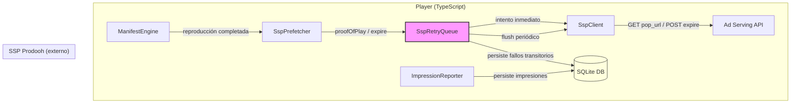
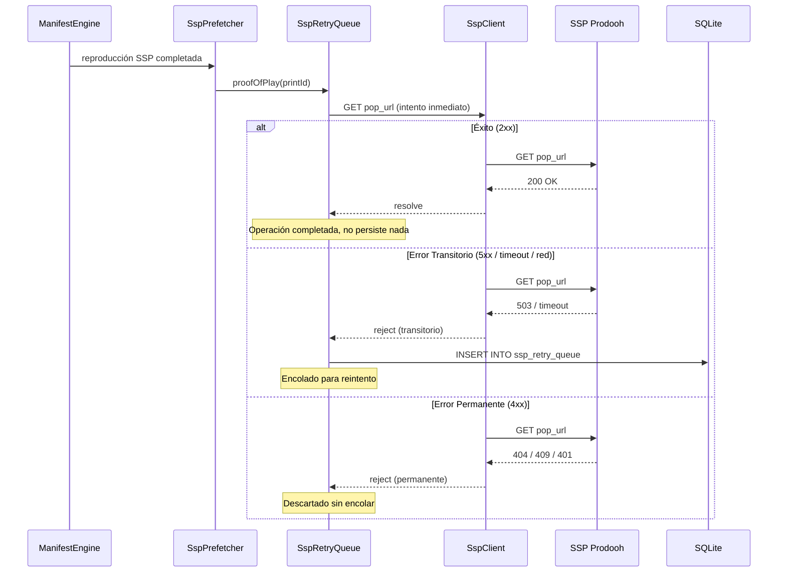
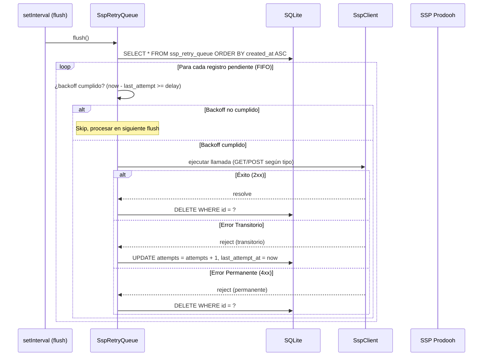
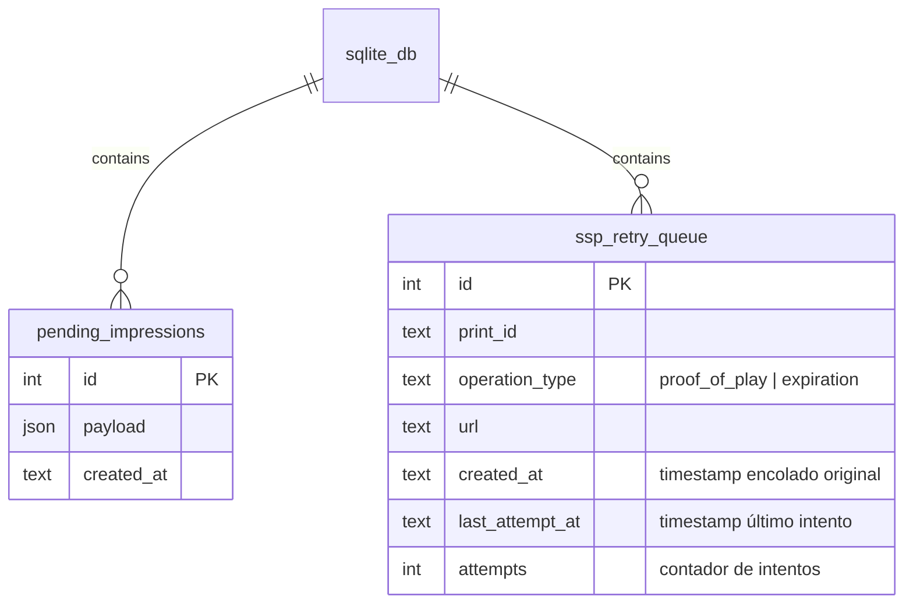

# Design Document

## Overview

Este diseño cubre la implementación de `SspRetryQueue`, una cola de reintentos local para las llamadas `proof_of_play` y `expiration` del SSP de Prodooh. El objetivo es reemplazar el comportamiento actual fire-and-forget por un mecanismo resiliente que persiste las llamadas fallidas en SQLite y las reintenta con backoff exponencial hasta éxito o descarte por error permanente.

### Decisiones de diseño clave

| Decisión | Justificación |
|----------|---------------|
| Reutilizar SQLite existente (tabla separada) | `ImpressionReporter` ya usa `better-sqlite3`; no introducir otro motor de persistencia |
| Backoff exponencial con cap de 60s | Misma constante documentada en el API de Prodooh para `429` |
| Sin TTL ni límite de intentos (errores transitorios) | Escenario aeropuerto: días sin red es normal |
| 4xx = error permanente, descartar | El SSP usa credenciales estáticas; un 401/404/409 no se resolverá con reintentos |
| FIFO simple sin priorización por tipo | Simplifica la lógica y mantiene el orden cronológico de eventos |
| Intento inmediato antes de encolar | En condiciones normales de red la confirmación llega sin demora |
| Payload mínimo: solo URL completa + tipo | `proof_of_play` es un GET a la `pop_url`; no se requiere cuerpo adicional |

## Architecture



### Flujo de una llamada proof_of_play



### Flujo del flush periódico



## Components and Interfaces

### Extensión de `SspClient`

La interfaz `SspClient` existente en `player/src/engine/SspPrefetcher.ts` se extiende con el método `proofOfPlay`:

```typescript
/** Client interface for SSP (ad server) communication. */
export interface SspClient {
  /** Request an ad from the SSP for the given duration. Returns null on no-fill or error. */
  requestAd(durationSeconds: number): Promise<SspContent | null>;
  /** Expire (cancel) a previously fetched ad that was not reproduced. */
  expireAd(printId: string): Promise<void>;
  /** Confirm proof of play for a reproduced ad. GET to the pop_url. */
  proofOfPlay(printId: string): Promise<void>;
}
```

**Nota**: La implementación concreta de `proofOfPlay` en `boot.ts` hará un `GET` a la `pop_url` que viene en la respuesta original del SSP. La URL se almacena asociada al `printId` durante el prefetch.

### `SspRetryQueue`

**Ubicación**: `player/src/sync/SspRetryQueue.ts`

```typescript
/** Types of SSP operations that can be retried */
export type SspOperationType = 'proof_of_play' | 'expiration';

/** Configuration for SspRetryQueue */
export interface SspRetryQueueOptions {
  /** Base backoff interval in ms (default: 1000) */
  baseBackoffMs?: number;
  /** Maximum backoff interval in ms (default: 60000) */
  maxBackoffMs?: number;
  /** Interval for periodic flush in ms (default: 5000) */
  flushIntervalMs?: number;
}

/** Row shape stored in SQLite */
export interface SspRetryRow {
  id: number;
  print_id: string;
  operation_type: SspOperationType;
  url: string;
  created_at: string;       // ISO 8601 — timestamp del intento original
  last_attempt_at: string;  // ISO 8601 — timestamp del último intento
  attempts: number;
}

/** Result of an SSP call attempt */
export interface SspCallResult {
  success: boolean;
  permanent: boolean;  // true if 4xx (should not retry)
  statusCode?: number;
}

export class SspRetryQueue {
  private db: Database.Database;
  private sspClient: SspClient;
  private baseBackoffMs: number;
  private maxBackoffMs: number;
  private flushTimer: ReturnType<typeof setInterval> | null;

  constructor(db: Database.Database, sspClient: SspClient, options?: SspRetryQueueOptions);

  /**
   * Attempt a proof_of_play call. If it fails transiently, enqueue for retry.
   * If it fails permanently (4xx), discard silently.
   */
  async proofOfPlay(printId: string, popUrl: string): Promise<void>;

  /**
   * Attempt an expiration call. If it fails transiently, enqueue for retry.
   * If it fails permanently (4xx), discard silently.
   */
  async expire(printId: string, expireUrl: string): Promise<void>;

  /**
   * Process all pending entries whose backoff has elapsed.
   * Called periodically by the flush timer.
   */
  async flush(): Promise<void>;

  /** Start periodic flush at the configured interval. */
  startPeriodicFlush(intervalMs?: number): void;

  /** Stop periodic flush. */
  stopPeriodicFlush(): void;

  /** Get count of pending entries (useful for testing/diagnostics). */
  getPendingCount(): number;

  /** Calculate backoff delay in ms for a given attempt count. */
  calculateBackoffMs(attempts: number): number;
}
```

### Integración con `SspPrefetcher`

El `SspPrefetcher` actual hace las llamadas de `expireAd` directamente con un `try/catch` silencioso. Con la nueva arquitectura, el `SspPrefetcher` delegará las confirmaciones/expiraciones al `SspRetryQueue`:

```typescript
// En boot.ts, al construir el SspPrefetcher:
// Se pasa el SspRetryQueue como dependencia para que el ManifestEngine
// pueda confirmar reproducción a través de él.

// El flujo será:
// ManifestEngine detecta reproducción SSP completada
//   → llama sspRetryQueue.proofOfPlay(printId, popUrl)
// SspPrefetcher.expire(printId) 
//   → llama sspRetryQueue.expire(printId, expireUrl)
```

### Almacenamiento de `pop_url` durante prefetch

La respuesta del SSP incluye un campo `pop_url` que se debe almacenar junto al `SspContent` para poder usarlo después:

```typescript
/** Represents the content returned by an SSP ad request (extendido). */
export interface SspContent {
  printId: string;
  assetUrl: string;
  durationSeconds: number;
  mimeType?: string;
  popUrl: string;      // URL para confirmar proof_of_play (GET)
  expireUrl: string;   // URL para notificar expiración (GET/POST)
}
```

## Data Models

### Tabla `ssp_retry_queue` (SQLite local del player)

Se crea en la misma base de datos SQLite que usa `ImpressionReporter` (tabla `pending_impressions`), en una tabla separada.

```sql
CREATE TABLE IF NOT EXISTS ssp_retry_queue (
    id INTEGER PRIMARY KEY AUTOINCREMENT,
    print_id TEXT NOT NULL,
    operation_type TEXT NOT NULL CHECK (operation_type IN ('proof_of_play', 'expiration')),
    url TEXT NOT NULL,
    created_at TEXT NOT NULL DEFAULT (datetime('now')),
    last_attempt_at TEXT NOT NULL DEFAULT (datetime('now')),
    attempts INTEGER NOT NULL DEFAULT 1
);

-- Índice para flush FIFO eficiente
CREATE INDEX IF NOT EXISTS idx_ssp_retry_queue_created_at 
    ON ssp_retry_queue(created_at ASC);
```

### Relación con tablas existentes



## Correctness Properties

*A property is a characteristic or behavior that should hold true across all valid executions of a system — essentially, a formal statement about what the system should do. Properties serve as the bridge between human-readable specifications and machine-verifiable correctness guarantees.*

### Property 1: Enqueue on transient failure persists correct data

*For any* valid SSP operation (random print_id, random operation_type, random URL) that fails with a transient error (5xx, timeout, network error), the SspRetryQueue SHALL persist exactly one row in SQLite containing that print_id, operation_type, URL, and attempts = 1.

**Validates: Requirements 1.1**

### Property 2: Successful first attempt produces no queue entries

*For any* valid SSP operation that succeeds on the first attempt (2xx response), the SspRetryQueue SHALL NOT insert any row into the retry queue table.

**Validates: Requirements 1.2**

### Property 3: Backoff formula with cap

*For any* attempt count N ≥ 1, the calculated backoff interval SHALL equal `min(2^(N-1) × baseBackoffMs, maxBackoffMs)`, which with defaults gives `min(2^(N-1) × 1000, 60000)` ms.

**Validates: Requirements 2.1, 2.2**

### Property 4: Successful retry removes entry

*For any* entry in the retry queue, when a retry attempt succeeds (2xx response), that entry SHALL be deleted from SQLite and no longer appear in subsequent flush operations.

**Validates: Requirements 2.3**

### Property 5: Failed retry increments attempts

*For any* entry in the retry queue with N attempts, when a retry fails with a transient error, the entry's attempts field SHALL become N + 1 and its last_attempt_at SHALL be updated.

**Validates: Requirements 2.4**

### Property 6: No TTL — entries persist indefinitely

*For any* entry in the retry queue regardless of its attempt count or age (created_at), the entry SHALL remain in the queue and be eligible for retry processing as long as no success or permanent error occurs.

**Validates: Requirements 3.1, 3.3**

### Property 7: Queue survives restart (round-trip persistence)

*For any* set of queue entries persisted in SQLite, creating a new SspRetryQueue instance with the same database SHALL recover all entries with their original print_id, operation_type, url, created_at, and attempts values intact.

**Validates: Requirements 3.2**

### Property 8: Any 4xx response discards entry without retry

*For any* entry in the retry queue and any HTTP response with status code in the range [400, 499], the SspRetryQueue SHALL delete that entry from SQLite immediately without further retry attempts.

**Validates: Requirements 4.1, 4.2, 4.3, 4.4**

### Property 9: FIFO processing by timestamp regardless of type

*For any* set of queue entries with distinct created_at timestamps and mixed operation types, the flush SHALL process them in ascending created_at order, with operation_type having no effect on ordering.

**Validates: Requirements 5.1, 5.2**

## Error Handling

| Escenario | Comportamiento | Justificación |
|-----------|---------------|---------------|
| Red caída (timeout / DNS failure) | Clasificar como Error_Transitorio → encolar con backoff | Resoluble con el tiempo |
| HTTP 5xx del SSP | Clasificar como Error_Transitorio → encolar con backoff | Servidor temporalmente indisponible |
| HTTP 404 (print_id no encontrado) | Clasificar como Error_Permanente → descartar | El arte ya no existe en el SSP |
| HTTP 409 (ya procesado/expirado) | Clasificar como Error_Permanente → descartar | Operación ya registrada previamente |
| HTTP 401 (credenciales SSP inválidas) | Clasificar como Error_Permanente → descartar | `api_key`/`network_id` mal configurados; no es JWT renovable |
| HTTP 4xx (cualquier otro) | Clasificar como Error_Permanente → descartar | Request malformado o estado irrecuperable |
| SQLite write falla (disco lleno) | Log error, no bloquear el flujo de reproducción | La reproducción es prioridad; la cola es best-effort |
| Flush interrumpido por reinicio | Registros persisten en SQLite, se retomarán al boot | Consistencia garantizada por SQLite WAL |
| Múltiples entries con mismo print_id | Cada entry es independiente (idempotencia del GET) | El SSP maneja duplicados con 409 |
| pop_url/expire_url no almacenada | No encolar — log warning | No hay a dónde reintentar sin URL |

### Clasificación de errores HTTP

```typescript
function classifyHttpError(statusCode: number): 'transient' | 'permanent' {
  if (statusCode >= 500) return 'transient';
  if (statusCode >= 400) return 'permanent';
  // No debería llegar aquí (2xx/3xx son éxitos)
  return 'transient';
}

function isTransientError(error: unknown): boolean {
  // Network errors, timeouts, DNS failures
  if (error instanceof TypeError) return true;  // fetch network error
  if (error instanceof DOMException && error.name === 'AbortError') return true;
  return false;
}
```

## Testing Strategy

### Property-Based Tests (TypeScript con fast-check)

Se usará **fast-check** (ya instalado en el player como `fast-check@^4.0.0`) para validar las propiedades de correctness.

**Configuración**: Mínimo 100 iteraciones por propiedad, usando `fc.configureGlobal({ numRuns: 100 })`.

| Property | Componente bajo test | Tag |
|----------|---------------------|-----|
| 1: Enqueue on transient failure | `SspRetryQueue.proofOfPlay`, `SspRetryQueue.expire` | Feature: 07-player-reingenieria-estabilizacion, Property 1: Enqueue on transient failure persists correct data |
| 2: No enqueue on success | `SspRetryQueue.proofOfPlay`, `SspRetryQueue.expire` | Feature: 07-player-reingenieria-estabilizacion, Property 2: Successful first attempt produces no queue entries |
| 3: Backoff formula | `SspRetryQueue.calculateBackoffMs` | Feature: 07-player-reingenieria-estabilizacion, Property 3: Backoff formula with cap |
| 4: Success removes entry | `SspRetryQueue.flush` | Feature: 07-player-reingenieria-estabilizacion, Property 4: Successful retry removes entry |
| 5: Failure increments attempts | `SspRetryQueue.flush` | Feature: 07-player-reingenieria-estabilizacion, Property 5: Failed retry increments attempts |
| 6: No TTL | `SspRetryQueue.flush` | Feature: 07-player-reingenieria-estabilizacion, Property 6: No TTL — entries persist indefinitely |
| 7: Round-trip persistence | `SspRetryQueue` constructor | Feature: 07-player-reingenieria-estabilizacion, Property 7: Queue survives restart |
| 8: 4xx discards | `SspRetryQueue.flush` | Feature: 07-player-reingenieria-estabilizacion, Property 8: Any 4xx response discards entry without retry |
| 9: FIFO ordering | `SspRetryQueue.flush` | Feature: 07-player-reingenieria-estabilizacion, Property 9: FIFO processing by timestamp regardless of type |

### Generators (fast-check)

```typescript
// Generador de print_id (UUID-like string)
const arbPrintId = fc.uuid();

// Generador de tipo de operación
const arbOperationType = fc.constantFrom('proof_of_play', 'expiration');

// Generador de URL válida
const arbUrl = fc.webUrl();

// Generador de attempt count (para backoff)
const arbAttempts = fc.integer({ min: 1, max: 100 });

// Generador de status code 4xx
const arb4xx = fc.integer({ min: 400, max: 499 });

// Generador de status code 5xx (transitorio)
const arb5xx = fc.integer({ min: 500, max: 599 });

// Generador de SspRetryRow completa
const arbRetryRow = fc.record({
  print_id: arbPrintId,
  operation_type: arbOperationType,
  url: arbUrl,
  attempts: arbAttempts,
});
```

### Unit Tests (Example-Based)

| Área | Casos clave |
|------|-------------|
| `SspRetryQueue` constructor | Crea tabla `ssp_retry_queue` si no existe (Req 1.3) |
| `SspRetryQueue.proofOfPlay` | Intento inmediato exitoso → no persiste (Req 6.1) |
| `SspRetryQueue.expire` | Intento inmediato exitoso → no persiste (Req 6.2) |
| `SspRetryQueue.proofOfPlay` | Intento falla con 503 → persiste con attempts=1 (Req 6.3) |
| `SspRetryQueue.flush` | Cola vacía → no-op |
| `SspRetryQueue.flush` | Respeta backoff: no procesa entry cuyo delay no ha transcurrido |
| `SspRetryQueue` integración con SspClient | Verifica que usa `proofOfPlay` y `expireAd` del SspClient (Req 7.2) |
| `SspRetryQueue` DB compartida | Usa misma instancia de DB que ImpressionReporter (Req 7.3) |
| `SspClient.proofOfPlay` impl | Hace GET a pop_url con headers correctos |
| `SspContent` extendido | Incluye `popUrl` y `expireUrl` en la respuesta del ad request |

### Integration Tests

| Flujo | Descripción |
|-------|-------------|
| Ciclo completo proof_of_play | Prefetch → reproducción → proofOfPlay falla → enqueue → flush → éxito → entry eliminada |
| Ciclo completo expiration | Prefetch → cambio manifiesto → expire falla → enqueue → flush → éxito → entry eliminada |
| Reinicio del player | Encolar entries → destruir instancia → crear nueva → verificar recovery |
| Error permanente en flush | Encolar entries → flush con mock 404 → verificar entries eliminadas |

### Smoke Tests

| Verificación |
|-------------|
| `SspClient` interface incluye `proofOfPlay` (type check) |
| `SspContent` incluye `popUrl` y `expireUrl` (type check) |
| Tabla `ssp_retry_queue` se crea correctamente con todos los campos |
| `SspRetryQueue` arranca sin entries pendientes en DB vacía |
