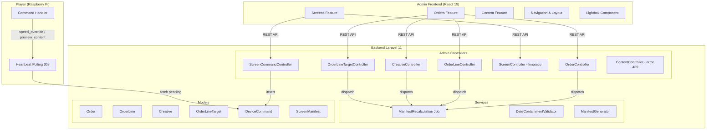
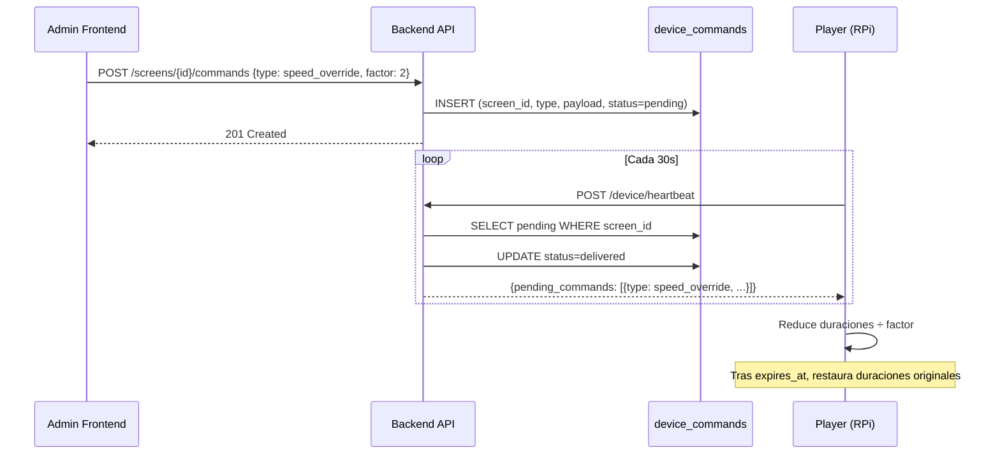
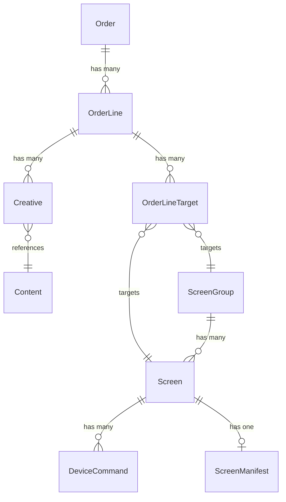

# Documento de Diseño Técnico — Reingeniería Back/Front

## Overview

Este diseño aborda la integración completa del flujo de pedidos comerciales (Orders) en el admin-frontend y backend, la eliminación de código obsoleto del sistema de Loop/Sources, renombramientos de interfaz, la funcionalidad de Modo Testigo para aceleración/previsualización, y mejoras UX de previews visuales con lightbox.

**Alcance:**
- 4 nuevos controladores Laravel para CRUD de Orders, OrderLines, Creatives y OrderLineTargets
- 1 nuevo endpoint de comandos para Modo Testigo
- Limpieza de ScreenController (campos obsoletos)
- 5 nuevas features en el admin-frontend (orders, order-lines, creatives, targets, commands)
- Refactor de navegación (Tenants → Networks, agregar Pedidos)
- Eliminación de componentes obsoletos (LoopEditor, SourceToggles)
- Lightbox/carrusel para previews de contenido
- Manejo de error FK 409 en eliminación de contenido

**Decisiones clave:**
- Reusar el patrón existente de controladores Admin con `TenantScopeMiddleware` y trait `BelongsToTenant`
- Disparar `ManifestRecalculation` como job en cola via `OrderLine::resolveTargetScreens()`
- Usar la tabla `device_commands` existente para Modo Testigo (sin nuevas tablas)
- Frontend: feature-based folder structure, TanStack Query, React Hook Form + Zod, shadcn/ui

## Architecture

### Diagrama de Arquitectura de Alto Nivel



### Diagrama de Flujo — Modo Testigo



## Components and Interfaces

### Backend — Nuevos Controladores

#### `OrderController`

```php
// app/Http/Controllers/Admin/OrderController.php
class OrderController extends Controller
{
    public function index(): JsonResponse;              // GET /admin/orders
    public function store(Request $request): JsonResponse;  // POST /admin/orders
    public function show(string $id): JsonResponse;         // GET /admin/orders/{id}
    public function update(Request $request, string $id): JsonResponse; // PUT /admin/orders/{id}
    public function destroy(string $id): JsonResponse;      // DELETE /admin/orders/{id}
}
```

**Validaciones store/update:**
- `name`: required, string, max:255
- `advertiser_name`: nullable, string, max:255
- `starts_at`: required, date
- `ends_at`: required, date, after_or_equal:starts_at
- `status`: required, in:draft,active,paused,finished
- `tenant_id`: required para super_admin (via interceptor), implícito para tenant_admin

#### `OrderLineController`

```php
// app/Http/Controllers/Admin/OrderLineController.php
class OrderLineController extends Controller
{
    public function index(string $orderId): JsonResponse;         // GET /admin/orders/{id}/order-lines
    public function store(Request $request, string $orderId): JsonResponse; // POST /admin/orders/{id}/order-lines
    public function show(string $id): JsonResponse;              // GET /admin/order-lines/{id}
    public function update(Request $request, string $id): JsonResponse;    // PUT /admin/order-lines/{id}
    public function destroy(string $id): JsonResponse;           // DELETE /admin/order-lines/{id}
}
```

**Validaciones store/update:**
- `name`: required, string, max:255
- `priority_tier`: required, in:patrocinio,estandar,red_interna
- `starts_at`: required, date (contenida en rango del Order padre — usa `DateContainmentValidator`)
- `ends_at`: required, date, after_or_equal:starts_at (contenida en rango del Order padre)
- `target_spots`: nullable, integer, min:1
- `delivery_pace`: required, in:asap,uniform
- `share_weight`: required, integer, min:1
- `status`: required, in:draft,active,paused,finished

#### `CreativeController`

```php
// app/Http/Controllers/Admin/CreativeController.php
class CreativeController extends Controller
{
    public function index(string $orderLineId): JsonResponse;        // GET /admin/order-lines/{id}/creatives
    public function store(Request $request, string $orderLineId): JsonResponse; // POST /admin/order-lines/{id}/creatives
    public function update(Request $request, string $id): JsonResponse;        // PUT /admin/creatives/{id}
    public function destroy(string $id): JsonResponse;              // DELETE /admin/creatives/{id}
}
```

**Validaciones store/update:**
- `content_id`: required, exists:content,id (mismo tenant)
- `weight`: required, integer, min:1
- `active_dates`: required, array de strings ISO date (validadas via `DateContainmentValidator`)

#### `OrderLineTargetController`

```php
// app/Http/Controllers/Admin/OrderLineTargetController.php
class OrderLineTargetController extends Controller
{
    public function store(Request $request, string $orderLineId): JsonResponse; // POST /admin/order-lines/{id}/targets
    public function destroy(string $id): JsonResponse;                         // DELETE /admin/order-line-targets/{id}
}
```

**Validaciones store:**
- XOR: exactamente uno de `screen_id` o `screen_group_id` debe estar presente
- `screen_id`: exists:screens,id (mismo tenant)
- `screen_group_id`: exists:screen_groups,id (mismo tenant)

#### `ScreenCommandController`

```php
// app/Http/Controllers/Admin/ScreenCommandController.php
class ScreenCommandController extends Controller
{
    public function store(Request $request, string $screenId): JsonResponse; // POST /admin/screens/{id}/commands
}
```

**Validaciones:**
- `type`: required, in:speed_override,preview_content
- Si `type = speed_override`: `factor` required, in:1,2,4; `expires_at` opcional (default 10min)
- Si `type = preview_content`: `content_id` required, `asset_url` required, `duration_seconds` opcional

### Backend — Rutas Nuevas

```php
// routes/api.php — dentro del grupo admin autenticado
Route::middleware('role:super_admin,tenant_admin')->group(function () {
    // Orders
    Route::get('/orders', [OrderController::class, 'index']);
    Route::post('/orders', [OrderController::class, 'store']);
    Route::get('/orders/{id}', [OrderController::class, 'show']);
    Route::put('/orders/{id}', [OrderController::class, 'update']);
    Route::delete('/orders/{id}', [OrderController::class, 'destroy']);

    // Order Lines (nested under orders)
    Route::get('/orders/{orderId}/order-lines', [OrderLineController::class, 'index']);
    Route::post('/orders/{orderId}/order-lines', [OrderLineController::class, 'store']);
    Route::get('/order-lines/{id}', [OrderLineController::class, 'show']);
    Route::put('/order-lines/{id}', [OrderLineController::class, 'update']);
    Route::delete('/order-lines/{id}', [OrderLineController::class, 'destroy']);

    // Creatives (nested under order-lines)
    Route::get('/order-lines/{orderLineId}/creatives', [CreativeController::class, 'index']);
    Route::post('/order-lines/{orderLineId}/creatives', [CreativeController::class, 'store']);
    Route::put('/creatives/{id}', [CreativeController::class, 'update']);
    Route::delete('/creatives/{id}', [CreativeController::class, 'destroy']);

    // Targets (nested under order-lines)
    Route::post('/order-lines/{orderLineId}/targets', [OrderLineTargetController::class, 'store']);
    Route::delete('/order-line-targets/{id}', [OrderLineTargetController::class, 'destroy']);

    // Screen commands (Modo Testigo)
    Route::post('/screens/{id}/commands', [ScreenCommandController::class, 'store']);

    // Groups schedule apply
    Route::post('/groups/{id}/apply-schedule', [ScreenGroupController::class, 'applySchedule']);
});
```

### Backend — Limpieza ScreenController

El método `update` se simplifica para aceptar solo campos vigentes:

```php
$validated = $request->validate([
    'name' => ['sometimes', 'string', 'max:255'],
    'orientation' => ['sometimes', 'string', 'in:landscape,portrait'],
    'resolution_width' => ['sometimes', 'integer', 'min:1'],
    'resolution_height' => ['sometimes', 'integer', 'min:1'],
    'group_id' => ['sometimes', 'nullable', 'string'],
    'schedule' => ['sometimes', 'nullable', 'array'],
    'transition_type' => ['sometimes', 'nullable', 'string'],
    'transition_duration_ms' => ['sometimes', 'nullable', 'integer', 'min:0'],
]);
```

Se eliminan: `duration_seconds`, `loop_config`, `sources_config` de las reglas de validación.

### Backend — Error 409 en ContentController

```php
public function destroy(string $id): JsonResponse
{
    $content = Content::find($id);
    if (!$content) {
        return response()->json(['message' => 'Content not found.'], 404);
    }

    // Verificar FK antes de intentar delete
    if (Creative::where('content_id', $content->id)->exists()) {
        return response()->json([
            'message' => 'No se puede eliminar este contenido porque está siendo utilizado por uno o más creativos activos. Elimine primero los creativos que lo referencian.',
        ], 409);
    }

    $this->contentLibraryService->delete($content);
    return response()->json(['message' => 'Content deleted successfully.']);
}
```

### Frontend — Estructura de Carpetas Nuevas

```
admin-frontend/src/features/
├── orders/
│   ├── api.ts                    # ordersApi, orderLinesApi, creativesApi, targetsApi
│   ├── hooks.ts                  # useOrders, useOrder, useCreateOrder, etc.
│   ├── schemas.ts                # Zod schemas: orderSchema, orderLineSchema, creativeSchema
│   ├── types.ts                  # Order, OrderLine, Creative, OrderLineTarget interfaces
│   ├── pages/
│   │   ├── OrdersPage.tsx        # Listado con tabla y acción rápida pausa/activar
│   │   └── OrderDetailPage.tsx   # Detalle + CRUD líneas + creativos + targets
│   └── components/
│       ├── OrderForm.tsx          # Formulario crear/editar pedido (Dialog)
│       ├── OrderLineForm.tsx      # Formulario crear/editar línea (Dialog)
│       ├── CreativeForm.tsx       # Selector contenido + peso + calendario
│       ├── TargetSelector.tsx     # Selector pantallas/grupos
│       ├── ActiveDatesPicker.tsx  # Calendario multi-fecha
│       └── StatusToggle.tsx       # Botón acción rápida pausa/activar
├── content/
│   ├── components/
│   │   ├── ContentLightbox.tsx   # Lightbox modal con carrusel
│   │   └── ContentThumbnail.tsx  # Miniatura con lazy loading
│   └── ...
├── screens/
│   ├── components/
│   │   ├── WitnessMode.tsx       # Controles Modo Testigo
│   │   ├── PreviewContent.tsx    # Selector previsualización
│   │   ├── ActiveOrderLines.tsx  # Lista líneas activas en pantalla
│   │   ├── ManifestSummary.tsx   # Resumen manifiesto actual
│   │   └── ScheduleEditor.tsx    # Editor horario operativo
│   └── ...
└── networks/                     # Renombrado de tenants/
    ├── pages/
    │   └── NetworksPage.tsx      # Era TenantsPage
    └── api.ts                    # Mantiene endpoints /admin/tenants
```

### Frontend — Interfaces TypeScript Nuevas

```typescript
// features/orders/types.ts
export interface Order {
  id: string;
  tenant_id: string;
  name: string;
  advertiser_name: string | null;
  starts_at: string;
  ends_at: string;
  status: 'draft' | 'active' | 'paused' | 'finished';
  created_at: string;
  updated_at: string;
  order_lines_count?: number;
  order_lines?: OrderLine[];
}

export interface OrderLine {
  id: string;
  order_id: string;
  name: string;
  priority_tier: 'patrocinio' | 'estandar' | 'red_interna';
  starts_at: string;
  ends_at: string;
  target_spots: number | null;
  delivery_pace: 'asap' | 'uniform';
  share_weight: number;
  status: 'draft' | 'active' | 'paused' | 'finished';
  created_at: string;
  updated_at: string;
  creatives_count?: number;
  creatives?: Creative[];
  targets?: OrderLineTarget[];
  order?: Order;
}

export interface Creative {
  id: string;
  order_line_id: string;
  content_id: string;
  weight: number;
  active_dates: string[]; // ISO date strings YYYY-MM-DD
  created_at: string;
  updated_at: string;
  content?: Content;
}

export interface OrderLineTarget {
  id: string;
  order_line_id: string;
  screen_id: string | null;
  screen_group_id: string | null;
  created_at: string;
  screen?: Screen;
  screen_group?: ScreenGroup;
}
```

### Frontend — Zod Schemas

```typescript
// features/orders/schemas.ts
import { z } from 'zod';

export const orderSchema = z.object({
  name: z.string().min(1, 'El nombre es requerido').max(255),
  advertiser_name: z.string().max(255).nullable().optional(),
  starts_at: z.string().min(1, 'La fecha de inicio es requerida'),
  ends_at: z.string().min(1, 'La fecha de fin es requerida'),
  status: z.enum(['draft', 'active', 'paused', 'finished']).default('draft'),
}).refine(
  (data) => new Date(data.ends_at) >= new Date(data.starts_at),
  { message: 'La fecha de fin debe ser mayor o igual a la de inicio', path: ['ends_at'] }
);

export const orderLineSchema = z.object({
  name: z.string().min(1).max(255),
  priority_tier: z.enum(['patrocinio', 'estandar', 'red_interna']),
  starts_at: z.string().min(1),
  ends_at: z.string().min(1),
  target_spots: z.number().int().min(1).nullable().optional(),
  delivery_pace: z.enum(['asap', 'uniform']),
  share_weight: z.number().int().min(1),
  status: z.enum(['draft', 'active', 'paused', 'finished']).default('draft'),
});

export const creativeSchema = z.object({
  content_id: z.string().min(1, 'Seleccione un contenido'),
  weight: z.number().int().min(1, 'El peso debe ser al menos 1'),
  active_dates: z.array(z.string()).min(1, 'Seleccione al menos una fecha activa'),
});
```

### Frontend — API Layer

```typescript
// features/orders/api.ts
export const ordersApi = {
  list: () => api.get<{ data: Order[] }>('/admin/orders').then(r => r.data.data),
  get: (id: string) => api.get<{ data: Order }>(`/admin/orders/${id}`).then(r => r.data.data),
  create: (data: CreateOrderInput) => api.post<{ data: Order }>('/admin/orders', data).then(r => r.data.data),
  update: (id: string, data: UpdateOrderInput) => api.put<{ data: Order }>(`/admin/orders/${id}`, data).then(r => r.data.data),
  delete: (id: string) => api.delete(`/admin/orders/${id}`),
};

export const orderLinesApi = {
  list: (orderId: string) => api.get<{ data: OrderLine[] }>(`/admin/orders/${orderId}/order-lines`).then(r => r.data.data),
  get: (id: string) => api.get<{ data: OrderLine }>(`/admin/order-lines/${id}`).then(r => r.data.data),
  create: (orderId: string, data: CreateOrderLineInput) => api.post<{ data: OrderLine }>(`/admin/orders/${orderId}/order-lines`, data).then(r => r.data.data),
  update: (id: string, data: UpdateOrderLineInput) => api.put<{ data: OrderLine }>(`/admin/order-lines/${id}`, data).then(r => r.data.data),
  delete: (id: string) => api.delete(`/admin/order-lines/${id}`),
};

export const creativesApi = {
  list: (orderLineId: string) => api.get<{ data: Creative[] }>(`/admin/order-lines/${orderLineId}/creatives`).then(r => r.data.data),
  create: (orderLineId: string, data: CreateCreativeInput) => api.post<{ data: Creative }>(`/admin/order-lines/${orderLineId}/creatives`, data).then(r => r.data.data),
  update: (id: string, data: UpdateCreativeInput) => api.put<{ data: Creative }>(`/admin/creatives/${id}`, data).then(r => r.data.data),
  delete: (id: string) => api.delete(`/admin/creatives/${id}`),
};

export const targetsApi = {
  create: (orderLineId: string, data: CreateTargetInput) => api.post<{ data: OrderLineTarget }>(`/admin/order-lines/${orderLineId}/targets`, data).then(r => r.data.data),
  delete: (id: string) => api.delete(`/admin/order-line-targets/${id}`),
};

export const screenCommandsApi = {
  send: (screenId: string, data: CommandPayload) => api.post<{ data: DeviceCommand }>(`/admin/screens/${screenId}/commands`, data).then(r => r.data.data),
};
```

### Frontend — Hooks (patrón TanStack Query)

```typescript
// features/orders/hooks.ts
export function useOrders() {
  return useQuery({ queryKey: ['orders'], queryFn: ordersApi.list });
}

export function useOrder(id: string | undefined) {
  return useQuery({ queryKey: ['orders', id], queryFn: () => ordersApi.get(id!), enabled: !!id });
}

export function useCreateOrder() {
  return useMutation({
    mutationFn: (data: CreateOrderInput) => ordersApi.create(data),
    onSuccess: () => { queryClient.invalidateQueries({ queryKey: ['orders'] }); toast.success('Pedido creado'); },
    onError: (err) => toast.error(err.response?.data?.message ?? 'Error al crear pedido'),
  });
}

export function useUpdateOrder() {
  return useMutation({
    mutationFn: ({ id, data }: { id: string; data: UpdateOrderInput }) => ordersApi.update(id, data),
    onSuccess: (_, vars) => {
      queryClient.invalidateQueries({ queryKey: ['orders'] });
      queryClient.invalidateQueries({ queryKey: ['orders', vars.id] });
      toast.success('Pedido actualizado');
    },
  });
}

// Patrón análogo para OrderLines, Creatives, Targets...
```

### Frontend — Lightbox Component

```typescript
// components/shared/ContentLightbox.tsx
interface ContentLightboxProps {
  items: Content[];
  initialIndex: number;
  open: boolean;
  onOpenChange: (open: boolean) => void;
}
```

Funcionalidades:
- Navegación con flechas ← → (click y keyboard)
- Cierre con Escape, click fuera, o botón X
- Renderizado condicional: `` para imágenes, `<video controls>` para videos
- Lazy loading de miniaturas en galería via `loading="lazy"` + Intersection Observer

## Data Models

### Modelos Existentes (sin cambios de schema)

| Modelo | Tabla | Campos clave |
|--------|-------|--------------|
| Order | orders | id, tenant_id, name, advertiser_name, starts_at, ends_at, status |
| OrderLine | order_lines | id, order_id, name, priority_tier, starts_at, ends_at, target_spots, delivery_pace, share_weight, status |
| Creative | creatives | id, order_line_id, content_id, weight, active_dates |
| OrderLineTarget | order_line_targets | id, order_line_id, screen_id, screen_group_id |
| DeviceCommand | device_commands | id, screen_id, type, payload, status, delivered_at |
| ScreenManifest | screen_manifests | id, screen_id, version, generated_at, items, total_spots, remaining_spots |

### Relaciones Clave



### Campos a eliminar del modelo Screen (frontend)

Se eliminan de `types/models.ts`:
- `duration_seconds`
- `loop_config: LoopSlot[]`
- `sources_config: SourcesConfig`

Se eliminan interfaces:
- `LoopSlot`
- `SourcesConfig`

### Payload de DeviceCommand para Modo Testigo

```json
// speed_override
{
  "type": "speed_override",
  "payload": {
    "factor": 2,
    "expires_at": "2025-01-15T14:30:00Z"
  }
}

// preview_content
{
  "type": "preview_content",
  "payload": {
    "content_id": "uuid",
    "asset_url": "/api/device/content/uuid/file",
    "duration_seconds": 10
  }
}
```


## Correctness Properties

*Una propiedad de correctitud es una característica o comportamiento que debe mantenerse verdadero en todas las ejecuciones válidas de un sistema — esencialmente, una declaración formal sobre lo que el sistema debe hacer. Las propiedades sirven como puente entre las especificaciones legibles por humanos y las garantías de correctitud verificables por máquinas.*

### Property 1: Tenant Scope Filtering

*Para cualquier* conjunto de Pedidos (Orders) y Líneas de pedido (OrderLines) distribuidos entre múltiples tenants, cuando un usuario autenticado con un tenant_id específico consulta los endpoints de listado, TODOS los recursos retornados deben pertenecer exclusivamente a ese tenant_id, y NINGÚN recurso de otro tenant debe aparecer en los resultados.

**Validates: Requirements 1.1, 2.1**

### Property 2: Date Ordering Validation

*Para cualquier* par de fechas (starts_at, ends_at) donde ends_at < starts_at, tanto el backend (validación Laravel) como el frontend (Zod schema con `refine`) deben rechazar la entrada con un error de validación. Inversamente, para cualquier par donde ends_at ≥ starts_at, la validación de fechas debe pasar (asumiendo demás campos válidos).

**Validates: Requirements 1.6, 7.6**

### Property 3: Date Containment (Jerarquía padre-hijo)

*Para cualquier* combinación de fechas de una entidad hija (OrderLine o Creative) que caen fuera del rango de fechas de su entidad padre (Order o OrderLine respectivamente), el sistema debe rechazar la operación con error 422. Específicamente: para cualquier OrderLine con starts_at < Order.starts_at O ends_at > Order.ends_at, debe rechazar; para cualquier Creative con alguna fecha en active_dates fuera de [OrderLine.starts_at, OrderLine.ends_at], debe rechazar.

**Validates: Requirements 2.6, 3.5, 8.6, 9.6**

### Property 4: Enum Validation Strictness

*Para cualquier* string arbitrario proporcionado como `priority_tier`, el sistema debe aceptarlo sí y solo sí pertenece al conjunto {"patrocinio", "estandar", "red_interna"}. Para cualquier string arbitrario proporcionado como `delivery_pace`, debe aceptarlo sí y solo sí pertenece al conjunto {"asap", "uniform"}. Todo valor fuera de estos conjuntos debe resultar en error 422.

**Validates: Requirements 2.7, 2.8**

### Property 5: Positive Integer Validation (Weight)

*Para cualquier* valor numérico proporcionado como `weight` en un Creativo, el sistema (backend y Zod schema frontend) debe aceptarlo sí y solo sí es un entero ≥ 1. Valores como 0, negativos, decimales y no-numéricos deben ser rechazados.

**Validates: Requirements 3.7, 9.7**

### Property 6: Target XOR Constraint

*Para cualquier* payload de creación de OrderLineTarget, el sistema debe aceptarlo sí y solo sí exactamente uno de `screen_id` o `screen_group_id` está presente y no-null. Si ambos están presentes, o si ninguno está presente, debe rechazar con error 422.

**Validates: Requirements 4.3, 4.4**

### Property 7: Cross-Tenant Reference Rejection

*Para cualquier* referencia a un recurso (screen_id, screen_group_id, o content_id) que pertenece a un tenant diferente al del usuario autenticado/recurso padre, el sistema debe rechazar la operación con error de validación. Los targets solo pueden referenciar pantallas/grupos del mismo tenant, y los creativos solo pueden referenciar contenido del mismo tenant.

**Validates: Requirements 3.6, 4.5, 4.6**

### Property 8: Content Deletion FK Protection

*Para cualquier* contenido (Content) en el sistema, la operación DELETE debe tener éxito (200) sí y solo sí no existe ningún registro en la tabla `creatives` con `content_id` referenciando ese contenido. Si existe al menos un creativo referenciándolo, debe retornar error 409 con mensaje legible en español.

**Validates: Requirements 13.1, 13.4**

### Property 9: Player Speed Override Calculation

*Para cualquier* duración de spot (duration_seconds > 0) y cualquier factor de aceleración válido (1, 2, o 4), la duración ajustada durante Modo Testigo debe ser exactamente `Math.ceil(duration_seconds / factor)`. Al aplicar factor 1 o al expirar el tiempo, la duración debe restaurarse al valor original sin pérdida.

**Validates: Requirements 20.4, 20.5**

### Property 10: Witness Mode Impression Exclusion

*Para cualquier* reproducción que ocurre durante Modo Testigo (speed_override activo con factor ≠ 1) o durante un preview_content, el sistema NO debe contabilizarla como impresión normal contra target_spots. Las impresiones durante witness mode deben llevar un flag identificador (`mode: 'witness'`), y las reproducciones de preview no deben generar registro de impresión alguno.

**Validates: Requirements 20.8, 21.5**

### Property 11: Lightbox Carousel Navigation Consistency

*Para cualquier* galería de N contenidos (N ≥ 1) y cualquier posición actual `i` (0 ≤ i < N), navegar "siguiente" debe resultar en posición `(i + 1) % N`, y navegar "anterior" debe resultar en posición `(i - 1 + N) % N`. La navegación debe ser consistente independientemente del método de input (botón, tecla de flecha).

**Validates: Requirements 22.3, 22.5**

## Error Handling

### Backend

| Escenario | Código HTTP | Respuesta |
|-----------|-------------|-----------|
| Validación de campos fallida | 422 | `{ message, errors: { field: [msgs] } }` |
| Recurso no encontrado | 404 | `{ message: "... not found." }` |
| Delete content con FK de creatives | 409 | `{ message: "No se puede eliminar..." }` |
| OrderLine fechas fuera de rango | 422 | `{ message, errors: { starts_at: [...] } }` |
| Creative active_dates fuera de rango | 422 | `{ message, errors: { active_dates: [...] } }` |
| Target XOR violation | 422 | `{ message: "Exactly one of..." }` |
| Cross-tenant reference | 422 | `{ message, errors: { field: ["...does not belong to tenant"] } }` |
| Autenticación fallida | 401 | `{ message: "Unauthenticated." }` |
| Autorización insuficiente | 403 | `{ message: "Forbidden." }` |

### Frontend

- **Toast de error** (`sonner`): Para errores de mutación (create, update, delete), mostrar `error.response?.data?.message` o un mensaje genérico.
- **Error boundary**: Para errores inesperados de renderizado.
- **ErrorState component**: Para errores de carga de datos (query errors) con botón "Reintentar".
- **Validación inline**: Errores de Zod schema mostrados debajo de cada campo en tiempo real.
- **409 Conflict**: Toast específico con el mensaje del servidor (ej. contenido referenciado por creativos).

### Player (Modo Testigo)

- Si `expires_at` ya pasó cuando se recibe el comando → ignorar silenciosamente.
- Si `content_id` de preview no se puede descargar → ignorar comando, continuar manifiesto.
- Si factor es inválido → usar factor 1 (sin efecto).

## Testing Strategy

### Enfoque Dual: Unit Tests + Property Tests

Este feature combina lógica de negocio testeable con propiedades (validaciones, cálculos, filtrado) y componentes de UI/integración que requieren tests de ejemplo.

### Property-Based Testing

**Librería:** `fast-check` (ya instalada en el proyecto, v4.8.0)
**Configuración:** Mínimo 100 iteraciones por propiedad
**Framework:** Vitest (ya configurado)

Cada property test debe llevar el comentario de tag:

```typescript
// Feature: 08-reingenieria-back-front, Property {N}: {título}
```

**Properties a implementar como PBT:**

| # | Propiedad | Scope | Generadores |
|---|-----------|-------|-------------|
| 1 | Tenant Scope Filtering | Backend (unit con mock) | Arb orders con tenant_ids aleatorios |
| 2 | Date Ordering Validation | Frontend (Zod) + Backend | Arb date pairs (valid + invalid) |
| 3 | Date Containment | Frontend (Zod refine) + Backend | Arb parent/child date ranges |
| 4 | Enum Validation | Frontend (Zod) + Backend | Arb strings vs enum sets |
| 5 | Weight Positive Integer | Frontend (Zod) + Backend | Arb numbers (ints, floats, neg, zero) |
| 6 | Target XOR | Backend (model validation) | Arb combos de screen_id/group_id |
| 7 | Cross-Tenant Rejection | Backend | Arb resource IDs con tenant combos |
| 8 | Content FK Protection | Backend | Arb content con/sin creative refs |
| 9 | Speed Override Calc | Player (unit) | Arb durations × factors |
| 10 | Impression Exclusion | Player (unit) | Arb playback events con/sin witness |
| 11 | Lightbox Navigation | Frontend (unit) | Arb gallery sizes × positions |

### Unit Tests (Example-Based)

**Backend (PHPUnit/Pest):**
- CRUD happy paths para cada controlador (create → show → update → delete)
- Cascade delete de Order con hijos
- ManifestRecalculation dispatch (integration con mock de Queue)
- ScreenController limpiado: verifica que campos obsoletos son ignorados
- DeviceCommand creation para Modo Testigo
- ContentController 409 con creative referenciado

**Frontend (Vitest + Testing Library):**
- Renderizado de OrdersPage con datos mock
- Formularios: validación inline, submit, error handling
- Navegación: /orders → /orders/:id → /orders/:id (líneas)
- Lightbox: open, close (Escape, click fuera, botón X), video controls
- Modo Testigo: botón, selector velocidad, toast confirmación
- Rename: "Networks" en header, placeholder "Seleccionar network"
- Eliminación de componentes: imports que ya no existen deben fallar la compilación

### Integration Tests

- Flujo completo: crear Order → crear OrderLine → crear Creative → crear Target → verificar ManifestRecalculation dispatch
- Heartbeat retorna pending commands después de enviar speed_override
- Content delete con FK constraint real en BD de test

### Estructura de Archivos de Test

```
backend/tests/Feature/Admin/
├── OrderControllerTest.php
├── OrderLineControllerTest.php
├── CreativeControllerTest.php
├── OrderLineTargetControllerTest.php
├── ScreenCommandControllerTest.php
└── ContentControllerDeleteTest.php

admin-frontend/src/features/
├── orders/__tests__/
│   ├── orders-validation.property.test.ts    # Props 2,3,4,5
│   ├── OrdersPage.test.tsx
│   └── OrderDetailPage.test.tsx
├── screens/__tests__/
│   ├── witness-mode.property.test.ts         # Props 9, 10
│   └── ScreenDetailPage.test.tsx
├── content/__tests__/
│   └── lightbox-navigation.property.test.ts  # Prop 11
└── __tests__/
    └── tenant-scope.property.test.ts         # Prop 1 (si aplica frontend)
```
