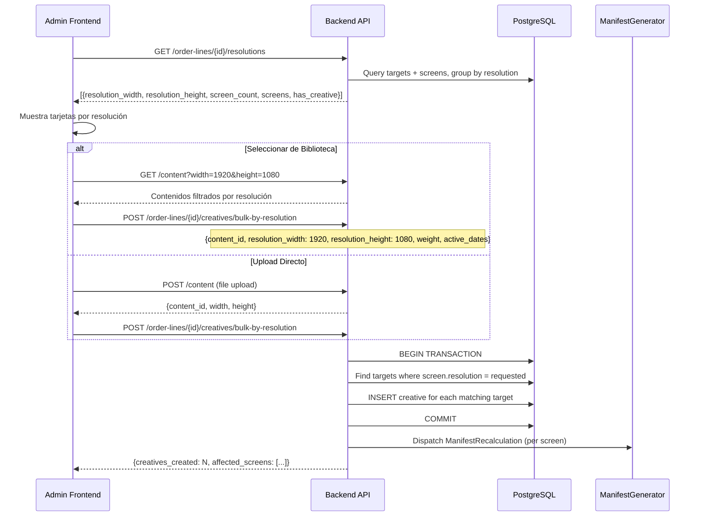
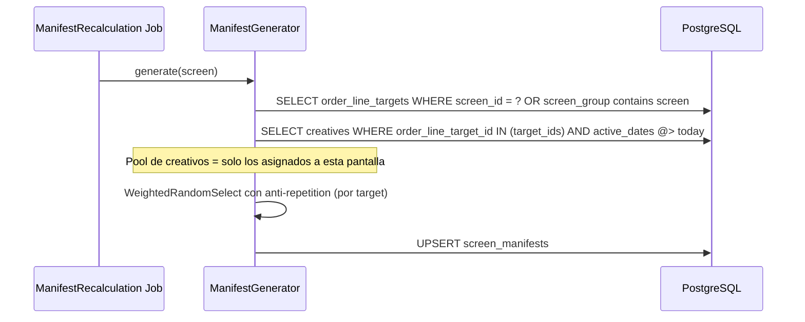
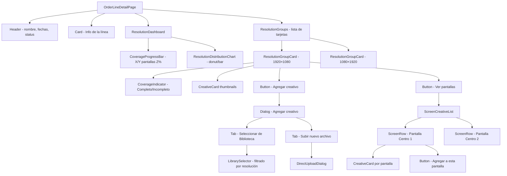
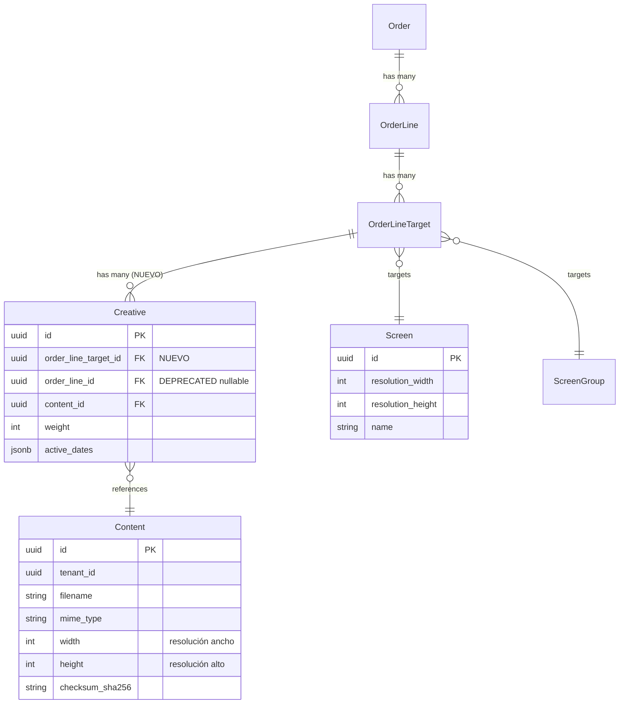

# Documento de Diseño Técnico — Creativos por Pantalla

## Overview

Este diseño redefine el modelo de asignación de creativos en Prodooh Player. El cambio fundamental es mover la relación de creativos desde `order_line_id` a `order_line_target_id`, permitiendo asignar contenido específico a cada pantalla (o grupo de resolución) dentro de una línea de pedido.

**Alcance:**
- Migración de schema: `creatives.order_line_target_id` reemplaza a `creatives.order_line_id`
- 3 nuevos endpoints backend (resoluciones, bulk-by-resolution, content filtrado)
- Modificación del CreativeController para operar por target
- Rediseño del ManifestGenerator para resolver creativos por pantalla
- Rediseño completo del OrderLineDetailPage con vista por resolución
- Comando artisan para extracción de dimensiones de contenido legacy
- Migración de datos existentes (creativos legacy → nuevo modelo)

**Decisiones clave:**
- Mantener `order_line_id` como columna deprecated (nullable) durante 30 días para rollback seguro
- Usar agrupación virtual (computada) por resolución, no almacenada en DB
- El ManifestGenerator filtra creativos por `order_line_target_id` del screen, no por `order_line_id`
- Upload directo = POST content + POST bulk-by-resolution en secuencia (orquestado por frontend)
- Renombrar "Contenido" → "Biblioteca" solo en la interfaz visible, no en código/API

## Architecture

### Diagrama de Arquitectura de Alto Nivel

```mermaid
graph TB
    subgraph "Admin Frontend (React 19)"
        OLDetail[OrderLineDetailPage - Rediseñada]
        Dashboard[ResolutionDashboard]
        ResCards[ResolutionGroupCards]
        LibSelector[LibrarySelector - Filtrado por resolución]
        UploadDirect[DirectUploadDialog]
    end

    subgraph "Backend Laravel 11"
        subgraph "Controllers"
            CC_New[CreativeController - por target]
            RES_EP[ResolutionController]
            CONT_EP[ContentController - filtro resolución]
            BULK_EP[BulkCreativeController]
        end

        subgraph "Services"
            MG_New[ManifestGenerator - por pantalla]
            CS_New[CreativeSelector - por target]
            DimExtract[DimensionExtractor]
        end

        subgraph "Models"
            Creative_New[Creative - order_line_target_id]
            OLTarget[OrderLineTarget]
            Content_M[Content - width/height]
        end
    end

    subgraph "Player (Node.js TypeScript)"
        Manifest[Manifest Consumer - sin cambios de protocolo]
    end

    OLDetail --> Dashboard
    OLDetail --> ResCards
    ResCards --> LibSelector
    ResCards --> UploadDirect

    LibSelector -->|GET /content?width&height| CONT_EP
    UploadDirect -->|POST /content + POST bulk| CONT_EP
    UploadDirect -->|POST bulk-by-resolution| BULK_EP
    ResCards -->|POST /order-line-targets/{id}/creatives| CC_New
    Dashboard -->|GET /order-lines/{id}/resolutions| RES_EP

    CC_New -->|dispatch| MG_New
    BULK_EP -->|dispatch| MG_New
    MG_New -->|query by target_id| Creative_New
    Creative_New -->|belongs to| OLTarget

    MG_New -->|genera manifiesto| Manifest
```

### Flujo de Asignación por Resolución (Bulk)



### Flujo de ManifestGenerator Actualizado



## Components and Interfaces

### Backend — Nuevos Controladores

#### `CreativeController` (Refactorizado — por target)

```php
// app/Http/Controllers/Admin/CreativeController.php
class CreativeController extends Controller
{
    /**
     * GET /api/admin/order-line-targets/{targetId}/creatives
     * Lista creativos asignados a un target específico.
     */
    public function index(string $targetId): JsonResponse;

    /**
     * POST /api/admin/order-line-targets/{targetId}/creatives
     * Crea un creativo vinculado a un target.
     * Valida: content resolution vs screen resolution, tenant ownership, date containment.
     */
    public function store(Request $request, string $targetId): JsonResponse;

    /**
     * PUT /api/admin/creatives/{id}
     * Actualiza weight, active_dates, o content_id de un creativo.
     */
    public function update(Request $request, string $id): JsonResponse;

    /**
     * DELETE /api/admin/creatives/{id}
     * Elimina un creativo.
     */
    public function destroy(string $id): JsonResponse;
}
```

**Validaciones store:**
- `content_id`: required, exists:content,id, mismo tenant, resolución exacta vs pantalla del target
- `weight`: required, integer, min:1
- `active_dates`: required, array de strings YYYY-MM-DD, contenidas en rango de la OrderLine padre

#### `BulkCreativeController` (Nuevo)

```php
// app/Http/Controllers/Admin/BulkCreativeController.php
class BulkCreativeController extends Controller
{
    /**
     * POST /api/admin/order-lines/{orderLineId}/creatives/bulk-by-resolution
     * Crea un creativo para cada target de la línea cuya pantalla tenga la resolución solicitada.
     */
    public function bulkByResolution(Request $request, string $orderLineId): JsonResponse;
}
```

**Request body:**
```json
{
  "content_id": "uuid",
  "resolution_width": 1920,
  "resolution_height": 1080,
  "weight": 100,
  "active_dates": ["2025-01-15", "2025-01-16", "2025-01-17"]
}
```

**Validaciones:**
- `content_id`: required, exists:content,id, mismo tenant
- `resolution_width`: required, integer, min:1
- `resolution_height`: required, integer, min:1
- `weight`: required, integer, min:1
- `active_dates`: required, array, min:1, cada fecha dentro del rango de la OrderLine
- Content.width === resolution_width AND Content.height === resolution_height
- Al menos un target con pantalla de la resolución solicitada existe

**Response 201:**
```json
{
  "data": {
    "creatives_created": 30,
    "affected_screens": ["screen-uuid-1", "screen-uuid-2", "..."]
  }
}
```

#### `ResolutionController` (Nuevo)

```php
// app/Http/Controllers/Admin/ResolutionController.php
class ResolutionController extends Controller
{
    /**
     * GET /api/admin/order-lines/{orderLineId}/resolutions
     * Retorna las pantallas agrupadas por resolución con estado de cobertura.
     */
    public function index(string $orderLineId): JsonResponse;
}
```

**Response 200:**
```json
{
  "data": [
    {
      "resolution_width": 1920,
      "resolution_height": 1080,
      "screen_count": 30,
      "screens": [
        { "id": "uuid", "name": "Pantalla Centro 1", "target_id": "target-uuid" }
      ],
      "has_creative": true,
      "coverage": { "with_creative": 28, "total": 30 }
    },
    {
      "resolution_width": 1080,
      "resolution_height": 1920,
      "screen_count": 5,
      "screens": [...],
      "has_creative": false,
      "coverage": { "with_creative": 0, "total": 5 }
    }
  ]
}
```

**Lógica:**
1. Cargar todos los targets de la OrderLine con sus pantallas (directas y via grupo)
2. Agrupar por `(resolution_width, resolution_height)`
3. Para cada grupo, verificar si cada pantalla tiene al menos un creativo asignado a su target
4. Ordenar por `screen_count` descendente

#### `ContentController` (Modificado — filtro por resolución)

```php
// Método index modificado en app/Http/Controllers/Admin/ContentController.php
public function index(Request $request): JsonResponse
{
    $query = Content::orderBy('created_at', 'desc');

    // Filtro por resolución exacta (opcional)
    if ($request->has('width') && $request->has('height')) {
        $width = (int) $request->input('width');
        $height = (int) $request->input('height');
        $query->where('width', $width)->where('height', $height);
    }

    $content = $query->get();
    return response()->json(['data' => $content]);
}
```

### Backend — Rutas Nuevas

```php
// routes/api.php — dentro del grupo admin autenticado
Route::middleware('role:super_admin,tenant_admin')->group(function () {
    // ... rutas existentes ...

    // Creativos por target (reemplaza la versión por order_line_id)
    Route::get('/order-line-targets/{targetId}/creatives', [CreativeController::class, 'index']);
    Route::post('/order-line-targets/{targetId}/creatives', [CreativeController::class, 'store']);
    Route::put('/creatives/{id}', [CreativeController::class, 'update']);
    Route::delete('/creatives/{id}', [CreativeController::class, 'destroy']);

    // Resoluciones de una línea de pedido
    Route::get('/order-lines/{orderLineId}/resolutions', [ResolutionController::class, 'index']);

    // Asignación bulk por resolución
    Route::post('/order-lines/{orderLineId}/creatives/bulk-by-resolution', [BulkCreativeController::class, 'bulkByResolution']);

    // Content listing (ya existe, se modifica para aceptar query params width/height)
    // GET /admin/content?width=1920&height=1080
});
```

### Backend — ManifestGenerator Refactorizado

El cambio central en `ManifestGenerator::buildOrderLineItems()`:

```php
// ANTES: Carga creativos de la OrderLine completa
$orderLines = OrderLine::with(['creatives.content'])
    ->whereIn('id', $orderLineIds)
    ->get();

// DESPUÉS: Carga creativos filtrados por targets de ESTA pantalla
private function buildOrderLineItems(Screen $screen, array $sequence, int $durationSeconds): array
{
    $items = [];
    $recentHistory = [];

    $orderLineIds = array_unique(array_column($sequence, 'order_line_id'));

    // Obtener los target_ids de esta pantalla (directos + via grupo)
    $screenTargetIds = $this->resolveTargetIdsForScreen($screen);

    // Cargar creativos SOLO de targets de esta pantalla, filtrados por active_dates de hoy
    $today = now()->toDateString();
    $creativesByOrderLine = Creative::with('content')
        ->whereIn('order_line_target_id', $screenTargetIds)
        ->whereJsonContains('active_dates', $today)
        ->get()
        ->groupBy(function ($creative) {
            return $creative->orderLineTarget->order_line_id;
        });

    foreach ($sequence as $entry) {
        $orderLineId = $entry['order_line_id'];
        $pool = $creativesByOrderLine->get($orderLineId, collect());

        if ($pool->isEmpty()) {
            continue; // Sin creativo para esta pantalla en esta línea → omitir
        }

        if (!isset($recentHistory[$orderLineId])) {
            $recentHistory[$orderLineId] = [];
        }

        $creative = $this->creativeSelector->select($pool, $recentHistory[$orderLineId]);
        array_unshift($recentHistory[$orderLineId], $creative->id);

        $content = $creative->content;
        $items[] = [
            'position' => $entry['position'],
            'type' => 'order_line_creative',
            'asset_url' => $content ? url("/api/device/content/{$content->id}/file") : null,
            'checksum_sha256' => $content?->checksum_sha256,
            'duration_seconds' => $durationSeconds,
            'order_line_id' => $orderLineId,
            'creative_id' => $creative->id,
            'target_id' => $creative->order_line_target_id,
        ];
    }

    return $items;
}

/**
 * Resuelve los target_ids que apuntan a esta pantalla (directo o via grupo).
 */
private function resolveTargetIdsForScreen(Screen $screen): array
{
    return OrderLineTarget::where(function ($query) use ($screen) {
        $query->where('screen_id', $screen->id)
              ->orWhere('screen_group_id', $screen->group_id);
    })->pluck('id')->toArray();
}
```

### Backend — CreativeSelector Refactorizado

La interfaz del selector cambia para aceptar una colección directa en lugar de una OrderLine:

```php
// app/Services/CreativeSelectorInterface.php
interface CreativeSelectorInterface
{
    /**
     * Selecciona un creativo del pool dado con anti-repetición.
     *
     * @param Collection<Creative> $pool Pool de creativos activos para hoy
     * @param array<string> $recentHistory IDs recientes (más reciente primero)
     * @return Creative
     */
    public function select(Collection $pool, array $recentHistory): Creative;
}
```

### Backend — Comando Artisan para extracción de dimensiones

```php
// app/Console/Commands/ExtractContentDimensions.php
class ExtractContentDimensions extends Command
{
    protected $signature = 'content:extract-dimensions';
    protected $description = 'Extract width/height from content files missing dimensions';

    public function handle(): int
    {
        $contents = Content::whereNull('width')
            ->orWhere('width', 0)
            ->get();

        $processed = 0;
        $failed = 0;

        foreach ($contents as $content) {
            try {
                [$width, $height] = $this->extractDimensions($content);
                $content->update(['width' => $width, 'height' => $height]);
                $processed++;
            } catch (\Exception $e) {
                $failed++;
                $this->warn("Failed: {$content->filename} - {$e->getMessage()}");
            }
        }

        $this->info("Processed: {$processed}, Failed: {$failed}, Total: {$contents->count()}");
        return 0;
    }
}
```

### Frontend — Estructura de Carpetas (Cambios)

```
admin-frontend/src/features/orders/
├── api.ts                          # + creativesApi refactorizado, resolutionsApi, bulkApi
├── hooks.ts                        # + useResolutions, useBulkCreative, useTargetCreatives
├── types.ts                        # + ResolutionGroup, BulkCreativeResponse
├── pages/
│   ├── OrderLineDetailPage.tsx     # REDISEÑADA completamente
│   └── ...
└── components/
    ├── ResolutionDashboard.tsx      # Dashboard con chart y cobertura global
    ├── ResolutionGroupCard.tsx      # Tarjeta por resolución con creativos
    ├── ScreenCreativeList.tsx       # Lista expandible de pantallas individuales
    ├── LibrarySelector.tsx          # Selector de contenido filtrado por resolución
    ├── DirectUploadDialog.tsx       # Upload + asignación inmediata
    ├── CreativeCard.tsx             # Thumbnail + info de un creativo individual
    ├── CoverageIndicator.tsx        # Badge Completo/Incompleto
    ├── ActiveDatesPicker.tsx        # Calendario multi-fecha (existente, sin cambios)
    └── ...
```

### Frontend — Interfaces TypeScript Nuevas

```typescript
// features/orders/types.ts — Adiciones

export interface ResolutionGroup {
  resolution_width: number;
  resolution_height: number;
  screen_count: number;
  screens: ResolutionScreen[];
  has_creative: boolean;
  coverage: {
    with_creative: number;
    total: number;
  };
}

export interface ResolutionScreen {
  id: string;
  name: string;
  target_id: string;
}

export interface BulkCreativeInput {
  content_id: string;
  resolution_width: number;
  resolution_height: number;
  weight: number;
  active_dates: string[];
}

export interface BulkCreativeResponse {
  creatives_created: number;
  affected_screens: string[];
}

// Creative actualizado — order_line_target_id en lugar de order_line_id
export interface Creative {
  id: string;
  order_line_target_id: string;
  content_id: string;
  weight: number;
  active_dates: string[];
  created_at: string;
  updated_at: string;
  content?: Content;
  // Campo derivado para backward compat
  order_line_id?: string;
}
```

### Frontend — API Layer Refactorizado

```typescript
// features/orders/api.ts — Cambios

export const creativesApi = {
  // NUEVO: Listar por target
  listByTarget: (targetId: string) =>
    api.get<{ data: Creative[] }>(`/admin/order-line-targets/${targetId}/creatives`)
      .then((r) => r.data.data),

  // NUEVO: Crear por target
  createForTarget: (targetId: string, data: CreateCreativeInput) =>
    api.post<{ data: Creative }>(`/admin/order-line-targets/${targetId}/creatives`, data)
      .then((r) => r.data.data),

  // Sin cambios
  update: (id: string, data: UpdateCreativeInput) =>
    api.put<{ data: Creative }>(`/admin/creatives/${id}`, data).then((r) => r.data.data),

  delete: (id: string) =>
    api.delete(`/admin/creatives/${id}`),
};

export const resolutionsApi = {
  list: (orderLineId: string) =>
    api.get<{ data: ResolutionGroup[] }>(`/admin/order-lines/${orderLineId}/resolutions`)
      .then((r) => r.data.data),
};

export const bulkCreativesApi = {
  createByResolution: (orderLineId: string, data: BulkCreativeInput) =>
    api.post<{ data: BulkCreativeResponse }>(
      `/admin/order-lines/${orderLineId}/creatives/bulk-by-resolution`, data
    ).then((r) => r.data.data),
};

export const contentApi = {
  // MODIFICADO: Acepta filtro de resolución opcional
  list: (filters?: { width?: number; height?: number }) => {
    const params = new URLSearchParams();
    if (filters?.width) params.set('width', String(filters.width));
    if (filters?.height) params.set('height', String(filters.height));
    const query = params.toString() ? `?${params.toString()}` : '';
    return api.get<{ data: Content[] }>(`/admin/content${query}`).then((r) => r.data.data);
  },
};
```

### Frontend — Hooks TanStack Query

```typescript
// features/orders/hooks.ts — Nuevos hooks

export function useResolutions(orderLineId: string | undefined) {
  return useQuery({
    queryKey: ['order-lines', orderLineId, 'resolutions'],
    queryFn: () => resolutionsApi.list(orderLineId!),
    enabled: !!orderLineId,
  });
}

export function useTargetCreatives(targetId: string | undefined) {
  return useQuery({
    queryKey: ['targets', targetId, 'creatives'],
    queryFn: () => creativesApi.listByTarget(targetId!),
    enabled: !!targetId,
  });
}

export function useBulkCreateByResolution(orderLineId: string) {
  const queryClient = useQueryClient();
  return useMutation({
    mutationFn: (data: BulkCreativeInput) => bulkCreativesApi.createByResolution(orderLineId, data),
    onSuccess: () => {
      queryClient.invalidateQueries({ queryKey: ['order-lines', orderLineId, 'resolutions'] });
      toast.success('Creativos asignados a todas las pantallas del grupo');
    },
    onError: (err) => toast.error(err.response?.data?.message ?? 'Error en asignación bulk'),
  });
}

export function useCreateCreativeForTarget(targetId: string) {
  const queryClient = useQueryClient();
  return useMutation({
    mutationFn: (data: CreateCreativeInput) => creativesApi.createForTarget(targetId, data),
    onSuccess: () => {
      queryClient.invalidateQueries({ queryKey: ['targets', targetId, 'creatives'] });
      toast.success('Creativo asignado');
    },
    onError: (err) => toast.error(err.response?.data?.message ?? 'Error al asignar creativo'),
  });
}

export function useContentByResolution(width?: number, height?: number) {
  return useQuery({
    queryKey: ['content', { width, height }],
    queryFn: () => contentApi.list({ width, height }),
    enabled: !!width && !!height,
  });
}
```

### Frontend — Árbol de Componentes (OrderLineDetailPage)



### Frontend — Componentes Principales

#### `ResolutionDashboard`

```typescript
interface ResolutionDashboardProps {
  resolutions: ResolutionGroup[];
  onGroupClick: (group: ResolutionGroup) => void;
}
```

Muestra:
- Barra de progreso global: "Cobertura total: 28/35 pantallas con creativo (80%)"
- Chart de distribución (barras horizontales con colores por resolución)
- Click en segmento → scroll a la tarjeta

#### `ResolutionGroupCard`

```typescript
interface ResolutionGroupCardProps {
  group: ResolutionGroup;
  orderLineId: string;
  orderLineDates: { starts_at: string; ends_at: string };
  onCreativeAdded: () => void;
}
```

Muestra:
- Header: "{W}×{H} — {N} pantallas" + CoverageIndicator
- Thumbnails de creativos existentes (max 4, luego "+N más")
- Botones: "Agregar creativo" (abre dialog), "Ver pantallas" (expande)
- Sección expandible: ScreenCreativeList

#### `LibrarySelector`

```typescript
interface LibrarySelectorProps {
  width: number;
  height: number;
  onSelect: (contentId: string) => void;
  onClose: () => void;
}
```

- Llama `useContentByResolution(width, height)`
- Muestra grid de thumbnails filtrados
- Badge visible: "Filtro: {W}×{H}"
- Estado vacío con acciones alternativas

#### `DirectUploadDialog`

```typescript
interface DirectUploadDialogProps {
  resolutionWidth: number;
  resolutionHeight: number;
  orderLineId: string;
  targetId?: string; // Si es upload para pantalla individual
  onSuccess: () => void;
}
```

- Acepta archivos (JPEG, PNG, WebP, MP4, WebM)
- Progreso en 2 fases: "Subiendo archivo..." → "Asignando a N pantallas..."
- Si targetId: POST content → POST creative individual
- Si no targetId: POST content → POST bulk-by-resolution

## Data Models

### Migración del Schema — Tabla `creatives`

**Cambio principal:** Agregar `order_line_target_id`, deprecar `order_line_id`.

```php
// database/migrations/XXXX_add_order_line_target_id_to_creatives.php
Schema::table('creatives', function (Blueprint $table) {
    // Paso 1: Agregar nueva columna (nullable para migración gradual)
    $table->uuid('order_line_target_id')->nullable()->after('id');
    $table->foreign('order_line_target_id')
          ->references('id')
          ->on('order_line_targets')
          ->onDelete('cascade');  // Cascade: eliminar target → eliminar sus creativos

    $table->index('order_line_target_id');

    // Paso 2: Hacer order_line_id nullable (era NOT NULL)
    $table->uuid('order_line_id')->nullable()->change();
});
```

### Migración de Datos

```php
// database/migrations/XXXX_migrate_creatives_to_targets.php
// Este migration script se ejecuta DESPUÉS del schema change

public function up(): void
{
    // Para cada creativo con order_line_id pero sin order_line_target_id
    $creativesLegacy = DB::table('creatives')
        ->whereNotNull('order_line_id')
        ->whereNull('order_line_target_id')
        ->get();

    foreach ($creativesLegacy as $creative) {
        // Encontrar todos los targets de la línea
        $targets = DB::table('order_line_targets')
            ->where('order_line_id', $creative->order_line_id)
            ->get();

        if ($targets->isEmpty()) {
            // Sin targets: mantener el creativo como está (legacy sin targets)
            continue;
        }

        // Asignar el creativo original al primer target
        DB::table('creatives')
            ->where('id', $creative->id)
            ->update(['order_line_target_id' => $targets->first()->id]);

        // Duplicar para los demás targets
        foreach ($targets->skip(1) as $target) {
            DB::table('creatives')->insert([
                'id' => Str::uuid(),
                'order_line_target_id' => $target->id,
                'order_line_id' => $creative->order_line_id, // mantener para rollback
                'content_id' => $creative->content_id,
                'weight' => $creative->weight,
                'active_dates' => $creative->active_dates,
                'created_at' => now(),
                'updated_at' => now(),
            ]);
        }
    }
}
```

### Modelo Creative Actualizado

```php
// app/Models/Creative.php
class Creative extends Model
{
    use HasFactory, HasUuids;

    protected $fillable = [
        'order_line_target_id',
        'order_line_id',  // deprecated, nullable, para rollback
        'content_id',
        'weight',
        'active_dates',
    ];

    protected function casts(): array
    {
        return ['active_dates' => 'array'];
    }

    public function orderLineTarget()
    {
        return $this->belongsTo(OrderLineTarget::class);
    }

    // Relación derivada para backward compat
    public function orderLine()
    {
        return $this->hasOneThrough(
            OrderLine::class,
            OrderLineTarget::class,
            'id',              // FK en order_line_targets
            'id',              // FK en order_lines
            'order_line_target_id',  // Local key en creatives
            'order_line_id'    // Local key en order_line_targets
        );
    }

    public function content()
    {
        return $this->belongsTo(Content::class);
    }
}
```

### Modelo OrderLineTarget Actualizado

```php
// app/Models/OrderLineTarget.php — Agregar relación con creativos
class OrderLineTarget extends Model
{
    // ... existente ...

    /**
     * Get the creatives assigned to this target.
     */
    public function creatives()
    {
        return $this->hasMany(Creative::class);
    }
}
```

### Diagrama ER Actualizado



### Índices adicionales

```sql
-- Optimizar consulta de contenido filtrado por resolución
CREATE INDEX idx_content_resolution ON content (width, height);

-- Optimizar resolución de creativos por target
CREATE INDEX idx_creatives_target_id ON creatives (order_line_target_id);
```

## Correctness Properties

*Una propiedad de correctitud es una característica o comportamiento que debe mantenerse verdadero en todas las ejecuciones válidas de un sistema — esencialmente, una declaración formal sobre lo que el sistema debe hacer. Las propiedades sirven como puente entre las especificaciones legibles por humanos y las garantías de correctitud verificables por máquinas.*

### Property 1: Validación de resolución exacta (Content vs Screen)

*Para cualquier* contenido con dimensiones (w1, h1) y cualquier pantalla con resolución (w2, h2), la asignación de un creativo vinculando ese contenido a un target de esa pantalla debe ser aceptada sí y solo sí w1 === w2 AND h1 === h2. Si las dimensiones no coinciden exactamente, el sistema debe rechazar con error 422.

**Validates: Requirements 2.1, 2.2, 2.3, 3.4, 5.4**

### Property 2: Bulk por resolución crea creativos solo para targets coincidentes

*Para cualquier* línea de pedido con N targets asignados a pantallas de resoluciones mixtas, y una solicitud de asignación bulk con resolución (W, H), el sistema debe crear exactamente K creativos donde K = cantidad de targets cuya pantalla tiene resolución (W, H). El campo `creatives_created` del response debe igualar K, y `affected_screens` debe contener exactamente K screen IDs.

**Validates: Requirements 3.1, 3.2, 5.1**

### Property 3: Aislamiento de creativos por target

*Para cualquier* target con un conjunto de creativos asignados C, y otros targets con creativos diferentes, al consultar `GET /order-line-targets/{target_id}/creatives`, la respuesta debe contener exactamente los elementos de C y ningún creativo de otros targets.

**Validates: Requirements 4.1, 1.6**

### Property 4: Rechazo de referencias cross-tenant

*Para cualquier* contenido perteneciente a un tenant A, intentar asignarlo como creativo en un contexto de tenant B (donde A ≠ B) debe ser rechazado con error de validación. Los targets solo pueden referenciar contenido del mismo tenant que la order line padre.

**Validates: Requirements 4.5**

### Property 5: Validación de weight como entero positivo

*Para cualquier* valor numérico proporcionado como `weight`, el sistema debe aceptarlo sí y solo sí es un entero ≥ 1. Valores como 0, negativos, decimales (1.5) y no-numéricos deben ser rechazados con error 422.

**Validates: Requirements 4.6**

### Property 6: Contención de active_dates en rango de OrderLine

*Para cualquier* conjunto de fechas `active_dates` y cualquier OrderLine con rango [starts_at, ends_at], la asignación de un creativo debe ser aceptada sí y solo sí TODAS las fechas en `active_dates` caen dentro del rango [starts_at, ends_at] inclusive. Si al menos una fecha cae fuera del rango, debe rechazar con 422.

**Validates: Requirements 4.7, 13.5**

### Property 7: Eliminación en cascada — Target → Creativos

*Para cualquier* OrderLineTarget con N creativos asignados (N ≥ 0), al eliminar el target, la cantidad de creativos en la base de datos debe disminuir en exactamente N, y ningún creativo con ese `order_line_target_id` debe existir tras la operación.

**Validates: Requirements 1.4**

### Property 8: Atomicidad transaccional del bulk

*Para cualquier* operación bulk-by-resolution donde al menos una validación individual falla (ej. resolución incompatible del contenido), la cantidad total de creativos creados debe ser cero — ningún creativo parcial debe persistir en la base de datos.

**Validates: Requirements 5.6**

### Property 9: Correctitud de agrupación por resolución

*Para cualquier* línea de pedido con targets asignados a pantallas de resoluciones variadas, el endpoint de resoluciones debe retornar una partición correcta: (a) la suma de `screen_count` de todos los grupos iguala el total de pantallas, (b) cada pantalla aparece en exactamente un grupo, (c) todas las pantallas dentro de un grupo tienen la misma resolución, (d) los grupos están ordenados por `screen_count` descendente.

**Validates: Requirements 6.1, 6.2, 6.3, 6.4**

### Property 10: Aislamiento de creativos en manifiesto por pantalla

*Para cualquier* pantalla con target_ids asignados y creativos activos, el manifiesto generado debe contener exclusivamente items `order_line_creative` cuyos creative_id pertenecen a creativos con `order_line_target_id` IN los target_ids de esa pantalla. Ningún creativo de otra pantalla debe aparecer.

**Validates: Requirements 10.1, 10.5, 14.1**

### Property 11: Filtrado de contenido por resolución

*Para cualquier* conjunto de registros de contenido con dimensiones variadas y un filtro de consulta (width=W, height=H), la respuesta del endpoint `GET /content?width=W&height=H` debe contener solo registros donde `content.width === W AND content.height === H`. Contenidos con dimensiones NULL no deben aparecer en resultados filtrados.

**Validates: Requirements 12.1, 12.4**

## Error Handling

### Backend

| Escenario | Código HTTP | Respuesta |
|-----------|-------------|-----------|
| Resolución de contenido no coincide con pantalla | 422 | `{ message, errors: { content_id: ["El contenido es {W1}×{H1} pero la pantalla requiere {W2}×{H2}"] } }` |
| Contenido sin dimensiones registradas | 422 | `{ message, errors: { content_id: ["El contenido requiere re-procesamiento para extraer sus dimensiones"] } }` |
| Target no pertenece a la línea de pedido | 422 | `{ message, errors: { order_line_target_id: ["El target no pertenece a esta línea de pedido"] } }` |
| No hay pantallas con la resolución solicitada (bulk) | 422 | `{ message: "No hay pantallas con resolución {W}×{H} asignadas a esta línea de pedido" }` |
| active_dates fuera del rango de la línea | 422 | `{ message, errors: { active_dates: ["Las fechas deben estar dentro del rango de la línea: {starts_at} a {ends_at}"] } }` |
| content_id de otro tenant | 422 | `{ message, errors: { content_id: ["El contenido seleccionado no pertenece al mismo network"] } }` |
| weight < 1 o no entero | 422 | `{ message, errors: { weight: ["El peso debe ser un entero mayor o igual a 1"] } }` |
| Target no encontrado | 404 | `{ message: "Order line target not found." }` |
| Creative no encontrado | 404 | `{ message: "Creative not found." }` |
| Fallo parcial en bulk (atomicidad) | 422 | `{ message: "Fallo de validación en la asignación bulk. Ningún creativo fue creado.", errors: {...} }` |

### Frontend — Estrategia de Manejo de Errores

| Escenario | Componente | Acción |
|-----------|------------|--------|
| Error 422 en asignación (resolución) | LibrarySelector / DirectUploadDialog | Toast error con mensaje del servidor indicando incompatibilidad |
| Error en bulk-by-resolution | ResolutionGroupCard | Toast error + revert optimistic update |
| Error de carga de resoluciones | ResolutionDashboard | ErrorState con botón "Reintentar" |
| Upload exitoso pero asignación falla | DirectUploadDialog | Toast informando que el archivo quedó en Biblioteca pero no se asignó |
| Contenido vacío para resolución | LibrarySelector | Mensaje "No hay archivos con resolución {W}×{H}" + acciones alternativas |
| Error de red genérico | Todos | Toast genérico "Error de conexión" via interceptor axios |

### Validación Frontend (Zod — preventiva)

```typescript
// features/orders/schemas.ts — Nuevos schemas

export const creativeForTargetSchema = z.object({
  content_id: z.string().min(1, 'Seleccione un contenido'),
  weight: z.number().int('El peso debe ser un número entero').min(1, 'El peso debe ser al menos 1'),
  active_dates: z.array(z.string()).min(1, 'Seleccione al menos una fecha activa'),
});

export const bulkByResolutionSchema = z.object({
  content_id: z.string().min(1, 'Seleccione un contenido'),
  resolution_width: z.number().int().min(1),
  resolution_height: z.number().int().min(1),
  weight: z.number().int().min(1, 'El peso debe ser al menos 1'),
  active_dates: z.array(z.string()).min(1, 'Seleccione al menos una fecha activa'),
});
```

## Testing Strategy

### Enfoque Dual: Unit Tests + Property Tests

Este feature tiene lógica de negocio rica y universalmente cuantificable (validaciones de resolución, filtrado, agrupación, aislamiento) ideal para PBT, combinada con comportamientos de UI y flujos de integración que requieren tests de ejemplo.

### Property-Based Testing

**Librería:** `fast-check` v4.8.0 (ya instalada)
**Configuración:** Mínimo 100 iteraciones por propiedad
**Framework:** Vitest (ya configurado)

Cada property test debe llevar el comentario de tag:

```typescript
// Feature: 09-creativos-por-pantalla, Property {N}: {título}
```

**Properties a implementar como PBT:**

| # | Propiedad | Scope | Generadores |
|---|-----------|-------|-------------|
| 1 | Resolución exacta | Backend validation (unit con mock) | Arb content dimensions × screen dimensions |
| 2 | Bulk count correctness | Backend (unit) | Arb targets con resoluciones mixtas × resolución solicitada |
| 3 | Target isolation | Backend (unit) | Arb creativos distribuidos entre targets |
| 4 | Cross-tenant rejection | Backend (unit) | Arb tenant_ids × content ownership |
| 5 | Weight validation | Backend + Frontend (Zod) | Arb numbers (int, float, neg, zero, string) |
| 6 | Date containment | Backend + Frontend (Zod) | Arb date sets × date ranges |
| 7 | Cascade delete | Backend (unit) | Arb targets con N creativos |
| 8 | Atomicidad transaccional | Backend (unit) | Arb bulk con mixed valid/invalid targets |
| 9 | Correctitud de agrupación | Backend (unit) | Arb screens con resoluciones variadas |
| 10 | Manifest isolation | Backend (unit) | Arb screens × targets × creativos |
| 11 | Content filter | Backend (unit) | Arb content records con dimensiones mixtas × filtro |

### Unit Tests (Example-Based)

**Backend (PHPUnit/Pest):**
- CRUD happy paths: crear, leer, actualizar, eliminar creativo por target
- Bulk-by-resolution happy path con N pantallas
- Endpoint de resoluciones con datos reales (targets directos + via grupo)
- Migración de datos: creativo legacy se distribuye a todos los targets
- Migración idempotente: ejecutar dos veces no duplica
- Content filter sin parámetros retorna todo
- Content upload extrae dimensiones correctas
- ManifestGenerator con nueva lógica de target isolation
- CreativeSelector con pool por target (no por line)

**Frontend (Vitest + Testing Library):**
- ResolutionDashboard renderiza con datos mock
- ResolutionGroupCard muestra estado Completo/Incompleto
- LibrarySelector envía query params width/height correctos
- DirectUploadDialog flujo de 2 pasos (upload → asignación)
- Formulario de creativo: validación inline de weight y active_dates
- Estado vacío: mensaje cuando no hay contenido compatible
- Navegación: renaming "Contenido" → "Biblioteca" en labels

**Integration Tests:**
- Flujo completo: crear target → asignar creativo → generar manifiesto → verificar aislamiento
- Migración end-to-end: seed legacy data → run migration → verify new model
- Upload con extracción de dimensiones: subir imagen → verificar width/height almacenados
