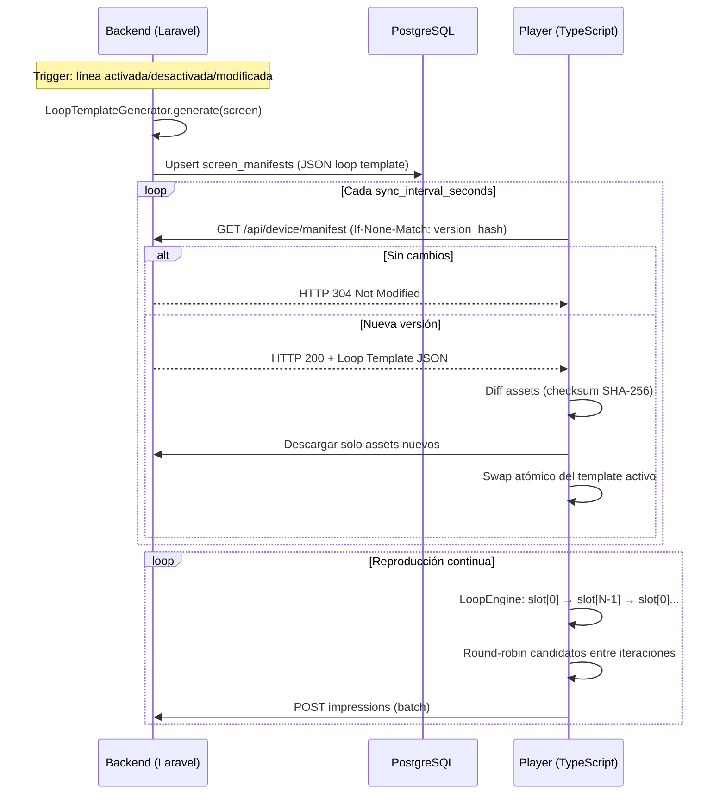
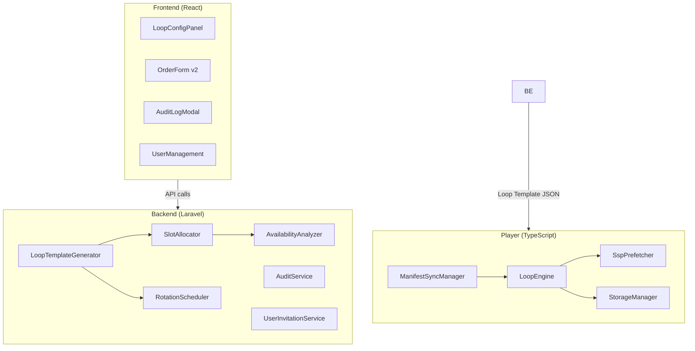
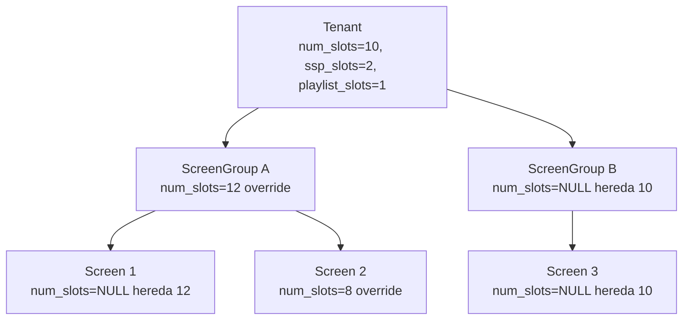

# Documento de Diseño — Loop Template (Ad Manager v3)

## Overview

### Resumen del Cambio Arquitectónico

Este diseño describe la migración del sistema ProDooh desde un **manifiesto plano** (5.760 posiciones pre-calculadas por día) hacia un modelo de **Loop Template** estándar de la industria DOOH. En el nuevo modelo:

- Un **loop** es un ciclo de duración fija (e.g., 10 slots × 10s = 100s) que se repite ~576 veces/día.
- El **backend** genera una plantilla (Loop Template) que define la composición del loop.
- El **player** reproduce el loop de forma autónoma, rotando candidatos localmente via round-robin.
- El player consulta al backend periódicamente solo para detectar cambios de versión (hash SHA-256).

### Tabla de Decisiones Clave

| Decisión | Opción elegida | Justificación |
|----------|---------------|---------------|
| Formato de template | JSON con slots array | Simple, versionable via SHA-256, compatible con el esquema actual de `screen_manifests` |
| Estrategia de rotación | Round-robin local en player | Reduce carga del backend; el player no necesita reconexión para rotar creativos |
| Detección de cambios | Hash SHA-256 del template | Permite HTTP 304, sin timestamp comparison |
| Herencia de num_slots | Screen → ScreenGroup → Tenant → 10 | Consistente con la jerarquía existente de `duration_seconds` |
| Slots fijos por tipo | Rangos predecibles (ad → ssp → playlist) | Simplifica lógica del player y debugging |
| Ratio ASAP:Uniform | 1:2 (≤10 creativos) / 1:3 (>10) | Balance entre urgencia de entrega y equidad |
| Pace forzado por tier | Patrocinio/Red_Interna = uniform | Modelo de negocio: patrocinio es garantizado, red_interna es relleno |


## Architecture

### Flujo General: Backend genera → Player consume



### Diagrama de Componentes




### Jerarquía de Herencia de Configuración



## Components and Interfaces

### Backend: LoopTemplateGenerator (Reemplaza ManifestGenerator)

Servicio principal que orquesta la generación del Loop Template para una pantalla.

```php
<?php

namespace App\Services;

use App\Models\Screen;
use App\Models\ScreenManifest;

interface LoopTemplateGeneratorInterface
{
    /**
     * Genera el Loop Template completo para una pantalla.
     * Resuelve num_slots por herencia, ejecuta SlotAllocator,
     * aplica RotationScheduler, y persiste en screen_manifests.
     */
    public function generate(Screen $screen): ScreenManifest;

    /**
     * Regenera templates para todas las pantallas afectadas por un cambio.
     * Debe completar en < 30 segundos.
     */
    public function regenerateAffected(array $screenIds): void;

    /**
     * Resuelve num_slots efectivo por herencia: Screen → ScreenGroup → Tenant → 10.
     */
    public function resolveNumSlots(Screen $screen): int;
}
```


### Backend: SlotAllocator

Asigna líneas de orden a ad_slots según la jerarquía de prioridades.

```php
<?php

namespace App\Services;

use Illuminate\Support\Collection;

interface SlotAllocatorInterface
{
    /**
     * Asigna líneas a ad_slots siguiendo waterfall: Patrocinio > Estandar ASAP > Estandar Uniform > Red_Interna.
     *
     * @param Collection $activeLines Líneas activas para esta pantalla
     * @param int $adSlots Número de ad_slots disponibles
     * @param int $loopsPerDay Iteraciones del loop por día (para calcular frequency)
     * @return array<int, SlotAssignment> Mapa posición → asignación
     */
    public function allocate(Collection $activeLines, int $adSlots, int $loopsPerDay): array;

    /**
     * Valida que las líneas de Patrocinio no excedan ad_slots.
     * Retorna null si OK, o un mensaje de error si hay exceso.
     */
    public function validatePatrocinioCapacity(Collection $patrocinioLines, int $adSlots): ?string;
}

/**
 * Value Object que representa la asignación de un slot.
 */
class SlotAssignment
{
    public function __construct(
        public readonly int $position,
        public readonly string $type,        // 'ad' | 'ssp' | 'playlist'
        public readonly string $strategy,    // 'fixed' | 'round_robin'
        public readonly array $candidates,   // Lista ordenada de candidatos
    ) {}
}
```

### Backend: RotationScheduler

Determina el orden de rotación round-robin y el ratio ASAP:Uniform entre iteraciones.

```php
<?php

namespace App\Services;

use Illuminate\Support\Collection;

interface RotationSchedulerInterface
{
    /**
     * Calcula las frecuencias de rotación para candidatos de un slot compartido.
     * Aplica ratio ASAP:Uniform según cantidad de creativos activos:
     * - ≤10 creativos: 1 ASAP cada 2 Uniform
     * - >10 creativos: 1 ASAP cada 3 Uniform
     *
     * @param Collection $candidates Líneas que comparten el slot
     * @param int $totalActiveCreatives Total de creativos activos en la pantalla
     * @return array<array{order_line_id: string, frequency: string}>
     */
    public function calculateRotation(Collection $candidates, int $totalActiveCreatives): array;

    /**
     * Distribuye líneas Red_Interna proporcionalmente al share_weight.
     */
    public function distributeByWeight(Collection $redInternaLines, int $availableSlots): array;
}
```


### Backend: AvailabilityAnalyzer

Calcula disponibilidad de inventario al momento de activación de una línea.

```php
<?php

namespace App\Services;

use App\Models\OrderLine;

interface AvailabilityAnalyzerInterface
{
    /**
     * Analiza si el target_spots de la línea es alcanzable dado el inventario actual.
     *
     * @return AvailabilityResult
     */
    public function analyze(OrderLine $line): AvailabilityResult;
}

class AvailabilityResult
{
    public function __construct(
        public readonly bool $isSufficient,
        public readonly int $targetSpots,
        public readonly int $availableCapacity,
        public readonly float $saturationPercent,
        public readonly ?string $warningMessage,
    ) {}
}
```

### Backend: AuditService

Registra cambios sobre entidades del sistema usando estructura polimórfica.

```php
<?php

namespace App\Services;

use Illuminate\Database\Eloquent\Model;

interface AuditServiceInterface
{
    /**
     * Registra un evento de auditoría.
     *
     * @param Model $auditable Entidad afectada (polimórfica)
     * @param string $eventType Tipo: created|field_modified|status_changed|creative_added|creative_removed|spots_modified|name_changed|target_added|target_removed
     * @param array|null $diff ['old_value' => mixed, 'new_value' => mixed, 'field' => string]
     * @param string|null $userId ID del usuario que realiza el cambio
     */
    public function log(Model $auditable, string $eventType, ?array $diff = null, ?string $userId = null): void;
}
```

### Backend: UserInvitationService

Gestiona invitaciones y restablecimiento de contraseña.

```php
<?php

namespace App\Services;

interface UserInvitationServiceInterface
{
    /**
     * Envía invitación por email via Resend. Token válido 48h.
     */
    public function invite(string $email, string $role, string $tenantId): void;

    /**
     * Completa el registro con token válido.
     * @throws \App\Exceptions\InvitationExpiredException
     */
    public function completeRegistration(string $token, string $password): void;

    /**
     * Inicia flujo de reset de contraseña. Enlace válido 1h.
     */
    public function requestPasswordReset(string $email): void;

    /**
     * Completa el reset de contraseña.
     * @throws \App\Exceptions\ResetTokenExpiredException
     */
    public function resetPassword(string $token, string $newPassword): void;
}
```


### Player: LoopEngine (Reemplaza ManifestEngine lineal)

El LoopEngine reproduce el template en ciclo continuo, rotando candidatos localmente.

```typescript
/**
 * LoopEngine — Reproduce un Loop Template en ciclo continuo.
 *
 * Diferencias con ManifestEngine anterior:
 * - No recibe una secuencia lineal de 5.760 items
 * - Recibe N slots (típicamente 10) con candidatos por slot
 * - Rota candidatos localmente usando round-robin entre iteraciones
 * - El loop se repite indefinidamente: slot[0]→slot[N-1]→slot[0]...
 * - Soporta swap atómico cuando llega nueva versión del template
 */

export interface LoopSlot {
  position: number;
  type: 'ad' | 'ssp' | 'playlist';
  strategy: 'fixed' | 'round_robin';
  candidates: SlotCandidate[];
  /** Solo para SSP */
  provider?: string;
  config?: SspConfig;
}

export interface SlotCandidate {
  order_line_id?: string;
  creative_id?: string;
  playlist_item_id?: string;
  asset_url: string;
  checksum_sha256: string;
  frequency?: string; // e.g., "1/2", "1/3"
}

export interface SspConfig {
  api_key: string;
  network_id: string;
  venue_id: string;
}

export interface LoopTemplate {
  version: string;
  generated_at: string;
  loop_config: {
    num_slots: number;
    slot_duration_seconds: number;
    loop_duration_seconds: number;
    loops_per_day: number;
  };
  slots: LoopSlot[];
  sync_interval_seconds: number;
  cache_flush_interval_hours: number;
}

export interface LoopEngineOptions {
  template: LoopTemplate;
  onSlotStart?: (slot: LoopSlot, candidate: SlotCandidate, iteration: number) => void;
  onSlotComplete?: (slot: LoopSlot, candidate: SlotCandidate, result: 'success' | 'failed') => void;
  sspPrefetcher?: SspPrefetcher;
  playbackFn?: (candidate: SlotCandidate, durationMs: number) => Promise<'success' | 'failed'>;
}

export class LoopEngine {
  private template: LoopTemplate;
  private iteration: number = 0;
  private currentSlotIndex: number = 0;
  private running: boolean = false;
  private pendingTemplate: LoopTemplate | null = null;
  /** Tracks round-robin offset per slot position */
  private rotationOffsets: Map<number, number> = new Map();

  constructor(options: LoopEngineOptions) { /* ... */ }

  /** Inicia el loop continuo */
  async run(): Promise<void> { /* ... */ }

  /** Detiene el loop tras el slot actual */
  stop(): void { /* ... */ }

  /** Swap atómico: nueva template se aplica al inicio del siguiente loop */
  updateTemplate(newTemplate: LoopTemplate): void { /* ... */ }

  /**
   * Selecciona el candidato para un slot en la iteración actual.
   * - strategy: 'fixed' → siempre candidates[0]
   * - strategy: 'round_robin' → offset basado en iteration y frequency
   */
  private selectCandidate(slot: LoopSlot): SlotCandidate { /* ... */ }
}
```


### Player: SspPrefetcher (Ajuste para slots)

El SspPrefetcher existente se mantiene, pero se ajusta el timing para slot-based playback.

```typescript
/**
 * SspPrefetcher — Pre-carga contenido SSP antes de que el slot SSP se reproduzca.
 *
 * Cambio: en vez de prefetch 3s antes del final del item anterior,
 * ahora prefetch al inicio del slot anterior (tiene slot_duration_seconds completos).
 */
export interface SspPrefetcher {
  /** Inicia pre-carga del contenido SSP. Llama a ProDoohSource.prefetch(). */
  prefetch(durationSeconds: number): Promise<void>;
  /** Retorna true si hay contenido SSP listo para reproducir */
  isReady(): boolean;
  /** Retorna el contenido pre-cargado */
  getContent(): { assetUrl: string; durationSeconds: number; printId: string } | null;
  /** Limpia el contenido después de reproducirlo */
  cleanup(): void;
}
```

## Data Models

### Migraciones de Base de Datos

#### 1. Modificar tabla `tenants` — Agregar configuración de loop

```php
Schema::table('tenants', function (Blueprint $table) {
    $table->unsignedSmallInteger('num_slots')->default(10);
    $table->unsignedSmallInteger('ssp_slots')->default(2);
    $table->unsignedSmallInteger('playlist_slots')->default(1);
    $table->unsignedSmallInteger('sync_interval_seconds')->default(240);
    $table->unsignedSmallInteger('cache_flush_interval_hours')->default(24);
});
```

#### 2. Modificar tabla `screen_groups` — Override de num_slots

```php
Schema::table('screen_groups', function (Blueprint $table) {
    $table->unsignedSmallInteger('num_slots')->nullable();
});
```

#### 3. Modificar tabla `screens` — Override de num_slots

```php
Schema::table('screens', function (Blueprint $table) {
    $table->unsignedSmallInteger('num_slots')->nullable();
});
```

#### 4. Modificar tabla `order_lines` — Slots purchased

```php
Schema::table('order_lines', function (Blueprint $table) {
    $table->unsignedSmallInteger('slots_purchased')->nullable();
    $table->boolean('by_slot')->default(false);
});
```


#### 5. Modificar tabla `orders` — Eliminar columnas de fecha

```php
Schema::table('orders', function (Blueprint $table) {
    $table->dropColumn(['starts_at', 'ends_at']);
});
```

#### 6. Modificar tabla `users` — Agregar is_active y rol trafficker

```php
Schema::table('users', function (Blueprint $table) {
    $table->boolean('is_active')->default(true);
    // El campo 'role' ya existe como string; se actualiza el enum check constraint
    // para incluir 'trafficker': super_admin | tenant_admin | trafficker
});
```

#### 7. Nueva tabla: `audit_logs`

```php
Schema::create('audit_logs', function (Blueprint $table) {
    $table->uuid('id')->primary();
    $table->string('auditable_type');    // App\Models\Order, App\Models\OrderLine, etc.
    $table->uuid('auditable_id');
    $table->uuid('user_id')->nullable();
    $table->string('event_type');        // created, field_modified, status_changed, etc.
    $table->jsonb('diff')->nullable();   // {field, old_value, new_value}
    $table->timestamp('created_at');

    $table->index(['auditable_type', 'auditable_id']);
    $table->index('user_id');
    $table->index('created_at');

    $table->foreign('user_id')->references('id')->on('users')->nullOnDelete();
});
```

#### 8. Nueva tabla: `user_invitations`

```php
Schema::create('user_invitations', function (Blueprint $table) {
    $table->uuid('id')->primary();
    $table->uuid('tenant_id');
    $table->string('email');
    $table->string('role');              // tenant_admin | trafficker
    $table->string('token', 64)->unique();
    $table->timestamp('expires_at');
    $table->timestamp('accepted_at')->nullable();
    $table->timestamp('created_at');

    $table->foreign('tenant_id')->references('id')->on('tenants')->cascadeOnDelete();
});
```

#### 9. Nueva tabla: `password_resets`

```php
Schema::create('password_resets', function (Blueprint $table) {
    $table->uuid('id')->primary();
    $table->uuid('user_id');
    $table->string('token', 64)->unique();
    $table->timestamp('expires_at');
    $table->timestamp('used_at')->nullable();
    $table->timestamp('created_at');

    $table->foreign('user_id')->references('id')->on('users')->cascadeOnDelete();
});
```


### Formato JSON del Loop Template (screen_manifests.items)

```json
{
  "version": "sha256:a1b2c3d4e5f6...",
  "generated_at": "2025-01-15T10:30:00Z",
  "loop_config": {
    "num_slots": 10,
    "slot_duration_seconds": 10,
    "loop_duration_seconds": 100,
    "loops_per_day": 576
  },
  "slots": [
    {
      "position": 0,
      "type": "ad",
      "strategy": "fixed",
      "candidates": [
        {
          "order_line_id": "uuid-patrocinio-1",
          "creative_id": "uuid-creative-1",
          "asset_url": "/api/device/content/uuid/file",
          "checksum_sha256": "abc123..."
        }
      ]
    },
    {
      "position": 1,
      "type": "ad",
      "strategy": "round_robin",
      "candidates": [
        {
          "order_line_id": "uuid-estandar-A",
          "creative_id": "uuid-creative-A",
          "asset_url": "/api/device/content/uuid-A/file",
          "checksum_sha256": "def456...",
          "frequency": "1/2"
        },
        {
          "order_line_id": "uuid-estandar-B",
          "creative_id": "uuid-creative-B",
          "asset_url": "/api/device/content/uuid-B/file",
          "checksum_sha256": "ghi789...",
          "frequency": "1/2"
        }
      ]
    },
    {
      "position": 7,
      "type": "ssp",
      "strategy": "fixed",
      "provider": "prodooh",
      "config": {
        "api_key": "encrypted-ref",
        "network_id": "net-123",
        "venue_id": "venue-456"
      },
      "candidates": []
    },
    {
      "position": 8,
      "type": "ssp",
      "strategy": "fixed",
      "provider": "prodooh",
      "config": {
        "api_key": "encrypted-ref",
        "network_id": "net-123",
        "venue_id": "venue-456"
      },
      "candidates": []
    },
    {
      "position": 9,
      "type": "playlist",
      "strategy": "round_robin",
      "candidates": [
        {
          "playlist_item_id": "uuid-pl-1",
          "asset_url": "/api/device/content/uuid-pl-1/file",
          "checksum_sha256": "jkl012..."
        },
        {
          "playlist_item_id": "uuid-pl-2",
          "asset_url": "/api/device/content/uuid-pl-2/file",
          "checksum_sha256": "mno345..."
        }
      ]
    }
  ],
  "sync_interval_seconds": 240,
  "cache_flush_interval_hours": 24
}
```


### Distribución de Posiciones dentro del Loop

Los slots se organizan en rangos predecibles:

| Rango | Tipo | Ejemplo (num_slots=10, ssp=2, playlist=1) |
|-------|------|------------------------------------------|
| 0 .. ad_slots-1 | ad | Posiciones 0-6 (7 ad_slots) |
| ad_slots .. ad_slots+ssp_slots-1 | ssp | Posiciones 7-8 |
| ad_slots+ssp_slots .. num_slots-1 | playlist | Posición 9 |

## API Changes

### Endpoints Nuevos

| Método | Path | Descripción |
|--------|------|-------------|
| PUT | `/api/admin/tenants/{id}/loop-config` | Configurar num_slots, ssp_slots, playlist_slots |
| PUT | `/api/admin/tenants/{id}/network-settings` | Configurar sync_interval, cache_flush |
| POST | `/api/admin/tenants/{id}/loop-config/propagate` | Propagar num_slots a descendientes |
| GET | `/api/admin/order-lines/{id}/availability` | Calcular disponibilidad antes de activar |
| GET | `/api/admin/{auditableType}/{id}/audit-logs` | Obtener historial de auditoría |
| POST | `/api/admin/users/invite` | Enviar invitación por email |
| POST | `/api/auth/register` | Completar registro con token |
| POST | `/api/auth/forgot-password` | Solicitar reset de contraseña |
| POST | `/api/auth/reset-password` | Completar reset de contraseña |

### Endpoints Modificados

| Método | Path | Cambio |
|--------|------|--------|
| POST | `/api/admin/orders` | Elimina starts_at, ends_at del body |
| GET | `/api/admin/orders/{id}` | starts_at/ends_at calculados dinámicamente |
| PUT | `/api/admin/order-lines/{id}` | Acepta slots_purchased, by_slot para patrocinio |
| PATCH | `/api/admin/order-lines/{id}/activate` | Ejecuta AvailabilityAnalyzer antes |
| GET | `/api/device/manifest` | Retorna Loop Template JSON (nuevo formato) |

### Contratos TypeScript (contracts/)

```typescript
// contracts/src/loop-template.ts

export interface LoopTemplateResponse {
  version: string;
  generated_at: string;
  loop_config: LoopConfig;
  slots: LoopSlotContract[];
  sync_interval_seconds: number;
  cache_flush_interval_hours: number;
}

export interface LoopConfig {
  num_slots: number;
  slot_duration_seconds: number;
  loop_duration_seconds: number;
  loops_per_day: number;
}

export interface LoopSlotContract {
  position: number;
  type: 'ad' | 'ssp' | 'playlist';
  strategy: 'fixed' | 'round_robin';
  candidates: CandidateContract[];
  provider?: string;
  config?: Record<string, string>;
}

export interface CandidateContract {
  order_line_id?: string;
  creative_id?: string;
  playlist_item_id?: string;
  asset_url: string;
  checksum_sha256: string;
  frequency?: string;
}
```


## Correctness Properties

*Una propiedad es una característica o comportamiento que debe cumplirse en todas las ejecuciones válidas de un sistema — esencialmente, una declaración formal sobre lo que el sistema debe hacer. Las propiedades sirven como puente entre especificaciones legibles por humanos y garantías de corrección verificables por máquinas.*

### Property 1: Validación de rango en campos de configuración de loop

*For any* campo de configuración numérica (num_slots, ssp_slots, playlist_slots, sync_interval_seconds, cache_flush_interval_hours) y *for any* valor entero, el backend debe aceptar el valor si y solo si está dentro del rango permitido para ese campo (num_slots: [1,100], ssp_slots: [0, num_slots], playlist_slots: [0, num_slots], sync_interval_seconds: [30,900], cache_flush_interval_hours: [1,720]).

**Validates: Requirements 1.1, 1.2, 1.3, 8.1, 8.2**

### Property 2: Invariante de ad_slots y restricción mínima

*For any* configuración válida de loop (num_slots, ssp_slots, playlist_slots), ad_slots debe ser exactamente igual a num_slots - ssp_slots - playlist_slots, y la configuración debe ser rechazada si ad_slots resulta menor que 1.

**Validates: Requirements 1.4, 1.5**

### Property 3: Herencia de num_slots por jerarquía

*For any* pantalla en el sistema, el num_slots efectivo debe resolverse siguiendo la cadena: valor explícito de Screen (si no es null) → valor explícito de ScreenGroup padre (si no es null) → valor del Tenant → 10 (default global).

**Validates: Requirements 1.6**

### Property 4: Propagación selectiva de num_slots

*For any* operación "Aplicar a todos" de num_slots en un Tenant, solo los ScreenGroups y Screens que NO tienen un override explícito deben ser actualizados al nuevo valor; los que tienen override deben mantener su valor original.

**Validates: Requirements 1.8**

### Property 5: Invariante estructural del Loop Template

*For any* Loop Template generado para una pantalla, el template debe contener exactamente num_slots (resuelto por herencia) posiciones, donde las posiciones [0..ad_slots-1] son de tipo "ad", las posiciones [ad_slots..ad_slots+ssp_slots-1] son de tipo "ssp", y las posiciones [ad_slots+ssp_slots..num_slots-1] son de tipo "playlist". Cada slot debe tener: tipo, posición ordinal, al menos un candidato (excepto ssp que puede tener 0), y estrategia de rotación.

**Validates: Requirements 2.1, 2.8, 2.12**


### Property 6: Asignación waterfall con prioridad estricta

*For any* conjunto de líneas activas de diferentes tiers para una pantalla, el SlotAllocator debe asignar slots siguiendo estrictamente: Patrocinio primero (con slots_purchased posiciones fijas garantizadas), luego Estandar, luego Red_Interna. Si la suma de slots_purchased de Patrocinio excede ad_slots, la última activación debe ser rechazada. Si Patrocinio + Estandar llenan todos los ad_slots, Red_Interna no debe aparecer.

**Validates: Requirements 2.2, 2.3, 2.4, 2.9**

### Property 7: Round-robin cuando hay sobre-suscripción de un tier

*For any* situación donde el número de líneas activas de un mismo tier excede los ad_slots restantes para ese tier, el template debe asignar múltiples candidatos al mismo slot con estrategia "round_robin", y la lista de candidatos debe incluir todas las líneas del tier que comparten ese slot.

**Validates: Requirements 2.5**

### Property 8: Ratio de rotación ASAP:Uniform

*For any* pantalla con líneas Estandar ASAP y Uniform activas simultáneamente: si el total de creativos activos es ≤10, la frecuencia ASAP debe ser 1 cada 2 Uniform; si >10, debe ser 1 cada 3 Uniform. Si solo existen líneas ASAP (sin Uniform), deben distribuirse por share_weight sin aplicar ratio.

**Validates: Requirements 2.6, 2.7, 2.15**

### Property 9: Distribución proporcional de Red_Interna por share_weight

*For any* conjunto de líneas Red_Interna asignadas a slots restantes, el número de apariciones de cada línea debe ser proporcional a su share_weight relativo al total de weights del grupo.

**Validates: Requirements 2.10**

### Property 10: Integridad del hash de versión

*For any* Loop Template generado, el campo version debe ser exactamente el hash SHA-256 del contenido serializado del template (excluyendo el propio campo version). Si el contenido del template no cambia, el hash no debe cambiar; si cambia cualquier dato, el hash debe ser diferente.

**Validates: Requirements 2.13**

### Property 11: Pace forzado por tier

*For any* OrderLine, si priority_tier es "patrocinio" o "red_interna", el delivery_pace almacenado debe ser "uniform" independientemente del valor enviado. Si priority_tier es "estandar", el delivery_pace almacenado debe ser el valor enviado por el usuario (asap o uniform).

**Validates: Requirements 3.1, 3.2, 3.3**

### Property 12: Cálculo de target_spots por slot

*For any* OrderLine de Patrocinio con by_slot=true y slots_purchased=N, el target_spots debe ser exactamente N × loops_per_day, donde loops_per_day = ventana_operativa_segundos / (num_slots × slot_duration_seconds).

**Validates: Requirements 4.3**


### Property 13: Fechas de orden derivadas de líneas

*For any* orden con al menos una OrderLine, starts_at debe ser igual al MIN(starts_at) de todas sus OrderLines, y ends_at debe ser igual al MAX(ends_at) de todas sus OrderLines. Para órdenes sin líneas, ambas fechas deben ser null.

**Validates: Requirements 5.2**

### Property 14: Rechazo de activación sin creative

*For any* orden que no tiene al menos 1 OrderLine con al menos 1 Creative asignado, el intento de activación debe ser rechazado con un error descriptivo.

**Validates: Requirements 5.6**

### Property 15: Cálculo de disponibilidad de inventario

*For any* OrderLine al momento de activación, la disponibilidad calculada debe comparar correctamente: target_spots de la línea contra (loops_per_day × slots asignables) considerando las demás líneas activas en las mismas pantallas. El resultado debe indicar isSufficient=true si y solo si target_spots ≤ capacidad disponible.

**Validates: Requirements 6.1**

### Property 16: Descarga diferencial de assets por checksum

*For any* par de Loop Templates (anterior y nuevo) para una misma pantalla, el player debe descargar únicamente los assets cuyo checksum_sha256 en el nuevo template no coincide con ningún asset almacenado localmente. Assets con checksum idéntico no deben descargarse.

**Validates: Requirements 7.4**

### Property 17: Protección de assets activos contra limpieza LRU

*For any* asset incluido en el Loop Template activo de una pantalla, ese asset debe estar protegido de la limpieza LRU independientemente de su antigüedad o tiempo desde último acceso.

**Validates: Requirements 7.7**

### Property 18: Rotación round-robin secuencial en el player

*For any* slot con N candidatos y estrategia "round_robin", el player debe reproducir el candidato en posición (iteration_count mod N) en cada iteración del loop, avanzando secuencialmente sin repetir hasta completar el ciclo.

**Validates: Requirements 7.12**

### Property 19: Matriz de permisos por rol y tenant

*For any* combinación de (usuario, recurso, acción), el acceso debe ser otorgado si y solo si: (a) el usuario es super_admin, o (b) el usuario es tenant_admin y el recurso pertenece a su tenant, o (c) el usuario es trafficker, el recurso pertenece a su tenant, y la acción es CRUD sobre órdenes/líneas/creativos (excluyendo activación, configuración y gestión de usuarios).

**Validates: Requirements 9.1, 10.5, 12.2**

### Property 20: Completitud del registro de auditoría

*For any* cambio sobre una entidad auditable (Order, OrderLine, Creative), el sistema debe crear un audit_log con: auditable_type y auditable_id correctos (polimórfico), user_id del usuario que realizó el cambio, created_at con timestamp válido, y para eventos field_modified un diff con old_value y new_value del campo modificado que refleje correctamente los valores antes y después del cambio.

**Validates: Requirements 11.1, 11.3, 11.6**


## Error Handling

### Backend (Laravel)

| Escenario | HTTP Code | Respuesta |
|-----------|-----------|-----------|
| Validación de rango en config | 422 | `{ errors: { field: ["message"] } }` |
| ssp_slots + playlist_slots ≥ num_slots | 422 | `{ errors: { num_slots: ["Debe quedar al menos 1 ad_slot"] } }` |
| Patrocinio excede ad_slots | 422 | `{ errors: { slots_purchased: ["Insuficientes ad_slots: se necesitan N pero solo hay M disponibles"] } }` |
| Activación sin creative | 422 | `{ errors: { status: ["La orden debe tener al menos 1 línea con creative asignado"] } }` |
| Token de invitación expirado | 422 | `{ errors: { token: ["La invitación ha expirado"] } }` |
| Token de reset expirado | 422 | `{ errors: { token: ["El enlace de restablecimiento ha expirado"] } }` |
| Permiso denegado (rol) | 403 | `{ message: "No tiene permisos para esta acción" }` |
| Recurso de otro tenant | 403 | `{ message: "Acceso denegado" }` |
| Regeneración > 30s | — | Log warning + retry con queue |

### Player (TypeScript)

| Escenario | Comportamiento |
|-----------|---------------|
| Backend inaccesible (sync) | Continuar con template local, reintentar en próximo ciclo |
| Descarga de asset falla | Mantener template anterior, reintentar en próximo sync |
| Checksum de asset no coincide post-descarga | Descartar archivo, mantener template anterior |
| SSP no-fill o timeout | Reproducir primer playlist_item como fallback |
| Template vacío recibido | Mostrar pantalla en estado idle (logo/screensaver) |
| JSON malformado del backend | Ignorar respuesta, mantener template actual, log error |

### Frontend (React)

| Escenario | Comportamiento |
|-----------|---------------|
| Error 422 (validación) | Mostrar mensajes de error junto a los campos del formulario |
| Error 403 (permiso) | Mostrar toast de error "No tiene permisos" |
| Error 5xx | Mostrar toast genérico "Error del servidor, intente nuevamente" |
| Disponibilidad insuficiente | Modal informativo con opciones "Estoy de acuerdo" / "Modificar" |
| Network error | Toast con opción de retry |


## Testing Strategy

### Enfoque Dual: Property-Based Testing + Unit Tests + Integration Tests

Este feature combina lógica algorítmica compleja (asignación de slots, rotación, herencia) con integración de sistemas (API, player sync, DB). Usamos PBT para la lógica pura y tests de ejemplo/integración para el resto.

### Property-Based Testing (PBT)

**Librería**: 
- Backend (PHP): `spatie/pest-plugin-faker` + custom generators con Pest
- Player (TypeScript): `fast-check` con Vitest

**Configuración**: Mínimo 100 iteraciones por propiedad.

**Tag format**: `Feature: 12-simil-ad-manager, Property {N}: {título}`

#### Propiedades a implementar como PBT:

| Property | Servicio bajo test | Generadores necesarios |
|----------|-------------------|----------------------|
| 1: Validación de rango | LoopConfigValidator | Enteros random [-1000, 1000] |
| 2: ad_slots invariante | LoopConfigValidator | Triples (num, ssp, playlist) |
| 3: Herencia num_slots | resolveNumSlots() | Hierarchies con nullable fields |
| 5: Estructura del template | LoopTemplateGenerator | Screen configs variados |
| 6: Waterfall allocation | SlotAllocator | Conjuntos de OrderLines multi-tier |
| 7: Round-robin over-sub | SlotAllocator | Líneas > slots scenarios |
| 8: Ratio ASAP:Uniform | RotationScheduler | Líneas ASAP+Uniform con totals variables |
| 9: Red_Interna weight | RotationScheduler | Líneas con share_weights random |
| 10: Hash integridad | computeVersion() | Templates con contenido variable |
| 11: Pace por tier | OrderLine store logic | (tier, pace) pairs |
| 12: target_spots calc | Patrocinio calculator | (N, loop_config) pairs |
| 13: Fechas derivadas | Order accessor | Orders con múltiples lines con fechas |
| 18: Round-robin player | LoopEngine.selectCandidate | Slots con N candidatos, M iteraciones |
| 19: Permisos | Authorization middleware | (role, tenant, resource, action) tuples |

### Unit Tests (Ejemplo-based)

- Activación rechazada sin creative (Req 5.6)
- Modal de disponibilidad insuficiente (Req 6.2)
- HTTP 304 no reinicia posición del player (Req 7.2)
- Fallback a playlist cuando SSP falla (Req 7.9)
- Token expirado rechazado (Req 10.2)
- Badges de color por tipo de evento (Req 11.5)
- Frontend oculta secciones para trafficker (Req 9.5)

### Integration Tests

- Regeneración de templates completa en < 30s (Req 2.11)
- Flujo completo de invitación → registro → login
- Sync player con backend real: poll → detect change → download diff
- Flujo de activación con modal de disponibilidad end-to-end
- Propagación de num_slots con "Aplicar a todos" a través de la jerarquía

### Cobertura por Capa

| Capa | Tipo de test | Herramienta |
|------|-------------|-------------|
| Backend Services (PHP) | PBT + Unit | Pest + custom generators |
| Backend API (PHP) | Integration | Pest + RefreshDatabase |
| Frontend Components (TSX) | Unit | Vitest + Testing Library |
| Frontend Hooks (TS) | Unit | Vitest + MSW |
| Player Engine (TS) | PBT + Unit | Vitest + fast-check |
| Player Sync (TS) | Integration | Vitest + mock server |

