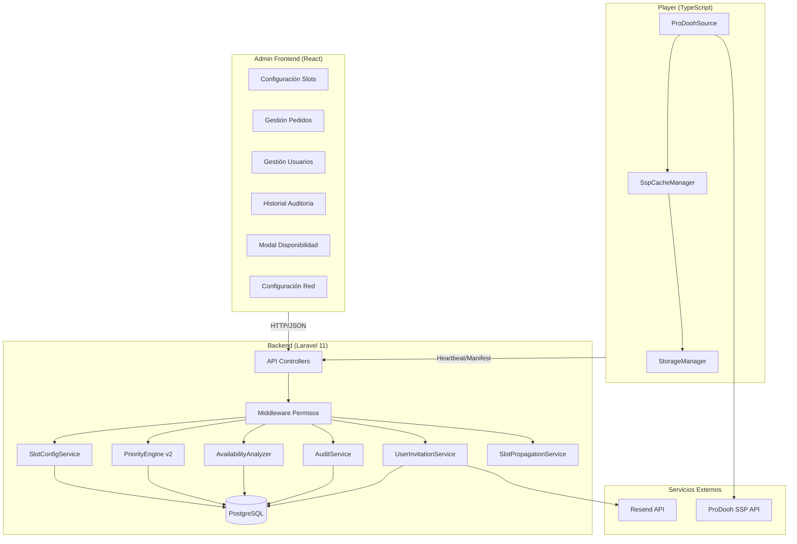
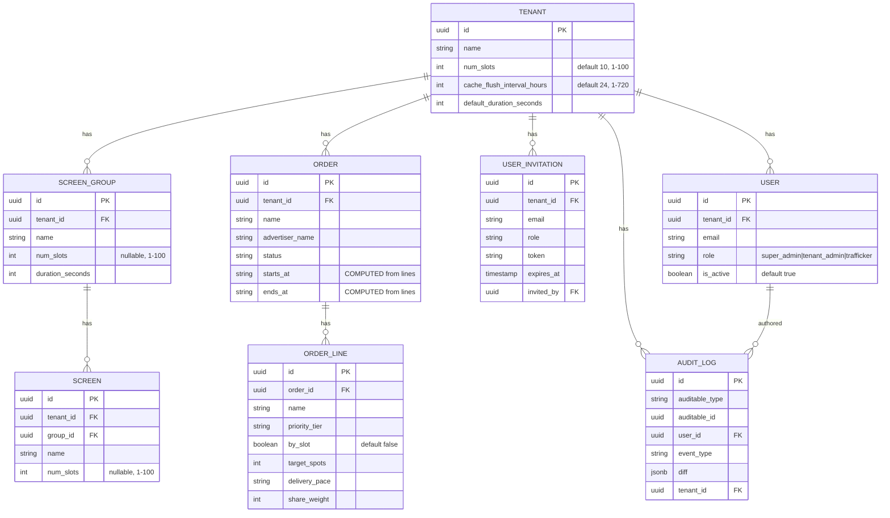

# Design Document — Simil Ad Manager

## Overview

Este documento detalla el diseño técnico del feature "Simil Ad Manager", un conjunto de capacidades avanzadas de gestión publicitaria para la plataforma Prodooh Hybrid Ad Player. El feature abarca:

1. **Configuración de Slots** — División del inventario diario por slots con herencia Tenant→ScreenGroup→Screen
2. **Waterfall mejorado** — Reglas de inserción ASAP:uniform con ratio dinámico según creativos activos
3. **Modo "por Slot"** — Cálculo automático de target_spots para líneas de patrocinio
4. **Fechas dinámicas de Order** — Eliminación de fechas manuales, cálculo desde OrderLines
5. **Alerta de disponibilidad** — Análisis de conflictos al activar OrderLines
6. **Rol Trafficker** — Nuevo rol con permisos limitados
7. **Gestión de Usuarios** — Invitaciones vía email con Resend
8. **Auditoría** — Bitácora de cambios en Orders/OrderLines
9. **Configuración de Red** — Parámetros globales de Tenant incluyendo caché
10. **Caché SSP en Player** — Almacenamiento local de creativos SSP con política LRU

### Decisiones de Diseño Clave

| Decisión | Justificación |
|----------|---------------|
| `num_slots` como campo entero (no entidad) | Simplicidad; un slot no requiere identidad propia |
| Herencia Tenant→Group→Screen para `num_slots` | Consistente con patrón existente de `duration_seconds` y `schedule` |
| Fechas de Order calculadas (no almacenadas) | Elimina inconsistencia y mantenimiento manual |
| Audit logs con relación polimórfica | Flexibilidad para auditar más entidades en el futuro |
| Caché SSP con URL completa como key | Evita colisiones por query parameters de tracking |
| Ratio ASAP:uniform dinámico | Adapta la frecuencia de inserción al volumen de creativos |

---

## Architecture

### Diagrama de Arquitectura General



### Capas Modificadas

| Capa | Componentes Afectados | Tipo de Cambio |
|------|----------------------|----------------|
| Database | tenants, screen_groups, screens, orders, users, audit_logs (new), user_invitations (new) | Schema changes |
| Backend Services | PriorityEngine, ManifestGenerator, nuevos services | Logic changes + new |
| API Controllers | OrderController, OrderLineController, TenantController, nuevos controllers | New endpoints + modifications |
| Middleware | Nuevo RoleMiddleware actualizado | Permission enforcement |
| Frontend | Orders, Screens, Groups, Users (new), Audit (new) | New features + modifications |
| Player | ProDoohSource, nuevo SspCacheManager | New caching layer |

---

## Components and Interfaces

### 1. Backend — Nuevos Services

#### SlotConfigService

Responsable de resolver el `num_slots` efectivo para cualquier pantalla y calcular la capacidad por slot.

```php
interface SlotConfigServiceInterface
{
    /** Resuelve num_slots efectivo: Screen → ScreenGroup → Tenant → 10 */
    public function resolveEffectiveNumSlots(Screen $screen): int;

    /** Calcula spots por slot: floor(totalDailySpots / numSlots) */
    public function calculateSlotCapacity(Screen $screen): int;

    /** Calcula target_spots "por slot" para una línea en una pantalla específica */
    public function calculatePerSlotTargetSpots(Screen $screen): int;
}
```

#### SlotPropagationService

Maneja la propagación "Aplicar a Todos" de forma atómica.

```php
interface SlotPropagationServiceInterface
{
    /** Propaga num_slots desde Tenant a todos los ScreenGroups y Screens */
    public function propagateFromTenant(Tenant $tenant): PropagationResult;

    /** Propaga num_slots desde ScreenGroup a todas sus Screens */
    public function propagateFromGroup(ScreenGroup $group): PropagationResult;

    /** Cuenta entidades con overrides que serían sobreescritas */
    public function countOverrides(Tenant|ScreenGroup $entity): int;
}
```

#### AvailabilityAnalyzer

Analiza conflictos de disponibilidad al activar una OrderLine.

```php
interface AvailabilityAnalyzerInterface
{
    /**
     * Analiza disponibilidad para una OrderLine que se va a activar.
     * Retorna array de conflictos por pantalla/día.
     */
    public function analyze(OrderLine $line): AvailabilityReport;
}
```

#### AuditService

Registra eventos de auditoría con diff old/new.

```php
interface AuditServiceInterface
{
    /** Registra un evento de creación */
    public function logCreated(Model $entity, ?string $userId): void;

    /** Registra un evento de modificación (detecta campos cambiados) */
    public function logModified(Model $entity, array $original, ?string $userId): void;

    /** Registra un evento de cambio de status */
    public function logStatusChanged(Model $entity, string $oldStatus, string $newStatus, ?string $userId): void;
}
```

#### UserInvitationService

Gestiona invitaciones y reset de contraseña vía Resend.

```php
interface UserInvitationServiceInterface
{
    /** Crea invitación y envía email. Lanza exception si falla Resend. */
    public function invite(string $email, string $role, string $tenantId, string $invitedBy): UserInvitation;

    /** Valida token y activa cuenta con contraseña */
    public function acceptInvitation(string $token, string $password): User;

    /** Envía email de reset de contraseña */
    public function sendPasswordReset(string $email): void;

    /** Valida token de reset y actualiza contraseña */
    public function resetPassword(string $token, string $newPassword): void;
}
```

### 2. Backend — Modificaciones al PriorityEngine

El `PriorityEngine` actual se extiende con:

1. **Slot-aware allocation**: La waterfall ahora opera por slots. Cada slot tiene capacidad = `floor(total_daily_spots / num_slots)`. Las OrderLines se asignan a slots (un anunciante por slot). Slots vacíos van a Playlist/SSP.

2. **Ratio ASAP:uniform dinámico** en tier `estandar`:
   - Cuenta total de creativos activos (con `active_dates` incluyendo hoy) de todas las OrderLines activas del tier `estandar` para la pantalla.
   - Si ≤ 10 creativos: patrón 1:2 (1 spot ASAP cada 2 uniform).
   - Si > 10 creativos: patrón 1:3 (1 spot ASAP cada 3 uniform).
   - Si no hay ASAP: solo uniform con Bresenham.
   - Si todas son ASAP: distribución por share_weight con Bresenham.

3. **Patrocinio sin entrelazado**: Las líneas de patrocinio se procesan primero, sin aplicar ratio ASAP/uniform. Se distribuyen por daily_budget/share_weight directamente.

```php
// Nuevo método en PriorityEngine
public function runWaterfallV2(Collection $lines, int $capacity, Screen $screen): array
{
    $numSlots = $this->slotConfig->resolveEffectiveNumSlots($screen);
    $slotCapacity = (int) floor($capacity / $numSlots);

    // Patrocinio: consume slots completos
    // Estandar: consume slots con ratio ASAP:uniform
    // Red_interna: consume slots restantes
    // Remainder: SSP/Playlist split
}

public function calculateAsapUniformRatio(Screen $screen, Collection $estandarLines): array
{
    $activeCreativeCount = $this->countActiveCreatives($screen, $estandarLines);
    $ratio = $activeCreativeCount <= 10 ? [1, 2] : [1, 3]; // [asap, uniform]
    return $ratio;
}
```

### 3. Backend — Nuevos API Endpoints

| Método | Ruta | Descripción | Roles |
|--------|------|-------------|-------|
| PUT | `/admin/tenants/{id}/settings` | Actualizar num_slots y cache_flush_interval_hours | super_admin, tenant_admin |
| POST | `/admin/tenants/{id}/propagate-slots` | Ejecutar "Aplicar a Todos" desde Tenant | super_admin, tenant_admin |
| POST | `/admin/groups/{id}/propagate-slots` | Ejecutar "Aplicar a Todos" desde ScreenGroup | super_admin, tenant_admin |
| GET | `/admin/tenants/{id}/slot-overrides-count` | Contar overrides antes de propagar | super_admin, tenant_admin |
| GET | `/admin/groups/{id}/slot-overrides-count` | Contar overrides en grupo | super_admin, tenant_admin |
| POST | `/admin/order-lines/{id}/check-availability` | Analizar disponibilidad pre-activación | super_admin, tenant_admin |
| GET | `/admin/order-lines/{id}/per-slot-targets` | Calcular target_spots "por slot" por pantalla | super_admin, tenant_admin, trafficker |
| GET | `/admin/orders/{id}/audit-log` | Historial de auditoría de Order | super_admin, tenant_admin |
| GET | `/admin/order-lines/{id}/audit-log` | Historial de auditoría de OrderLine | super_admin, tenant_admin |
| GET | `/admin/users` | Listar usuarios del tenant (o todos para super_admin) | super_admin, tenant_admin |
| POST | `/admin/users/invite` | Crear invitación de usuario | super_admin, tenant_admin |
| DELETE | `/admin/users/{id}` | Desactivar usuario | super_admin, tenant_admin |
| POST | `/admin/users/reset-password` | Solicitar reset de contraseña | super_admin, tenant_admin |
| POST | `/auth/accept-invitation` | Aceptar invitación (público con token) | público |
| POST | `/auth/reset-password` | Resetear contraseña (público con token) | público |
| POST | `/auth/forgot-password` | Solicitar reset (público) | público |
| GET | `/admin/order-lines/{id}/affected-lines` | Líneas activas afectadas por cambio num_slots | super_admin, tenant_admin |

### 4. Backend — Modificaciones a Endpoints Existentes

| Endpoint | Cambio |
|----------|--------|
| `GET /admin/orders` | Retornar `starts_at`/`ends_at` calculados desde OrderLines (no de BD) |
| `GET /admin/orders/{id}` | Incluir fechas calculadas como campos computados |
| `POST /admin/orders` | Eliminar validación y campo `starts_at`/`ends_at` |
| `PUT /admin/orders/{id}` | Eliminar validación y campo `starts_at`/`ends_at` |
| `PUT /admin/order-lines/{id}` | Agregar lógica de audit log en status change |
| `POST /device/heartbeat` | Incluir `cache_flush_interval_hours` en respuesta |
| `PUT /admin/groups/{id}` | Aceptar campo `num_slots` |
| `PUT /admin/screens/{id}` | Aceptar campo `num_slots` |

### 5. Frontend — Nuevos Componentes

#### Módulo de Configuración de Slots

```
admin-frontend/src/features/settings/
├── api.ts                    # Endpoints de configuración y propagación
├── hooks.ts                  # useSlotConfig, usePropagateSlots
├── types.ts                  # TenantSettings, PropagationResult
├── schemas.ts                # Zod schemas para validación
├── components/
│   ├── SlotConfigField.tsx   # Campo num_slots con herencia visual
│   ├── PropagateDialog.tsx   # Diálogo de confirmación "Aplicar a Todos"
│   └── AffectedLinesAlert.tsx # Alerta de líneas activas afectadas
└── pages/
    └── NetworkSettingsPage.tsx # Página de configuración de red
```

#### Módulo de Usuarios

```
admin-frontend/src/features/users/
├── api.ts                    # CRUD usuarios, invite, reset
├── hooks.ts                  # useUsers, useInviteUser, useResetPassword
├── types.ts                  # User, Invitation, etc.
├── schemas.ts                # Zod validación
├── components/
│   ├── UserList.tsx          # Tabla de usuarios
│   ├── InviteUserDialog.tsx  # Modal de invitación
│   └── UserRoleBadge.tsx     # Badge de rol con color
└── pages/
    ├── UsersPage.tsx         # Listado
    ├── AcceptInvitationPage.tsx  # Establecer contraseña (público)
    └── ForgotPasswordPage.tsx   # Reset de contraseña (público)
```

#### Módulo de Auditoría

```
admin-frontend/src/features/audit/
├── api.ts                    # GET audit logs
├── hooks.ts                  # useAuditLog
├── types.ts                  # AuditEntry, EventType, etc.
└── components/
    ├── AuditLogModal.tsx     # Modal con historial
    ├── AuditEntry.tsx        # Entrada individual con badge
    └── AuditTriggerButton.tsx # Botón ícono reloj
```

#### Componentes Modificados

- **OrderLineForm**: Agregar toggle "por Slot" condicional al tier `patrocinio`
- **OrderForm**: Eliminar campos `starts_at`/`ends_at`, mostrar fechas calculadas como read-only
- **AvailabilityModal**: Nuevo modal informativo pre-activación
- **Header/Navigation**: Filtrar secciones según rol (trafficker ve solo Orders/Content)
- **ScreenGroupForm**: Agregar campo `num_slots`
- **ScreenForm**: Agregar campo `num_slots`

### 6. Player — SspCacheManager

Nuevo módulo que encapsula la lógica de caché de archivos SSP.

```typescript
// player/src/cache/SspCacheManager.ts

export interface SspCacheConfig {
  cacheDir: string;
  flushIntervalHours: number;
  downloadTimeoutMs: number; // 30000
}

export interface SspCacheEntry {
  url: string;          // Clave: URL completa exacta
  filePath: string;     // Ruta local del archivo cacheado
  contentId: string;    // ID para integración con CachedFileProvider
  sizeBytes: number;
  cachedAt: number;     // timestamp ms
  lastAccessed: number; // timestamp ms
}

export interface SspCacheManager {
  /** Obtiene archivo de caché o descarga. Retorna path local o null si falla. */
  getOrDownload(url: string): Promise<string | null>;

  /** Registra acceso a un archivo cacheado (actualiza lastAccessed) */
  recordAccess(url: string): void;

  /** Ejecuta flush periódico basado en cache_flush_interval_hours */
  checkPeriodicFlush(): Promise<void>;

  /** Registra entradas en CachedFileProvider para LRU global */
  syncWithStorageManager(): void;

  /** Elimina entrada de caché por URL */
  evict(url: string): Promise<void>;
}
```

#### Flujo de Reproducción SSP con Caché

```mermaid
sequenceDiagram
    participant Loop as PlaybackLoop
    participant Source as ProDoohSource
    participant Cache as SspCacheManager
    participant Storage as StorageManager
    participant SSP as SSP API

    Loop->>Source: prefetch()
    Source->>SSP: POST /v1/ad
    SSP-->>Source: {media: url, print_id, ...}
    Source->>Cache: getOrDownload(url)
    alt Cache Hit
        Cache-->>Source: localPath
        Cache->>Cache: recordAccess(url)
    else Cache Miss
        Cache->>SSP: GET url (timeout 30s)
        alt Download OK
            Cache->>Cache: store file + register in CachedFileProvider
            Cache-->>Source: localPath
        else Download Fail
            Cache-->>Source: null (use remote URL)
        end
    end
    Source-->>Loop: PreparedContent (localPath or remoteUrl)
    Loop->>Loop: play content
    Loop->>Source: confirmPlay(content) — usa print_id más reciente
```

---

## Data Models

### Migraciones de Base de Datos

#### Migración 1: Agregar `num_slots` a tenants, screen_groups, screens

```php
// add_num_slots_to_hierarchy.php
Schema::table('tenants', function (Blueprint $table) {
    $table->integer('num_slots')->default(10);
    $table->integer('cache_flush_interval_hours')->default(24);
});

Schema::table('screen_groups', function (Blueprint $table) {
    $table->integer('num_slots')->nullable();
});

Schema::table('screens', function (Blueprint $table) {
    $table->integer('num_slots')->nullable();
});

// CHECK constraints
DB::statement('ALTER TABLE tenants ADD CONSTRAINT tenants_num_slots_check CHECK (num_slots BETWEEN 1 AND 100)');
DB::statement('ALTER TABLE tenants ADD CONSTRAINT tenants_cache_flush_check CHECK (cache_flush_interval_hours BETWEEN 1 AND 720)');
DB::statement('ALTER TABLE screen_groups ADD CONSTRAINT sg_num_slots_check CHECK (num_slots IS NULL OR num_slots BETWEEN 1 AND 100)');
DB::statement('ALTER TABLE screens ADD CONSTRAINT screens_num_slots_check CHECK (num_slots IS NULL OR num_slots BETWEEN 1 AND 100)');
```

#### Migración 2: Eliminar `starts_at`/`ends_at` de orders

```php
// remove_dates_from_orders.php
Schema::table('orders', function (Blueprint $table) {
    DB::statement('ALTER TABLE orders DROP CONSTRAINT IF EXISTS orders_dates_check');
    $table->dropIndex(['starts_at', 'ends_at']);
    $table->dropColumn(['starts_at', 'ends_at']);
});
```

#### Migración 3: Agregar rol trafficker y campo `is_active`

```php
// update_users_for_trafficker.php
// El campo role ya es string; verificar que soporte 'trafficker'
Schema::table('users', function (Blueprint $table) {
    $table->boolean('is_active')->default(true)->after('role');
});

// Update existing role enum (PostgreSQL no tiene enums de Laravel, role es string)
// No se necesita migración de tipo; el campo 'role' ya es varchar
```

#### Migración 4: Crear tabla `audit_logs`

```php
// create_audit_logs_table.php
Schema::create('audit_logs', function (Blueprint $table) {
    $table->uuid('id')->primary();
    $table->string('auditable_type');      // 'App\Models\Order', 'App\Models\OrderLine'
    $table->uuid('auditable_id');
    $table->uuid('user_id')->nullable();   // nullable para acciones del sistema
    $table->string('event_type');          // created, field_modified, status_changed, etc.
    $table->jsonb('diff');                 // { old: {...}, new: {...} }
    $table->uuid('tenant_id');
    $table->timestamp('created_at')->useCurrent();

    $table->index(['auditable_type', 'auditable_id']);
    $table->index('tenant_id');
    $table->index('created_at');
    $table->foreign('tenant_id')->references('id')->on('tenants')->onDelete('cascade');
});
```

#### Migración 5: Crear tabla `user_invitations`

```php
// create_user_invitations_table.php
Schema::create('user_invitations', function (Blueprint $table) {
    $table->uuid('id')->primary();
    $table->uuid('tenant_id');
    $table->string('email');
    $table->string('role');               // 'tenant_admin' | 'trafficker'
    $table->string('token', 64)->unique();
    $table->timestamp('expires_at');
    $table->timestamp('accepted_at')->nullable();
    $table->uuid('invited_by');
    $table->timestamps();

    $table->foreign('tenant_id')->references('id')->on('tenants')->onDelete('cascade');
    $table->foreign('invited_by')->references('id')->on('users')->onDelete('cascade');
    $table->index(['email', 'tenant_id']);
    $table->index('token');
});
```

#### Migración 6: Crear tabla `password_resets`

```php
// create_password_resets_table.php
Schema::create('password_resets', function (Blueprint $table) {
    $table->uuid('id')->primary();
    $table->uuid('user_id');
    $table->string('token', 64)->unique();
    $table->timestamp('expires_at');
    $table->timestamp('used_at')->nullable();
    $table->timestamp('created_at')->useCurrent();

    $table->foreign('user_id')->references('id')->on('users')->onDelete('cascade');
    $table->index('token');
});
```

#### Migración 7: Agregar campo `by_slot` a order_lines

```php
// add_by_slot_to_order_lines.php
Schema::table('order_lines', function (Blueprint $table) {
    $table->boolean('by_slot')->default(false)->after('target_spots');
});
```

### Modelos Eloquent — Cambios

#### Tenant (modificado)

```php
// Nuevos fillable: 'num_slots', 'cache_flush_interval_hours'
// Nuevas relaciones: auditLogs()
protected $fillable = [
    // ... existentes ...
    'num_slots',
    'cache_flush_interval_hours',
];
```

#### ScreenGroup (modificado)

```php
// Nuevo fillable: 'num_slots'
protected $fillable = ['tenant_id', 'name', 'duration_seconds', 'schedule', 'num_slots'];
```

#### Screen (modificado)

```php
// Nuevo fillable: 'num_slots'
protected $fillable = [/* ... existentes ... */, 'num_slots'];
```

#### OrderLine (modificado)

```php
// Nuevo fillable: 'by_slot'
// Nuevo cast: 'by_slot' => 'boolean'
protected $fillable = [/* ... existentes ... */, 'by_slot'];
```

#### Order (modificado)

```php
// Eliminar: starts_at, ends_at de $fillable
// Eliminar: casts de starts_at, ends_at
// Agregar: accessor computado

protected $appends = ['starts_at', 'ends_at'];

public function getStartsAtAttribute(): ?string
{
    return $this->orderLines()->min('starts_at');
}

public function getEndsAtAttribute(): ?string
{
    return $this->orderLines()->max('ends_at');
}
```

#### AuditLog (nuevo)

```php
class AuditLog extends Model
{
    use HasUuids;

    public $incrementing = false;
    protected $keyType = 'string';
    const UPDATED_AT = null;

    protected $fillable = [
        'auditable_type', 'auditable_id', 'user_id',
        'event_type', 'diff', 'tenant_id',
    ];

    protected function casts(): array
    {
        return ['diff' => 'array'];
    }

    public function auditable()
    {
        return $this->morphTo();
    }

    public function user()
    {
        return $this->belongsTo(User::class);
    }
}
```

#### UserInvitation (nuevo)

```php
class UserInvitation extends Model
{
    use HasUuids;

    public $incrementing = false;
    protected $keyType = 'string';

    protected $fillable = [
        'tenant_id', 'email', 'role', 'token',
        'expires_at', 'accepted_at', 'invited_by',
    ];

    protected function casts(): array
    {
        return [
            'expires_at' => 'datetime',
            'accepted_at' => 'datetime',
        ];
    }

    public function isExpired(): bool
    {
        return now()->isAfter($this->expires_at);
    }

    public function isAccepted(): bool
    {
        return !is_null($this->accepted_at);
    }
}
```

### Diagrama Entidad-Relación (cambios)



---

## Correctness Properties

*A property is a characteristic or behavior that should hold true across all valid executions of a system — essentially, a formal statement about what the system should do. Properties serve as the bridge between human-readable specifications and machine-verifiable correctness guarantees.*

### Property 1: num_slots Validation Range

*For any* integer value `v`, the system SHALL accept `v` as a valid `num_slots` if and only if `1 ≤ v ≤ 100` and `v` is an integer. This applies uniformly at Tenant, ScreenGroup, and Screen levels.

**Validates: Requirements 1.1, 1.2, 1.3, 1.8**

### Property 2: num_slots Inheritance Resolution

*For any* Screen with a hierarchy Tenant→ScreenGroup→Screen, the effective `num_slots` SHALL equal: Screen.num_slots if not null, else ScreenGroup.num_slots if not null, else Tenant.num_slots if not null, else 10. This forms a strict priority chain where the most specific non-null value wins.

**Validates: Requirements 1.5, 1.6, 1.7**

### Property 3: Slot Capacity Calculation

*For any* Screen with `total_daily_spots = T` and effective `num_slots = N`, the capacity per slot SHALL equal `floor(T / N)`.

**Validates: Requirements 1.4, 6.2**

### Property 4: Propagation Completeness

*For any* Tenant (or ScreenGroup) with a set of child entities, executing "Aplicar a Todos" SHALL result in every child entity having its `num_slots` field set to the parent's current `num_slots` value, with no child retaining a different value.

**Validates: Requirements 2.1, 2.2**

### Property 5: Target Spots Immutability After Activation

*For any* OrderLine that has already been activated (status transitioned to "active"), its `target_spots` value SHALL remain unchanged regardless of subsequent modifications to `num_slots` at any level. This holds for lines that go active→paused→active as well.

**Validates: Requirements 3.4, 3.5**

### Property 6: Unused Slot Capacity Goes to Filler

*For any* Screen where a slot has no active OrderLines consuming it (or OrderLines consuming less than slot capacity), the unconsumed capacity SHALL be assigned entirely to the Playlist/SSP pool, split as `floor(remainder / 2)` to SSP and the rest to Playlist, without redistribution to other advertisers' slots.

**Validates: Requirements 4.1, 4.2, 4.3, 4.5**

### Property 7: Waterfall Tier Strict Ordering

*For any* manifest generated by the PriorityEngine, all spots from tier `patrocinio` SHALL appear allocated before any spot from `estandar`, and all `estandar` spots before any `red_interna` spot. The SSP/Playlist filler SHALL only receive capacity remaining after all tiers are processed.

**Validates: Requirements 5.1, 5.2**

### Property 8: ASAP:Uniform Ratio Determined by Active Creative Count

*For any* Screen and its active `estandar` OrderLines, if the total count of active creatives (with `active_dates` including today) is ≤ 10, the interleaving pattern SHALL be 1 ASAP spot for every 2 uniform spots; if > 10, the pattern SHALL be 1 ASAP for every 3 uniform. When no ASAP lines exist, all spots are uniform; when all are ASAP, distribution is by share_weight without ratio.

**Validates: Requirements 5.3, 5.4, 5.5, 5.6, 5.7**

### Property 9: Order Dates Computed from Lines

*For any* Order with at least one OrderLine, `starts_at` SHALL equal the minimum `starts_at` across all its OrderLines, and `ends_at` SHALL equal the maximum `ends_at` across all its OrderLines. For Orders with no OrderLines, both SHALL be null.

**Validates: Requirements 7.1, 7.2, 7.7**

### Property 10: Availability Conflict Detection

*For any* OrderLine being activated, the availability analysis SHALL detect a conflict for a (screen, day) pair if and only if the sum of `target_spots` of all existing active OrderLines targeting that screen on that day, plus the `target_spots` of the line being activated, exceeds `total_daily_spots` of that screen. The calculation uses full `total_daily_spots` (not net of SSP/Playlist).

**Validates: Requirements 8.1, 8.7, 8.8**

### Property 11: Trafficker Permission Enforcement

*For any* request from a user with role `trafficker`: CRUD operations on Orders, OrderLines, and Creatives within their own tenant SHALL succeed; attempts to activate/pause orders, access network configuration, manage users, or access resources from another tenant SHALL be rejected with HTTP 403.

**Validates: Requirements 9.2, 9.3, 9.4, 9.5, 9.6, 9.7, 14.3, 14.4, 14.6**

### Property 12: Audit Log Captures All Modifications

*For any* create, update, or status change operation on an Order or OrderLine, the system SHALL create exactly one AuditLog entry containing: the correct `auditable_type`/`auditable_id`, the acting user's ID, the appropriate `event_type`, and a `diff` JSON with `old` (null for creation) and `new` containing only changed fields with their before/after values.

**Validates: Requirements 11.1, 11.2, 11.4, 11.5, 11.6**

### Property 13: SSP Cache URL Identity

*For any* URL string returned by the SSP API, the Player SHALL use the exact URL string (including query parameters) as cache key. A subsequent SSP response with the same URL string SHALL result in a cache hit (no re-download), and a response with a different URL string (even if pointing to the same resource) SHALL be treated as a cache miss.

**Validates: Requirements 13.2, 13.3**

### Property 14: SSP Cache Uses Latest print_id for PoP

*For any* cached SSP media file that is played in response to a new SSP response, the Proof of Play SHALL be reported using the `print_id` from the most recent SSP response that referenced that URL, not the `print_id` from when the file was originally cached.

**Validates: Requirements 13.4**

### Property 15: Periodic Cache Flush Trigger

*For any* Player instance, when the elapsed time since the last cache flush exceeds `cache_flush_interval_hours` (from Tenant config), the Player SHALL execute an LRU cleanup regardless of current disk space percentage.

**Validates: Requirements 13.8, 12.1, 12.2**

### Property 16: Permission Matrix Completeness

*For any* (role, resource, operation) triple: super_admin has unrestricted access across all tenants; tenant_admin has full access within their own tenant and HTTP 403 for other tenants; trafficker has CRUD on orders/lines/creatives within their tenant only and HTTP 403 for activation, config, users, and cross-tenant access.

**Validates: Requirements 14.1, 14.2, 14.3, 14.4, 14.5, 14.6, 14.7**

---

## Error Handling

### Backend

| Escenario | Respuesta HTTP | Cuerpo |
|-----------|---------------|--------|
| `num_slots` fuera de rango 1-100 | 422 | `{ "errors": { "num_slots": ["El valor debe estar entre 1 y 100"] } }` |
| `cache_flush_interval_hours` fuera de rango | 422 | `{ "errors": { "cache_flush_interval_hours": ["El valor debe estar entre 1 y 720"] } }` |
| Trafficker intenta activar | 403 | `{ "message": "Permiso insuficiente para esta operación" }` |
| Trafficker accede recurso de otro tenant | 403 | `{ "message": "Permiso insuficiente para esta operación" }` |
| Token de invitación expirado | 422 | `{ "message": "El enlace de invitación ha expirado o ya fue utilizado" }` |
| Email ya registrado en tenant | 422 | `{ "errors": { "email": ["Este usuario ya existe en la red"] } }` |
| Envío email Resend falla | 503 | `{ "message": "No se pudo enviar la invitación. Intente nuevamente." }` |
| Propagación falla (DB transaction rollback) | 500 | `{ "message": "La operación no se completó. Los valores no fueron modificados." }` |
| Contraseña < 8 caracteres | 422 | `{ "errors": { "password": ["La contraseña debe tener mínimo 8 caracteres"] } }` |
| Auto-eliminación de usuario | 422 | `{ "message": "No puede eliminarse a sí mismo" }` |

### Frontend

- **Errores de red**: Mostrar toast con mensaje genérico + retry automático via TanStack Query
- **Errores de validación (422)**: Mostrar inline en campos del formulario via React Hook Form `setError`
- **Errores de permisos (403)**: Redirigir a `/orders` con toast de "Acceso denegado"
- **Errores de servidor (500/503)**: Toast con mensaje del servidor + log en consola

### Player

| Escenario | Comportamiento |
|-----------|---------------|
| Descarga SSP timeout (30s) | Reproducir desde URL remota, registrar fallo, reintentar próximo ciclo |
| Archivo cacheado no encontrado en disco | Re-descargar desde URL original, actualizar entry |
| Error de red en descarga | Reproducir desde URL remota (streaming), no cachear |
| Disk space < 20% | Ejecutar LRU cleanup (protegiendo playlist activa y fallback) |
| Disk space < 10% después de cleanup | Reportar alerta crítica via StorageAlertReporter |
| cache_flush_interval_hours no disponible en heartbeat | Usar default 24h |

---

## Testing Strategy

### Enfoque Dual

El testing se estructura en dos niveles complementarios:

1. **Property-Based Tests (PBT)** — Verifican propiedades universales con generación aleatoria de inputs
2. **Unit/Integration Tests** — Verifican ejemplos específicos, edge cases, y integración con servicios externos

### Property-Based Testing

**Librería**: [Pest PHP](https://pestphp.com/) con [PHPUnit Data Providers](https://docs.phpunit.de/en/10.5/writing-tests-for-phpunit.html#data-providers) para el backend + generadores custom. Para el Player (TypeScript): [fast-check](https://github.com/dubzzz/fast-check).

**Configuración**:
- Mínimo 100 iteraciones por property test
- Cada test referencia su property del design document
- Tag format: `Feature: 12-simil-ad-manager, Property {N}: {description}`

#### Properties a Implementar como PBT

| # | Property | Target | Generadores |
|---|----------|--------|-------------|
| 1 | num_slots Validation Range | Backend (FormRequest) | Integers [-1000, 1000], floats, strings |
| 2 | num_slots Inheritance Resolution | Backend (SlotConfigService) | Hierarchies con null/non-null combinations |
| 3 | Slot Capacity Calculation | Backend (SlotConfigService) | Random total_daily_spots (1-10000), num_slots (1-100) |
| 4 | Propagation Completeness | Backend (SlotPropagationService) | Random hierarchies (1-50 groups, 1-20 screens/group) |
| 5 | Target Spots Immutability | Backend (PriorityEngine) | Random lines with activation + num_slots changes |
| 6 | Unused Slot Capacity | Backend (PriorityEngine) | Random slot configurations with partial/no consumption |
| 7 | Waterfall Tier Ordering | Backend (PriorityEngine) | Random mixed-tier line sets |
| 8 | ASAP:Uniform Ratio | Backend (PriorityEngine) | Random estandar lines with varying creative counts |
| 9 | Order Dates Computed | Backend (Order model) | Random sets of OrderLines with various date ranges |
| 10 | Availability Conflict Detection | Backend (AvailabilityAnalyzer) | Random screen/line configurations with overlapping dates |
| 11 | Trafficker Permission Enforcement | Backend (Middleware) | All (role, resource, operation) triples |
| 12 | Audit Log Captures Modifications | Backend (AuditService) | Random field modifications on Order/OrderLine |
| 13 | SSP Cache URL Identity | Player (SspCacheManager) | Random URL strings with/without query params |
| 14 | SSP Cache Latest print_id | Player (SspCacheManager) | Sequences of SSP responses with same/different URLs |
| 15 | Periodic Cache Flush | Player (SspCacheManager) | Random timestamps and interval configurations |
| 16 | Permission Matrix | Backend (Middleware) | Full matrix of role × resource × operation |

### Unit Tests (Examples + Edge Cases)

- Propagación con 0 entidades hijas (mensaje informativo)
- Token de invitación expirado a los 48h + 1 segundo
- Email duplicado en mismo tenant
- Self-deletion attempt
- OrderLine sin target (null target_spots) en cálculo de disponibilidad
- Order sin OrderLines → fechas null
- Toggle "por Slot" en tier no-patrocinio (debe ocultarse)
- cache_flush_interval_hours = null → default 24
- Descarga SSP con timeout exacto a 30s

### Integration Tests

- Flujo completo de invitación: crear → email → aceptar → login
- Propagación atómica: fallo a mitad de operación → rollback total
- Heartbeat con `cache_flush_interval_hours` en respuesta
- Caché SSP end-to-end: prefetch → cache → replay → PoP con nuevo print_id
- Audit log con usuario eliminado → muestra "Usuario eliminado"

### Frontend Tests

- Componentes de formulario con Vitest + Testing Library
- Modal de disponibilidad con datos mock
- Navegación restringida por rol trafficker
- Formulario Order sin campos de fecha
