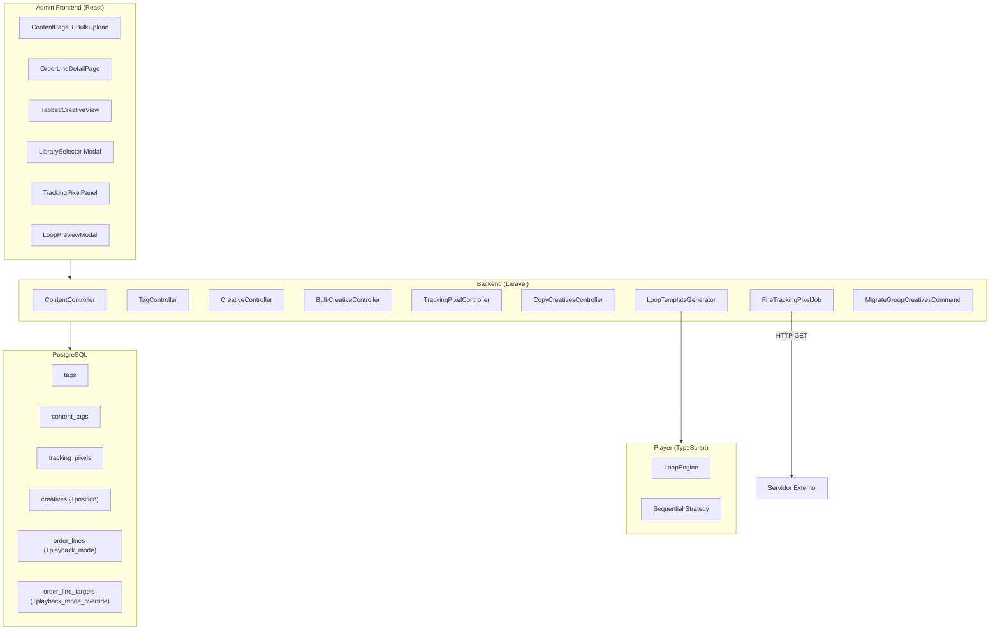
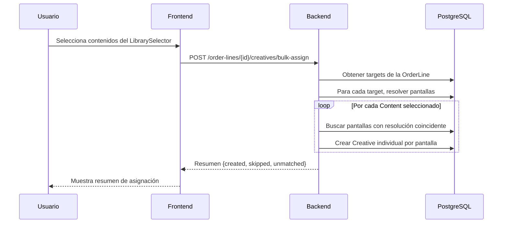
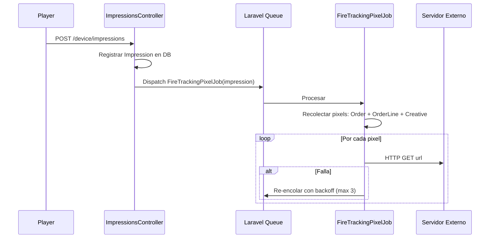
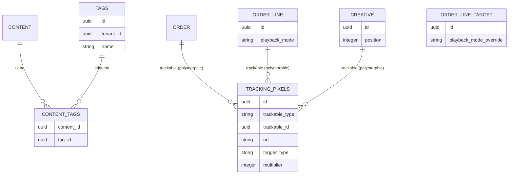

# Documento de Diseño Técnico — Creative Assignment UX Enhancements

## Overview

Este documento describe el diseño técnico para las mejoras en la experiencia de asignación de creativos del sistema DOOH. El alcance cubre 21 requisitos agrupados en:

1. **Carga y selección masiva** — Upload batch a Biblioteca con tags, selección masiva con auto-matching, carga directa desde OrderLine.
2. **Vistas tabuladas** — Por Resolución (actual), Por Grupo, Por Pantalla.
3. **Modos de reproducción** — Round-robin (actual) y Sequential con drag & drop.
4. **Creativos a nivel pantalla** — Explosión de grupo, eliminación granular.
5. **Tracking pixels** — Configuración multinivel (Order, OrderLine, Creative) con disparo server-side.
6. **Validaciones y UX** — Duración video vs slot, selector de biblioteca mejorado, preview de loop, copia entre líneas, edición inline de peso.
7. **Migración** — Creativos de grupo a pantalla individual.

### Decisiones de arquitectura clave

| Decisión | Justificación |
|----------|---------------|
| Creativos siempre a nivel pantalla individual | Permite eliminación granular sin efectos secundarios en otras pantallas |
| Tags como tabla pivot independiente | Reutilizable, indexable, no contamina Content con JSON |
| Tracking pixels polimórficos | Un solo modelo/tabla para Order, OrderLine y Creative |
| playback_mode en OrderLine + override en OrderLineTarget | Herencia con override es el patrón ya existente (num_slots, schedule) |
| Disparo de pixels en queue job | No bloquea el registro de impresiones, permite reintentos |
| strategy: 'sequential' en manifest | Mínimo cambio en el player — solo nueva lógica de selección |

---

## Architecture

### Diagrama de Componentes de Alto Nivel



### Diagrama de Flujo — Asignación Masiva con Auto-Matching



### Diagrama de Flujo — Disparo de Tracking Pixels



---

## Components and Interfaces

### Backend — Nuevos Controladores

#### 1. TagController

```php
// GET  /api/admin/tags                — Listar tags del tenant
// POST /api/admin/tags                — Crear tag
// PUT  /api/admin/tags/{id}           — Renombrar tag
// DELETE /api/admin/tags/{id}         — Eliminar tag
// POST /api/admin/content/{id}/tags   — Asignar tags a un Content
// DELETE /api/admin/content/{id}/tags/{tagId} — Desasignar tag
```

#### 2. TrackingPixelController

```php
// GET    /api/admin/{trackableType}/{id}/tracking-pixels — Listar pixels
// POST   /api/admin/{trackableType}/{id}/tracking-pixels — Crear pixel
// PUT    /api/admin/tracking-pixels/{id}                 — Actualizar pixel
// DELETE /api/admin/tracking-pixels/{id}                 — Eliminar pixel
// trackableType: orders | order-lines | creatives
```

#### 3. CopyCreativesController

```php
// POST /api/admin/order-lines/{sourceId}/copy-creatives
// Body: { "target_order_line_id": "uuid" }
// Respuesta: { created, skipped, covered_screens }
```

#### 4. Modificación a BulkCreativeController

```php
// POST /api/admin/order-lines/{id}/creatives/bulk-assign
// Body: { "content_ids": ["uuid", ...], "weight": 100 }
// Lógica: Para cada content_id, resolver pantallas por resolución,
//         crear Creative individual por pantalla.
// Respuesta: { created, unmatched_contents: [{id, width, height}], covered_screens }
```

#### 5. Modificación a OrderLineController

```php
// PUT /api/admin/order-lines/{id}
// Nuevo campo aceptado: playback_mode ('round_robin' | 'sequential')
```

#### 6. Modificación a OrderLineTargetController

```php
// PUT /api/admin/order-line-targets/{id}
// Nuevo campo aceptado: playback_mode_override ('round_robin' | 'sequential' | null)
```

#### 7. Modificación a CreativeController

```php
// PUT /api/admin/creatives/{id}
// Nuevo campo aceptado: position (integer, nullable)
// POST /api/admin/order-line-targets/{targetId}/creatives/reorder
// Body: { "creative_ids": ["uuid-1", "uuid-2", ...] }
// Actualiza position = index para cada creative
```

#### 8. LoopPreviewController

```php
// GET /api/admin/screens/{id}/loop-preview
// Respuesta: datos del manifest + metadata para renderizar preview visual
```

### Backend — Nuevos Jobs

#### FireTrackingPixelJob

```php
namespace App\Jobs;

class FireTrackingPixelJob implements ShouldQueue
{
    public int $tries = 4; // 1 intento + 3 reintentos
    public array $backoff = [10, 60, 300]; // segundos

    public function __construct(
        private string $pixelUrl,
        private string $creativeId,
        private string $impressionId,
        private int $multiplier = 1,
    ) {}

    public function handle(): void
    {
        for ($i = 0; $i < $this->multiplier; $i++) {
            $response = Http::timeout(5)->get($this->pixelUrl);
            if (!$response->successful()) {
                throw new \RuntimeException("Pixel fire failed: HTTP {$response->status()}");
            }
        }
    }

    public function failed(\Throwable $e): void
    {
        Log::error('TrackingPixel fire permanently failed', [
            'url' => $this->pixelUrl,
            'creative_id' => $this->creativeId,
            'impression_id' => $this->impressionId,
            'error' => $e->getMessage(),
        ]);
    }
}
```

#### MigrateGroupCreativesCommand

```php
namespace App\Console\Commands;

class MigrateGroupCreativesCommand extends Command
{
    protected $signature = 'creatives:migrate-groups {--dry-run}';

    public function handle(): void
    {
        // 1. Obtener todos Creative con OrderLineTarget que tiene screen_group_id
        // 2. Para cada uno, resolver pantallas del grupo
        // 3. Crear Creative individual por pantalla (copiar content_id, weight, resolution)
        // 4. Eliminar Creative original de grupo
        // 5. Log resultado
    }
}
```

### Backend — Modificación al LoopTemplateGenerator

En el método `enrichAdCandidates`, cuando el playback_mode efectivo es `sequential`:

```php
private function enrichAdCandidates(array $candidates, Screen $screen, ?string $effectivePlaybackMode = null): array
{
    // ... código existente ...
    
    if ($effectivePlaybackMode === 'sequential') {
        // Ordenar creativos por position ASC, nulls last
        $creatives = Creative::where('order_line_target_id', $target->id)
            ->whereHas('content')
            ->with('content')
            ->orderByRaw('position IS NULL, position ASC')
            ->get();
        
        // Retornar todos como candidatos ordenados
        return $creatives->map(fn($c) => [
            'order_line_id' => $lineId,
            'creative_id' => $c->id,
            'asset_url' => url("/api/device/content/{$c->content->id}/file"),
            'checksum_sha256' => $c->content->checksum_sha256 ?? '',
        ])->all();
    }
}
```

El slot generado tendrá:
```json
{
  "position": 0,
  "type": "ad",
  "strategy": "sequential",
  "candidates": [
    { "order_line_id": "...", "creative_id": "c1", "asset_url": "...", "checksum_sha256": "..." },
    { "order_line_id": "...", "creative_id": "c2", "asset_url": "...", "checksum_sha256": "..." }
  ]
}
```

### Frontend — Nuevos Componentes

| Componente | Ubicación | Descripción |
|-----------|-----------|-------------|
| `TabbedCreativeView` | `features/orders/components/` | Contenedor con tabs: Por Resolución, Por Grupo, Por Pantalla |
| `ByGroupTab` | `features/orders/components/` | Vista agrupada por ScreenGroup |
| `ByScreenTab` | `features/orders/components/` | Vista lista plana de pantallas con paginación virtual |
| `LibrarySelectorModal` | `features/orders/components/` | Modal mejorado con búsqueda por tags, metadata, indicador "Ya asignado" |
| `BulkUploadDialog` | `features/content/components/` | Dialog de carga masiva con asignación de tags |
| `TrackingPixelPanel` | `features/orders/components/` | Panel CRUD de tracking pixels (usado en Order, OrderLine, Creative) |
| `LoopPreviewModal` | `features/orders/components/` | Modal de preview visual del loop de una pantalla |
| `PlaybackModeSelector` | `features/orders/components/` | Selector round_robin/sequential |
| `DragDropCreativeList` | `features/orders/components/` | Lista con drag & drop para modo secuencial |
| `InlineWeightEditor` | `features/orders/components/` | Componente de edición inline de peso |
| `CopyCreativesDialog` | `features/orders/components/` | Dialog para copiar creativos a otra OrderLine |
| `DurationWarningBadge` | `features/orders/components/` | Badge de advertencia cuando video > slot_duration |

### Frontend — Nuevas API Functions

```typescript
// En features/orders/api.ts (adiciones)

export const bulkAssignApi = {
  assign: (orderLineId: string, data: { content_ids: string[]; weight: number }) =>
    api.post(`/admin/order-lines/${orderLineId}/creatives/bulk-assign`, data),
};

export const creativesApi = {
  // ... existentes ...
  reorder: (targetId: string, creativeIds: string[]) =>
    api.post(`/admin/order-line-targets/${targetId}/creatives/reorder`, { creative_ids: creativeIds }),
  updatePosition: (id: string, position: number) =>
    api.put(`/admin/creatives/${id}`, { position }),
};

export const copyCreativesApi = {
  copy: (sourceLineId: string, targetLineId: string) =>
    api.post(`/admin/order-lines/${sourceLineId}/copy-creatives`, { target_order_line_id: targetLineId }),
};

export const trackingPixelsApi = {
  list: (trackableType: string, trackableId: string) =>
    api.get(`/admin/${trackableType}/${trackableId}/tracking-pixels`),
  create: (trackableType: string, trackableId: string, data: TrackingPixelInput) =>
    api.post(`/admin/${trackableType}/${trackableId}/tracking-pixels`, data),
  update: (id: string, data: Partial<TrackingPixelInput>) =>
    api.put(`/admin/tracking-pixels/${id}`, data),
  delete: (id: string) =>
    api.delete(`/admin/tracking-pixels/${id}`),
};

export const tagsApi = {
  list: () => api.get<{ data: Tag[] }>('/admin/tags').then(r => r.data.data),
  create: (name: string) => api.post('/admin/tags', { name }),
  assignToContent: (contentId: string, tagIds: string[]) =>
    api.post(`/admin/content/${contentId}/tags`, { tag_ids: tagIds }),
};

export const loopPreviewApi = {
  get: (screenId: string) =>
    api.get(`/admin/screens/${screenId}/loop-preview`),
};
```

### Player — Modificaciones al LoopEngine

El `LoopEngine` actualmente soporta `strategy: 'fixed' | 'round_robin'`. Se agrega `'sequential'`:

```typescript
// Actualización de la interfaz LoopSlot
export interface LoopSlot {
  position: number;
  type: 'ad' | 'ssp' | 'playlist';
  strategy: 'fixed' | 'round_robin' | 'sequential';
  candidates: SlotCandidate[];
  provider?: string;
  config?: SspConfig;
}
```

Modificación al método `selectCandidate`:

```typescript
selectCandidate(slot: LoopSlot): SlotCandidate {
  if (slot.candidates.length === 0) {
    return { asset_url: '', checksum_sha256: '' };
  }

  if (slot.strategy === 'fixed') {
    return slot.candidates[0]!;
  }

  if (slot.strategy === 'sequential') {
    // En modo secuencial, se avanza linealmente por los candidatos.
    // Al llegar al final, se reinicia desde el primero.
    const position = slot.position;
    const offset = this.rotationOffsets.get(position) ?? 0;
    const candidateIndex = offset % slot.candidates.length;
    const candidate = slot.candidates[candidateIndex]!;
    this.rotationOffsets.set(position, offset + 1);
    return candidate;
  }

  // round_robin (comportamiento actual)
  const position = slot.position;
  const offset = this.rotationOffsets.get(position) ?? 0;
  const candidateIndex = offset % slot.candidates.length;
  const candidate = slot.candidates[candidateIndex]!;
  this.rotationOffsets.set(position, offset + 1);
  return candidate;
}
```

**Diferencia clave**: En `sequential`, los candidatos vienen PRE-ORDENADOS por `position` desde el backend. El player simplemente los reproduce en el orden del array (índice 0, 1, 2...). La mecánica de rotación offset es idéntica a round_robin, pero la semántica es diferente: el orden es determinista y definido por el usuario.

---

## Data Models

### Nuevas Tablas

#### `tags`

| Columna | Tipo | Constraints |
|---------|------|-------------|
| id | uuid | PK |
| tenant_id | uuid | FK → tenants.id, NOT NULL |
| name | varchar(100) | NOT NULL |
| created_at | timestamp | NOT NULL |

**Índice único**: `(tenant_id, name)`

#### `content_tags` (pivot)

| Columna | Tipo | Constraints |
|---------|------|-------------|
| content_id | uuid | FK → content.id ON DELETE CASCADE |
| tag_id | uuid | FK → tags.id ON DELETE CASCADE |

**PK compuesta**: `(content_id, tag_id)`

#### `tracking_pixels`

| Columna | Tipo | Constraints |
|---------|------|-------------|
| id | uuid | PK |
| trackable_type | varchar(50) | NOT NULL (App\Models\Order, App\Models\OrderLine, App\Models\Creative) |
| trackable_id | uuid | NOT NULL |
| url | varchar(2048) | NOT NULL |
| trigger_type | varchar(20) | NOT NULL, CHECK IN ('play', 'impression') |
| multiplier | integer | NOT NULL, DEFAULT 1, CHECK >= 1 |
| created_at | timestamp | NOT NULL |
| updated_at | timestamp | NOT NULL |

**Índice**: `(trackable_type, trackable_id)`

### Columnas Nuevas en Tablas Existentes

#### `order_lines` — nueva columna

| Columna | Tipo | Default |
|---------|------|---------|
| playback_mode | varchar(20) | 'round_robin' |

**CHECK**: `playback_mode IN ('round_robin', 'sequential')`

#### `order_line_targets` — nueva columna

| Columna | Tipo | Default |
|---------|------|---------|
| playback_mode_override | varchar(20) | NULL |

**CHECK**: `playback_mode_override IN ('round_robin', 'sequential') OR NULL`

#### `creatives` — nueva columna

| Columna | Tipo | Default |
|---------|------|---------|
| position | integer | NULL |

**Índice**: `(order_line_target_id, position)` — para ordenamiento eficiente.

### Diagrama ER de las nuevas entidades



### Modelos Laravel — Nuevos

#### Tag

```php
class Tag extends Model
{
    use BelongsToTenant, HasFactory, HasUuids;
    
    protected $fillable = ['tenant_id', 'name'];
    const UPDATED_AT = null;
    
    public function contents()
    {
        return $this->belongsToMany(Content::class, 'content_tags');
    }
}
```

#### TrackingPixel

```php
class TrackingPixel extends Model
{
    use HasFactory, HasUuids;
    
    protected $fillable = ['trackable_type', 'trackable_id', 'url', 'trigger_type', 'multiplier'];
    
    public function trackable()
    {
        return $this->morphTo();
    }
}
```

### Modelos Laravel — Modificaciones

#### Content (agregar relación)

```php
public function tags()
{
    return $this->belongsToMany(Tag::class, 'content_tags');
}
```

#### OrderLine (agregar a $fillable y casts)

```php
protected $fillable = [
    // ... existentes ...
    'playback_mode',
];

// En casts(): sin cambio (es string)
```

#### OrderLineTarget (agregar a $fillable)

```php
protected $fillable = [
    // ... existentes ...
    'playback_mode_override',
];
```

#### Creative (agregar a $fillable)

```php
protected $fillable = [
    // ... existentes ...
    'position',
];
```

#### Order, OrderLine, Creative (agregar relación polimórfica)

```php
public function trackingPixels()
{
    return $this->morphMany(TrackingPixel::class, 'trackable');
}
```

---

## Migraciones

### Lista de Migraciones (orden de ejecución)

1. `create_tags_table` — Tabla tags
2. `create_content_tags_table` — Tabla pivot content_tags
3. `add_playback_mode_to_order_lines` — Columna playback_mode en order_lines
4. `add_playback_mode_override_to_order_line_targets` — Columna en order_line_targets
5. `add_position_to_creatives` — Columna position en creatives
6. `create_tracking_pixels_table` — Tabla tracking_pixels
7. `migrate_group_creatives_to_screen_level` — Data migration (puede ejecutarse como command)

---

## Resolución del Playback Mode Efectivo

Algoritmo para determinar el modo de reproducción efectivo de una pantalla:

```php
function resolveEffectivePlaybackMode(OrderLineTarget $target): string
{
    if ($target->playback_mode_override !== null) {
        return $target->playback_mode_override;
    }
    return $target->orderLine->playback_mode ?? 'round_robin';
}
```

---

## Lógica de Auto-Matching por Resolución

Pseudocódigo del endpoint `bulk-assign`:

```
INPUT: order_line_id, content_ids[], weight
OUTPUT: { created: int, unmatched: Content[], covered_screens: string[] }

1. Cargar OrderLine con targets
2. Para cada target, resolver todas las pantallas individuales:
   - Si target.screen_id → esa pantalla
   - Si target.screen_group_id → todas las pantallas del grupo
3. Construir mapa: resolución (WxH) → [pantalla_ids + target_ids]
4. Para cada content_id:
   a. Obtener content.width, content.height
   b. Buscar en el mapa la resolución coincidente
   c. Si no hay coincidencia → agregar a unmatched
   d. Si hay coincidencia → Para cada pantalla del grupo de resolución:
      - Verificar que ya existe un OrderLineTarget con screen_id para esa pantalla
        (Si no, crear el target o usar el existente del grupo)
      - Crear Creative(order_line_target_id, content_id, weight, resolution_width, resolution_height)
5. Retornar resumen
```

---

## Lógica de Copia de Creativos

```
INPUT: source_order_line_id, target_order_line_id
OUTPUT: { created, skipped, covered_screens }

1. Obtener creativos de la línea origen con sus Content
2. Resolver pantallas de la línea destino con sus resoluciones
3. Para cada creativo origen:
   a. Obtener content.width, content.height
   b. Buscar pantallas destino con esa resolución
   c. Si no hay → skipped++
   d. Si hay → Crear Creative por cada pantalla destino (si no existe ya)
4. Retornar resumen
```

---

## Disparo de Tracking Pixels — Algoritmo

Integración en `ImpressionsController::store()`:

```php
// Después de crear la Impression...
$this->dispatchTrackingPixels($impression);

private function dispatchTrackingPixels(Impression $impression): void
{
    $creative = Creative::find($impression->creative_id);
    if (!$creative) return;
    
    $orderLine = OrderLine::find($impression->order_line_id);
    $order = $orderLine?->order;
    
    // Recolectar pixels de los 3 niveles
    $pixels = collect();
    
    if ($order) {
        $pixels = $pixels->merge($order->trackingPixels);
    }
    if ($orderLine) {
        $pixels = $pixels->merge($orderLine->trackingPixels);
    }
    $pixels = $pixels->merge($creative->trackingPixels);
    
    // Filtrar por trigger_type coincidente con el evento
    $triggerType = 'impression'; // o 'play' según el resultado
    $matchingPixels = $pixels->where('trigger_type', $triggerType);
    
    foreach ($matchingPixels as $pixel) {
        FireTrackingPixelJob::dispatch(
            pixelUrl: $pixel->url,
            creativeId: $creative->id,
            impressionId: $impression->id,
            multiplier: $pixel->multiplier,
        );
    }
}
```

---

## Validación de Duración de Video

Lógica en el frontend al asignar un Content de tipo video:

```typescript
function checkVideoDuration(content: Content, screens: Screen[]): DurationWarning | null {
  if (!content.duration_seconds || !content.mime_type?.startsWith('video/')) {
    return null;
  }
  
  const exceedingScreens = screens.filter(screen => {
    const slotDuration = resolveSlotDuration(screen); // grupo → tenant → 10s
    return content.duration_seconds! > slotDuration;
  });
  
  if (exceedingScreens.length === 0) return null;
  
  return {
    videoDuration: content.duration_seconds,
    screens: exceedingScreens.map(s => ({
      name: s.name,
      slotDuration: resolveSlotDuration(s),
    })),
  };
}
```

Esta validación es **no-bloqueante**: muestra advertencia pero permite continuar.

---


## Correctness Properties

*Una propiedad es una característica o comportamiento que debe ser verdadero en todas las ejecuciones válidas de un sistema — esencialmente, una declaración formal sobre lo que el sistema debe hacer. Las propiedades sirven como puente entre las especificaciones legibles por humanos y las garantías de corrección verificables por máquina.*

### Property 1: Auto-matching produce creativos individuales por pantalla con resolución coincidente

*Para cualquier* conjunto de Content items y cualquier OrderLine con pantallas asignadas, el algoritmo de auto-matching SHALL crear exactamente un Creative por cada par (Content, Screen) donde `content.width == screen.resolution_width AND content.height == screen.resolution_height`, con weight=100, y SHALL reportar como "unmatched" todo Content cuyas dimensiones no coincidan con ninguna pantalla. El total de creativos creados + contenidos no coincidentes SHALL ser igual al total de inputs.

**Validates: Requirements 2.2, 2.3, 2.4, 2.5, 3.1, 3.2, 3.3, 11.1**

### Property 2: Resolución del modo de reproducción efectivo

*Para cualquier* OrderLineTarget, el modo de reproducción efectivo SHALL ser: (a) `playback_mode_override` si no es null, o (b) `orderLine.playback_mode` si el override es null. Además, solo los valores 'round_robin' y 'sequential' son válidos.

**Validates: Requirements 7.1, 8.1, 8.2, 8.3**

### Property 3: Manifest secuencial ordena candidatos por position

*Para cualquier* pantalla cuyo modo efectivo sea "sequential" y con creativos asignados, el manifest generado SHALL contener: (a) `strategy: 'sequential'` en el slot, y (b) los candidatos ordenados en forma ascendente por el campo `position` de los Creatives, con creativos sin position (null) al final.

**Validates: Requirements 10.1, 10.2, 10.3**

### Property 4: Reordenamiento produce posiciones contiguas

*Para cualquier* lista de creativos y cualquier permutación válida (reorder), aplicar el reordenamiento SHALL asignar posiciones contíguas `0, 1, 2, ..., N-1` a los creativos en el nuevo orden especificado.

**Validates: Requirements 9.2**

### Property 5: Nuevo creativo en modo secuencial obtiene posición final

*Para cualquier* conjunto de creativos existentes con posiciones asignadas en un target con modo "sequential", agregar un nuevo creativo SHALL asignarle `position = max(existing_positions) + 1`.

**Validates: Requirements 9.3**

### Property 6: Eliminación de creativo es aislada por pantalla

*Para cualquier* OrderLine con creativos asignados en múltiples pantallas, eliminar un Creative de una pantalla específica SHALL dejar todos los Creative de las demás pantallas inalterados (mismo count, mismos IDs, mismos campos).

**Validates: Requirements 11.2**

### Property 7: Disparo acumulativo de tracking pixels en los 3 niveles

*Para cualquier* impresión de un Creative que tiene tracking pixels configurados en su Order padre, su OrderLine padre y en sí mismo, el sistema SHALL recolectar y disparar TODOS los pixels de los tres niveles cuyo `trigger_type` coincida con el evento, sin omitir ninguno.

**Validates: Requirements 13.2, 14.2, 15.2, 15.3**

### Property 8: Multiplier determina cantidad de disparos

*Para cualquier* tracking pixel con `multiplier = N` donde N ≥ 1, el sistema SHALL ejecutar exactamente N peticiones HTTP GET a la URL del pixel por cada impresión que lo activa.

**Validates: Requirements 14.3**

### Property 9: Validación de duración video vs slot

*Para cualquier* Content de tipo video asignado a una pantalla, el sistema SHALL producir una advertencia si y solo si `content.duration_seconds > resolveSlotDuration(screen)`.

**Validates: Requirements 17.1, 17.2**

### Property 10: Búsqueda en biblioteca filtra por tags, nombre y dimensiones

*Para cualquier* conjunto de Content items con tags asociados y cualquier query de búsqueda, los resultados filtrados SHALL incluir solo Content donde el query coincide como substring en al menos uno de: nombre de archivo, nombre de algún tag asociado, o representación de dimensiones (`{width}x{height}`).

**Validates: Requirements 2.1, 18.2**

### Property 11: Agrupación de pantallas por resolución

*Para cualquier* conjunto de pantallas asignadas a una OrderLine, la agrupación "Por Resolución" SHALL producir exactamente un grupo por cada combinación única de `(resolution_width, resolution_height)`, y cada pantalla SHALL aparecer en exactamente un grupo cuyas dimensiones coincidan con las suyas.

**Validates: Requirements 4.2**

### Property 12: Agrupación de pantallas por ScreenGroup

*Para cualquier* conjunto de pantallas asignadas a una OrderLine, la agrupación "Por Grupo" SHALL producir un grupo por cada ScreenGroup distinto que contenga al menos una pantalla asignada, más un grupo "Sin grupo" con las pantallas que no pertenecen a ningún ScreenGroup.

**Validates: Requirements 5.1, 5.2**

### Property 13: Copia de creativos respeta coincidencia de resolución

*Para cualquier* OrderLine origen con creativos y cualquier OrderLine destino con pantallas asignadas, la operación de copia SHALL crear creativos en el destino solo para Content cuyas dimensiones coincidan con al menos una pantalla del destino. Los contenidos sin coincidencia SHALL ser reportados como omitidos. `copiados + omitidos == total_origen_unique_contents`.

**Validates: Requirements 20.2, 20.3, 20.4**

### Property 14: Migración de grupo explota a pantallas individuales

*Para cualquier* Creative vinculado a un OrderLineTarget con `screen_group_id` (grupo con N pantallas), la migración SHALL: (a) crear exactamente N creativos individuales (uno por pantalla del grupo), cada uno con los mismos `content_id`, `weight`, `resolution_width`, `resolution_height` del original, (b) eliminar el Creative original de grupo.

**Validates: Requirements 21.2, 21.3, 11.3**

### Property 15: Migración corrige dimensiones null desde Content

*Para cualquier* Creative con `resolution_width = NULL` o `resolution_height = NULL` que tiene un Content asociado con dimensiones válidas, la migración SHALL asignar `resolution_width = content.width` y `resolution_height = content.height`.

**Validates: Requirements 21.5**

### Property 16: Resiliencia de lotes — fallo parcial no afecta éxitos

*Para cualquier* lote de operaciones (upload o migración) donde algunos items fallan, los items exitosos SHALL ser procesados completamente y persistidos, y los fallidos SHALL ser reportados sin afectar a los demás.

**Validates: Requirements 1.4, 21.4**

### Property 17: Tag assignment en carga masiva

*Para cualquier* lote de archivos subidos con un conjunto de tags T especificados, cada archivo cargado exitosamente SHALL tener exactamente los tags T asociados en la tabla `content_tags`.

**Validates: Requirements 1.2**

### Property 18: Validación de peso rechaza valores inválidos

*Para cualquier* valor de peso que sea menor a 1, igual a 0, negativo, o no numérico, el sistema SHALL rechazar la actualización y mantener el valor anterior del Creative inalterado.

**Validates: Requirements 12.4**

### Property 19: Ordenamiento de pantallas

*Para cualquier* lista de pantallas y criterio de ordenamiento (nombre o resolución), la lista resultante SHALL estar ordenada: (a) alfabéticamente por `screen.name` cuando el criterio es "nombre", o (b) numéricamente por `(resolution_width * 10000 + resolution_height)` cuando el criterio es "resolución".

**Validates: Requirements 6.4**

### Property 20: Filtro de pantallas por nombre

*Para cualquier* lista de pantallas y string de búsqueda Q, el resultado filtrado SHALL contener exactamente las pantallas cuyo `name` contiene Q como substring (case-insensitive), preservando el orden relativo.

**Validates: Requirements 6.5**

---

## Error Handling

### Backend

| Escenario | Código HTTP | Respuesta |
|-----------|-------------|-----------|
| Content no pertenece al tenant | 422 | `{ errors: { content_id: [...] } }` |
| Resolución no coincide con ninguna pantalla | 422 | `{ errors: { resolution_width: [...] } }` |
| Weight < 1 o no numérico | 422 | `{ errors: { weight: [...] } }` |
| Tracking pixel URL inválida | 422 | `{ errors: { url: [...] } }` |
| OrderLine no encontrada | 404 | `{ message: "Order line not found." }` |
| Archivo demasiado grande | 422 | `{ errors: { file: [...] } }` |
| Lote excede 50 archivos | 422 | `{ errors: { files: ["Máximo 50 archivos por lote"] } }` |
| Fallo parcial en upload batch | 207 | `{ successes: [...], failures: [...] }` |
| Fallo de tracking pixel (3 reintentos agotados) | — | Log error, no respuesta al user |
| Playback mode inválido | 422 | `{ errors: { playback_mode: [...] } }` |

### Frontend

| Escenario | Comportamiento |
|-----------|---------------|
| Error de red | Toast de error genérico + retry automático (TanStack Query) |
| Validación 422 | Mostrar errores inline en formulario |
| Upload parcial con fallos | Mostrar resumen con lista de éxitos y fallos |
| Video excede slot duration | Badge de advertencia amarillo (no-bloqueante) |
| Content sin resolución coincidente | Advertencia en resumen de asignación |

### Player

| Escenario | Comportamiento |
|-----------|---------------|
| strategy desconocido en manifest | Fallback a round_robin |
| Slot con 0 candidatos | Skip slot, avanzar al siguiente |
| Error de playback | Reportar `result: 'failed'`, continuar loop |

---

## Testing Strategy

### Testing Dual: Unit Tests + Property-Based Tests

Este feature tiene lógica de negocio pura (auto-matching, mode resolution, ordering, pixel collection) que es ideal para property-based testing, combinado con tests de ejemplo para UI y flujos de integración.

### Property-Based Testing (PBT)

**Librería**: [fast-check](https://github.com/dubzzz/fast-check) para TypeScript/Frontend y [pest-plugin-faker](https://pestphp.com/) con generadores custom para PHP/Backend.

**Configuración**:
- Mínimo 100 iteraciones por property test
- Cada test taggeado con referencia a la propiedad del diseño

**Tag format**: `Feature: 13-creatives-enhancements, Property {N}: {title}`

**Properties a implementar como PBT**:
- Property 1 (auto-matching) — Backend PHP
- Property 2 (mode resolution) — Backend PHP + Frontend TS
- Property 3 (manifest sequential ordering) — Backend PHP
- Property 4 (reorder positions) — Frontend TS + Backend PHP
- Property 5 (new creative position) — Backend PHP
- Property 6 (delete isolation) — Backend PHP
- Property 7 (pixel accumulation) — Backend PHP
- Property 8 (multiplier) — Backend PHP
- Property 9 (duration validation) — Frontend TS
- Property 10 (library search) — Backend PHP
- Property 11 (resolution grouping) — Frontend TS
- Property 12 (screen group grouping) — Frontend TS
- Property 13 (copy creatives) — Backend PHP
- Property 14 (migration explosion) — Backend PHP
- Property 15 (null dimension correction) — Backend PHP
- Property 16 (batch resilience) — Backend PHP
- Property 17 (tag assignment) — Backend PHP
- Property 18 (weight validation) — Backend PHP
- Property 19 (screen sorting) — Frontend TS
- Property 20 (screen name filter) — Frontend TS

### Unit Tests (Ejemplo-based)

| Área | Tests |
|------|-------|
| ContentController upload | Archivo válido, archivo inválido, mime type rechazado |
| TrackingPixelController CRUD | Crear, actualizar, eliminar pixel |
| LoopEngine sequential | Un slot con strategy:'sequential' reproduce en orden |
| UI: Tab default | Verifica tab "Por Resolución" activa por defecto |
| UI: Drag & drop visibility | Visible en sequential, oculto en round_robin |
| UI: Preview modal | Abre y muestra datos correctos |
| FireTrackingPixelJob | Éxito, fallo con retry, fallo permanente |

### Integration Tests

| Flujo | Descripción |
|-------|-------------|
| Bulk assign end-to-end | Upload → auto-match → verify DB state |
| Copy creatives | Source line → target line → verify correct copies |
| Impression → pixel fire | Record impression → verify jobs dispatched |
| Manifest regeneration | Change playback mode → verify manifest updates |
| Migration command | Run command → verify explosion completed |

### Player Tests

| Test | Descripción |
|------|-------------|
| LoopEngine + sequential | Template con strategy:'sequential', verificar orden de reproducción |
| LoopEngine fallback | strategy desconocido → fallback a round_robin |
| Regression | Templates existentes (round_robin, fixed) siguen funcionando |
