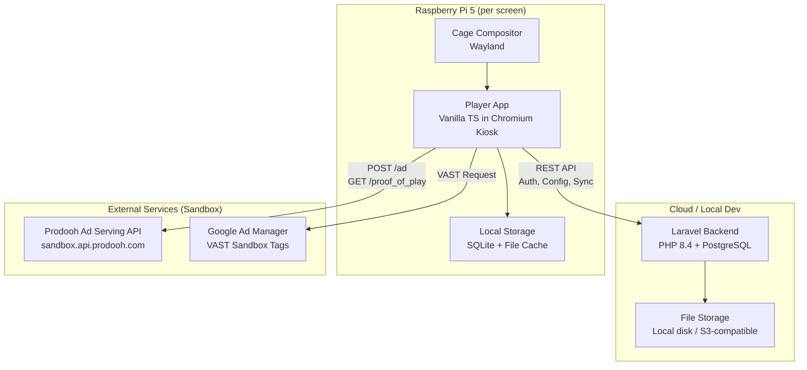
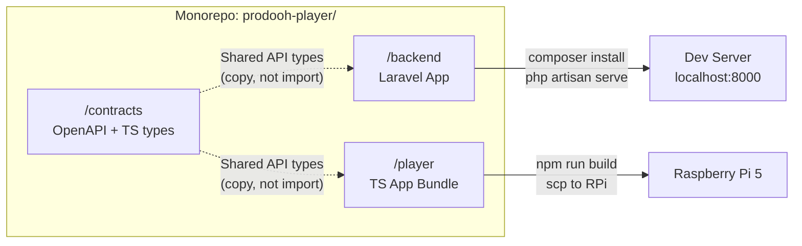
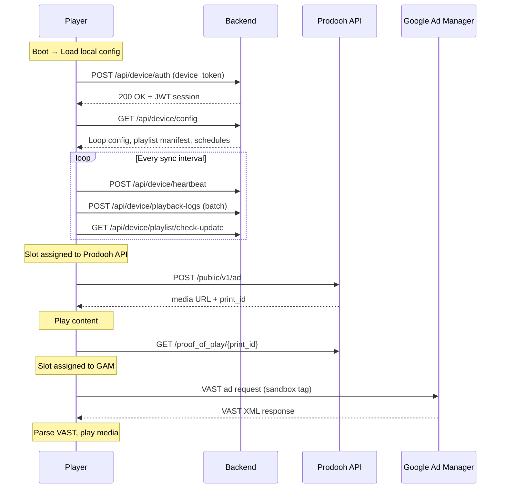
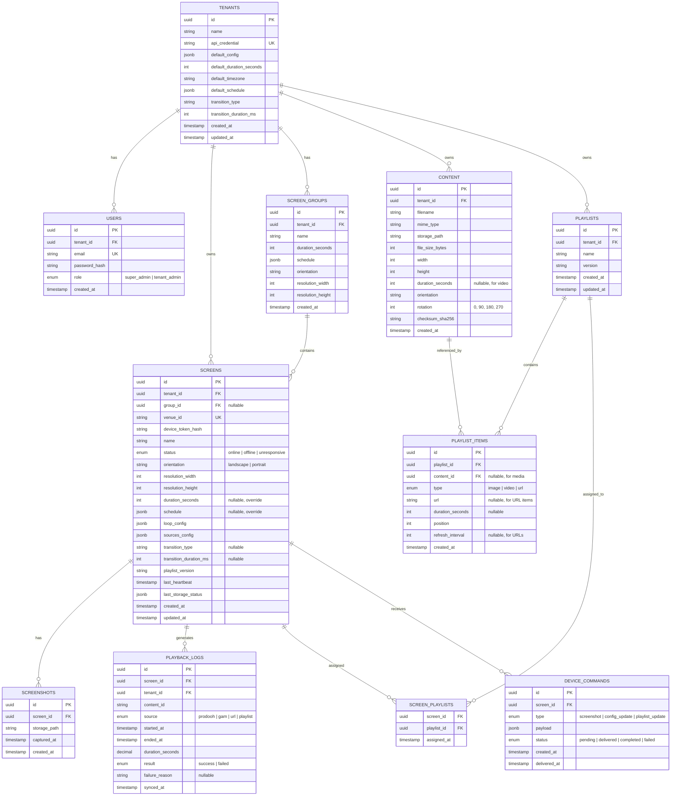

# Design Document: Hybrid Ad Player System

## Overview

The Hybrid Ad Player system is a multi-tenant digital signage platform that replaces Prodooh's licensed third-party player (Doohmain) with a custom-built solution. The system consists of two independently deployable components within a monorepo:

1. **Backend** (Laravel PHP 8.4 + PostgreSQL) — Multi-tenant admin panel, content management, device fleet management, and API layer for player communication.
2. **Player** (Vanilla JS/TS) — Runs in Chromium kiosk mode on Raspberry Pi 5 devices, executing a fixed-slot content loop with four sources, offline-capable with local storage.

### Key Design Decisions

| Decision | Rationale |
|----------|-----------|
| Fixed-slot loop (not priority cascade) | Predictable, auditable share of voice; simple calculation for advertisers |
| Vanilla JS/TS (no framework) | Minimal memory footprint on RPi 5; no virtual DOM overhead for fullscreen media |
| REST API (not WebSocket) | Player polls on sync intervals; no persistent connection needed for MVP |
| Local-first with sync | Player operates offline; backend is source of truth but not required for playback |
| PostgreSQL | JSONB for flexible slot config; strong multi-tenant isolation with row-level policies |
| Monorepo with contract separation | Coordinated development; API contracts as the only coupling point |

## Architecture

### High-Level Architecture Diagram



### Deployment Topology



### Communication Flow



## Components and Interfaces

### Backend Components

#### 1. Authentication & Authorization Module
- **Device Auth Controller** — Issues JWT tokens to players using device_token credentials.
- **Admin Auth Controller** — Laravel Sanctum-based auth for super-admin and tenant-admin users.
- **Tenant Middleware** — Row-level filtering ensuring tenant-admins see only their own data.
- **Role Guard** — Enforces super-admin vs tenant-admin permissions.

#### 2. Tenant & Device Management
- **TenantService** — CRUD for tenants, credential generation, config defaults.
- **DeviceService** — Screen registration, assignment to tenants, group membership.
- **ScreenGroupService** — Group CRUD, config inheritance (duration, schedule, orientation).

#### 3. Content & Playlist Management
- **ContentLibraryService** — Upload with validation (format, codec, resolution, size), storage deduplication, rotation metadata.
- **PlaylistService** — Playlist composition (images, videos, URLs), assignment to screens, versioning.
- **ContentValidationPipeline** — Chain of validators: format → codec → resolution → filesize → orientation check.

#### 4. Loop Configuration
- **LoopConfigService** — Define slot count, duration per slot, source assignment per slot.
- **SourceToggleService** — Enable/disable sources per screen; reassign disabled slots to playlist.

#### 5. Device Communication API
- **HeartbeatController** — Receives heartbeat + storage status, updates device state, detects offline.
- **ConfigSyncController** — Serves current config (loop, playlist manifest, schedules, sources).
- **PlaybackLogController** — Receives batched playback logs.
- **ScreenshotController** — Triggers screenshot request, receives upload.
- **PlaylistSyncController** — Serves playlist diff/manifest, receives adoption confirmation.

#### 6. Monitoring & Analytics
- **DeviceStatusService** — Tracks online/offline, last heartbeat, storage levels.
- **PlaybackAnalyticsService** — Aggregates playback logs for reporting.
- **ScreenshotStorageService** — Stores and serves screenshots with timestamps.

### Player Components

#### 1. Core Loop Engine
- **LoopScheduler** — Manages the fixed-slot sequence, advances through slots, handles source failures.
- **SlotExecutor** — Executes a single slot: calls the assigned ContentSource, manages timing.
- **TransitionManager** — Handles animated transitions (cut, fade, slide) between content pieces.

#### 2. Content Sources (Uniform Interface)

All sources implement a common `ContentSource` interface:

```typescript
interface ContentSource {
  readonly id: SourceType; // 'prodooh' | 'gam' | 'url' | 'playlist'
  
  /** Pre-fetch next content for this source. Returns null if unavailable. */
  prefetch(): Promise<PreparedContent | null>;
  
  /** Confirm the content was played successfully */
  confirmPlay(content: PreparedContent): Promise<void>;
  
  /** Notify that content could not be played */
  reportFailure(content: PreparedContent, reason: string): Promise<void>;
  
  /** Check if source is enabled and configured */
  isAvailable(): boolean;
}

interface PreparedContent {
  id: string;
  type: 'image' | 'video' | 'url' | 'html';
  mediaUrl: string;
  duration: number; // seconds, resolved from hierarchy
  metadata: Record<string, unknown>;
  element?: HTMLElement; // pre-rendered DOM element for instant swap
}
```

#### 3. Content Source Implementations

- **ProDoohSource** — Calls Prodooh Ad Serving API, manages print_id lifecycle (POP/expiration).
- **GamVastSource** — Validates sandbox tag, fetches VAST XML, parses media URL and duration.
- **UrlSource** — Loads URLs in hidden iframe, swaps to visible when ready.
- **PlaylistSource** — Cycles through local playlist items (images, videos, URLs).

#### 4. Prefetch & Buffer System
- **PrefetchManager** — While current slot plays, fetches next slot's content in background.
- **FallbackBuffer** — Always keeps ≥1 playlist item decoded and ready in memory as emergency fallback.
- **MediaPreloader** — Handles image decode, video preload, iframe pre-render.

#### 5. Offline & Sync Layer
- **LocalConfigStore** — SQLite-based config persistence (loop config, playlist manifest, credentials).
- **PlaylistSyncManager** — Polls backend for playlist updates, downloads assets, confirms adoption.
- **POPQueue** — Persistent queue (IndexedDB/SQLite) for proof-of-play and expiration calls; retries with exponential backoff.
- **PlaybackLogger** — Records every play event locally; batches and syncs to backend.
- **HeartbeatService** — Periodic heartbeat with device status (storage, current content, uptime).

#### 6. Display & Rendering
- **FullscreenRenderer** — Manages the visible canvas: primary layer + transition layer + fallback layer.
- **ImageRenderer** — Renders images with rotation metadata applied.
- **VideoRenderer** — HTML5 video element with hardware-accelerated decode.
- **WebviewRenderer** — iframe-based web content with timeout and error handling.
- **TransitionAnimator** — CSS-based transitions (fade, slide) between content layers.

#### 7. System Services
- **StorageManager** — Monitors disk usage, runs LRU cleanup, reports to backend.
- **ScreenshotService** — Captures current frame on demand (html2canvas or screen capture API).
- **ScheduleManager** — Enforces operating hours; starts/stops playback at configured times.
- **KioskWatchdog** — External systemd service that restarts player on crash (not in JS code).

### Interface Contracts — Backend REST API

#### Device Authentication

```
POST /api/device/auth
Request:  { device_token: string, venue_id: string }
Response: { access_token: string, expires_in: number }
```

#### Device Configuration

```
GET /api/device/config
Headers: Authorization: Bearer {jwt}
Response: {
  venue_id: string,
  tenant_id: string,
  loop: {
    slots: Array<{ position: number, source: SourceType, duration: number }>,
    total_duration: number
  },
  sources: {
    prodooh: { enabled: boolean, api_key: string, network_id: string },
    gam: { enabled: boolean, ad_tag_url: string },
    url: { enabled: boolean, urls: Array<{ url: string, duration: number, refresh_interval?: number }> },
    playlist: { enabled: boolean }
  },
  display: {
    resolution: { width: number, height: number },
    orientation: 'landscape' | 'portrait',
    transition: { type: 'cut' | 'fade' | 'slide', duration_ms: number }
  },
  schedule: {
    timezone: string,
    rules: Array<{ days: number[], start: string, end: string }>
  } | null,
  content_duration: {
    default_seconds: number,
    source: 'screen' | 'group' | 'tenant'
  },
  sync_interval_seconds: number,
  heartbeat_interval_seconds: number
}
```

#### Heartbeat

```
POST /api/device/heartbeat
Headers: Authorization: Bearer {jwt}
Request: {
  venue_id: string,
  timestamp: string (ISO 8601),
  current_content: { id: string, source: SourceType } | null,
  storage: { total_mb: number, available_mb: number, percent_used: number },
  uptime_seconds: number,
  playlist_version: string
}
Response: { ack: true, pending_commands: Command[] }
```

#### Playlist Sync

```
GET /api/device/playlist
Headers: Authorization: Bearer {jwt}, If-None-Match: {etag}
Response: {
  version: string,
  etag: string,
  items: Array<{
    id: string,
    type: 'image' | 'video' | 'url',
    url: string,          // download URL for media, or target URL for web
    duration?: number,
    rotation?: 0 | 90 | 180 | 270,
    refresh_interval?: number,  // for URL items
    checksum?: string     // SHA-256 for media files
  }>
}
304 Not Modified (if etag matches)
```

```
POST /api/device/playlist/confirm
Headers: Authorization: Bearer {jwt}
Request: { version: string, status: 'adopted' | 'failed', error?: string }
Response: { ack: true }
```

#### Playback Logs

```
POST /api/device/playback-logs
Headers: Authorization: Bearer {jwt}
Request: {
  logs: Array<{
    id: string (uuid),
    content_id: string,
    source: SourceType,
    started_at: string (ISO 8601),
    ended_at: string (ISO 8601),
    duration_seconds: number,
    result: 'success' | 'failed',
    failure_reason?: string
  }>
}
Response: { received: number, ack_ids: string[] }
```

#### Screenshot

```
POST /api/device/screenshot
Headers: Authorization: Bearer {jwt}
Request: multipart/form-data { image: file (JPEG), captured_at: string }
Response: { id: string, url: string }
```

#### Admin API (selected endpoints)

```
# Tenant Management (super-admin only)
POST   /api/admin/tenants              — Create tenant
GET    /api/admin/tenants              — List all tenants
GET    /api/admin/tenants/{id}         — Get tenant details
PUT    /api/admin/tenants/{id}         — Update tenant
DELETE /api/admin/tenants/{id}         — Delete tenant

# Screen Management
GET    /api/admin/screens              — List screens (filtered by tenant for tenant-admin)
POST   /api/admin/screens              — Register screen
PUT    /api/admin/screens/{id}         — Update screen config
PUT    /api/admin/screens/{id}/loop    — Update loop configuration
POST   /api/admin/screens/{id}/screenshot — Request screenshot

# Content Library
POST   /api/admin/content/upload       — Upload content with validation
GET    /api/admin/content              — List library content
DELETE /api/admin/content/{id}         — Delete content (cascades to playlists)
PUT    /api/admin/content/{id}/rotate  — Set rotation metadata

# Playlist Management
GET    /api/admin/playlists            — List playlists
POST   /api/admin/playlists            — Create playlist
PUT    /api/admin/playlists/{id}       — Update playlist items
POST   /api/admin/playlists/{id}/assign — Assign to screens

# Screen Groups
POST   /api/admin/groups               — Create group
PUT    /api/admin/groups/{id}          — Update group config
POST   /api/admin/groups/{id}/screens  — Assign screens to group

# Analytics
GET    /api/admin/analytics/playback   — Query playback logs with filters
```

## Data Models

### Backend Database Schema (PostgreSQL)



### Player Local Data Model (SQLite)

```sql
-- Device identity and credentials
CREATE TABLE device_config (
    key TEXT PRIMARY KEY,
    value TEXT NOT NULL,
    updated_at TEXT NOT NULL
);
-- Keys: venue_id, device_token, backend_url, prodooh_api_key, 
--        prodooh_network_id, gam_ad_tag, kiosk_password_hash

-- Current loop configuration (synced from backend)
CREATE TABLE loop_config (
    id INTEGER PRIMARY KEY,
    config_json TEXT NOT NULL,  -- full loop + sources + display config
    version TEXT NOT NULL,
    synced_at TEXT NOT NULL
);

-- Local playlist (synced from backend)
CREATE TABLE playlist (
    id TEXT PRIMARY KEY,
    version TEXT NOT NULL,
    synced_at TEXT NOT NULL
);

CREATE TABLE playlist_items (
    id TEXT PRIMARY KEY,
    playlist_id TEXT NOT NULL REFERENCES playlist(id),
    type TEXT NOT NULL CHECK(type IN ('image', 'video', 'url')),
    media_path TEXT,          -- local file path for downloaded media
    url TEXT,                 -- for URL-type items
    duration_seconds INTEGER,
    position INTEGER NOT NULL,
    rotation INTEGER DEFAULT 0,
    refresh_interval INTEGER, -- for URL items
    checksum TEXT,
    download_status TEXT DEFAULT 'pending' CHECK(download_status IN ('pending', 'downloading', 'ready', 'failed'))
);

-- Proof of Play queue (persistent, survives crashes)
CREATE TABLE pop_queue (
    id TEXT PRIMARY KEY,
    print_id TEXT NOT NULL,
    action TEXT NOT NULL CHECK(action IN ('proof_of_play', 'expiration')),
    url TEXT NOT NULL,
    created_at TEXT NOT NULL,
    attempts INTEGER DEFAULT 0,
    next_retry_at TEXT,
    status TEXT DEFAULT 'pending' CHECK(status IN ('pending', 'sending', 'sent', 'failed'))
);

-- Playback log (local source of truth)
CREATE TABLE playback_log (
    id TEXT PRIMARY KEY,
    content_id TEXT NOT NULL,
    source TEXT NOT NULL CHECK(source IN ('prodooh', 'gam', 'url', 'playlist')),
    started_at TEXT NOT NULL,
    ended_at TEXT NOT NULL,
    duration_seconds REAL NOT NULL,
    result TEXT NOT NULL CHECK(result IN ('success', 'failed')),
    failure_reason TEXT,
    synced INTEGER DEFAULT 0
);

-- Operating schedule cache
CREATE TABLE schedule (
    id INTEGER PRIMARY KEY,
    rules_json TEXT NOT NULL,
    timezone TEXT NOT NULL,
    synced_at TEXT NOT NULL
);
```

## Low-Level Design

### Algorithm: Loop Execution Engine

The loop engine is the core scheduling mechanism of the player. It executes a fixed sequence of slots continuously.

```typescript
// Pseudocode: Main loop execution
class LoopEngine {
  private slots: SlotConfig[];
  private currentIndex: number = 0;
  private isRunning: boolean = false;
  private fallbackBuffer: FallbackBuffer;
  private prefetchManager: PrefetchManager;

  async run(): Promise<void> {
    this.isRunning = true;
    
    while (this.isRunning) {
      // Check operating schedule
      if (!this.scheduleManager.isWithinOperatingHours()) {
        await this.enterSleepMode();
        continue;
      }

      const slot = this.slots[this.currentIndex];
      const source = this.getSource(slot.source);
      
      // Content should already be prefetched (from previous slot's execution)
      let content = this.prefetchManager.getReady(slot.source);
      
      if (!content && source.isAvailable()) {
        // Fallback: try to fetch now (shouldn't normally happen)
        content = await this.withTimeout(source.prefetch(), 3000);
      }

      if (!content) {
        // Source failed → use fallback buffer (instant, pre-decoded)
        content = this.fallbackBuffer.getNext();
      }

      // Display content with transition
      await this.display(content, slot.duration);
      
      // Post-play actions
      if (content.source !== 'fallback') {
        await source.confirmPlay(content);
      }
      this.playbackLogger.record(content);

      // Advance to next slot
      this.currentIndex = (this.currentIndex + 1) % this.slots.length;
      
      // Kick off prefetch for the NEXT slot while transitioning
      this.prefetchNextSlot();
    }
  }

  private prefetchNextSlot(): void {
    const nextIndex = (this.currentIndex + 1) % this.slots.length;
    const nextSlot = this.slots[nextIndex];
    const nextSource = this.getSource(nextSlot.source);
    
    if (nextSource.isAvailable()) {
      this.prefetchManager.startPrefetch(nextSource);
    }
    
    // Always keep fallback buffer topped up
    this.fallbackBuffer.replenish();
  }
}
```

### Algorithm: Duration Resolution (Inheritance Chain)

```typescript
// Resolves display duration using the hierarchy:
// Screen override > Group override > Tenant default
function resolveDuration(
  content: PreparedContent,
  screenConfig: ScreenConfig,
  groupConfig: GroupConfig | null,
  tenantConfig: TenantConfig
): number {
  // Video: always use natural duration
  if (content.type === 'video') {
    return content.metadata.videoDuration;
  }
  
  // VAST: use duration from VAST XML
  if (content.source === 'gam' && content.metadata.vastDuration) {
    return content.metadata.vastDuration;
  }
  
  // Prodooh API: use API-provided duration if available
  if (content.source === 'prodooh' && content.metadata.apiDuration) {
    return content.metadata.apiDuration;
  }

  // Static content: resolve from hierarchy
  if (screenConfig.durationSeconds !== null) {
    return screenConfig.durationSeconds;
  }
  if (groupConfig?.durationSeconds !== null) {
    return groupConfig.durationSeconds;
  }
  return tenantConfig.defaultDurationSeconds;
}
```

### Algorithm: Proof of Play Queue with Exponential Backoff

```typescript
class POPQueue {
  private db: SQLiteDatabase;
  private maxBackoff = 60_000; // 60 seconds max

  async enqueue(printId: string, action: 'proof_of_play' | 'expiration', url: string): Promise<void> {
    await this.db.insert('pop_queue', {
      id: crypto.randomUUID(),
      print_id: printId,
      action,
      url,
      created_at: new Date().toISOString(),
      attempts: 0,
      next_retry_at: new Date().toISOString(),
      status: 'pending'
    });
  }

  async processQueue(): Promise<void> {
    const pending = await this.db.query(
      'SELECT * FROM pop_queue WHERE status = "pending" AND next_retry_at <= ? ORDER BY created_at',
      [new Date().toISOString()]
    );

    for (const item of pending) {
      try {
        await this.db.update('pop_queue', item.id, { status: 'sending' });
        
        const response = await fetch(item.url, { method: 'GET' });
        
        if (response.status === 201 || response.status === 409) {
          // 201 = success, 409 = already processed (idempotent success)
          await this.db.update('pop_queue', item.id, { status: 'sent' });
        } else {
          throw new Error(`HTTP ${response.status}`);
        }
      } catch (error) {
        const nextAttempts = item.attempts + 1;
        const backoff = Math.min(1000 * Math.pow(2, nextAttempts), this.maxBackoff);
        const nextRetry = new Date(Date.now() + backoff).toISOString();
        
        await this.db.update('pop_queue', item.id, {
          status: 'pending',
          attempts: nextAttempts,
          next_retry_at: nextRetry
        });
      }
    }
  }
}
```

### Algorithm: Playlist Sync with Adoption Confirmation

```typescript
class PlaylistSyncManager {
  async sync(): Promise<void> {
    const currentVersion = await this.localStore.getPlaylistVersion();
    
    const response = await this.api.getPlaylist({
      headers: { 'If-None-Match': currentVersion }
    });

    if (response.status === 304) return; // No changes

    const newPlaylist = response.data;
    
    // Download new media items
    const downloadResults = await this.downloadNewMedia(newPlaylist.items);
    
    if (downloadResults.hasFailures) {
      // Report failure, keep current playlist
      await this.api.confirmPlaylist({
        version: newPlaylist.version,
        status: 'failed',
        error: `Failed to download ${downloadResults.failedCount} items`
      });
      return;
    }

    // Atomic swap: update local playlist
    try {
      await this.localStore.replacePlaylist(newPlaylist);
      
      // Confirm adoption to backend
      const confirmResult = await this.api.confirmPlaylist({
        version: newPlaylist.version,
        status: 'adopted'
      });
      
      if (!confirmResult.success) {
        // Confirmation failed → revert (per Requirement 9.3)
        await this.localStore.revertPlaylist();
        return;
      }
      
      // Clean up old media no longer in playlist
      await this.storageManager.cleanupOrphanedMedia(newPlaylist.items);
      
    } catch (error) {
      await this.localStore.revertPlaylist();
      await this.api.confirmPlaylist({
        version: newPlaylist.version,
        status: 'failed',
        error: error.message
      });
    }
  }
}
```

### Algorithm: Fallback Buffer Management

```typescript
class FallbackBuffer {
  private buffer: PreparedContent[] = [];
  private readonly minBufferSize = 1;
  private playlistSource: PlaylistSource;

  /** Called after each slot plays, and on startup */
  async replenish(): Promise<void> {
    while (this.buffer.length < this.minBufferSize) {
      const next = await this.playlistSource.prepareNext();
      if (next) {
        // Pre-decode: create DOM element, decode image, buffer video
        next.element = await this.preRender(next);
        this.buffer.push(next);
      } else {
        // Playlist empty → load factory content
        const factory = await this.loadFactoryContent();
        factory.element = await this.preRender(factory);
        this.buffer.push(factory);
        break;
      }
    }
  }

  getNext(): PreparedContent {
    const content = this.buffer.shift()!;
    // Async replenish (don't block)
    this.replenish();
    return content;
  }

  private async preRender(content: PreparedContent): Promise<HTMLElement> {
    if (content.type === 'image') {
      const img = new Image();
      img.src = content.mediaUrl;
      await img.decode(); // Hardware-accelerated decode
      return img;
    }
    if (content.type === 'video') {
      const video = document.createElement('video');
      video.src = content.mediaUrl;
      video.preload = 'auto';
      await new Promise(r => video.addEventListener('canplaythrough', r, { once: true }));
      return video;
    }
    // URL content: pre-render in hidden iframe
    const iframe = document.createElement('iframe');
    iframe.src = content.mediaUrl;
    iframe.style.visibility = 'hidden';
    document.body.appendChild(iframe);
    await new Promise(r => iframe.addEventListener('load', r, { once: true }));
    return iframe;
  }
}
```

### Algorithm: Storage Cleanup (LRU)

```typescript
class StorageManager {
  private thresholdWarning = 0.20; // 20% free
  private thresholdCritical = 0.10; // 10% free

  async checkAndClean(): Promise<StorageStatus> {
    const { total, available } = await this.getDiskUsage();
    const freeRatio = available / total;

    if (freeRatio < this.thresholdWarning) {
      await this.runLRUCleanup();
    }

    const afterClean = await this.getDiskUsage();
    const status: StorageStatus = {
      total_mb: Math.round(afterClean.total / 1_048_576),
      available_mb: Math.round(afterClean.available / 1_048_576),
      percent_used: Math.round((1 - afterClean.available / afterClean.total) * 100)
    };

    if (afterClean.available / afterClean.total < this.thresholdCritical) {
      await this.reportCriticalStorage(status);
    }

    return status;
  }

  private async runLRUCleanup(): Promise<void> {
    // Get all cached files NOT in active playlist and NOT in fallback buffer
    const activeIds = await this.getActivePlaylistIds();
    const cachedFiles = await this.getCachedFiles();
    
    // Sort by last access time (LRU)
    const deletable = cachedFiles
      .filter(f => !activeIds.has(f.contentId))
      .sort((a, b) => a.lastAccessed - b.lastAccessed);

    for (const file of deletable) {
      await this.deleteFile(file.path);
      const { available, total } = await this.getDiskUsage();
      if (available / total >= this.thresholdWarning) break;
    }
  }
}
```

### Algorithm: Content Validation Pipeline (Backend)

```php
// Pseudocode: Laravel validation pipeline for content uploads
class ContentValidationPipeline
{
    private array $validators = [
        FormatValidator::class,
        CodecValidator::class,
        ResolutionValidator::class,
        FileSizeValidator::class,
        OrientationValidator::class,
    ];

    public function validate(UploadedFile $file, Screen $targetScreen): ValidationResult
    {
        $metadata = $this->extractMetadata($file);
        $errors = [];
        $warnings = [];

        foreach ($this->validators as $validatorClass) {
            $validator = app($validatorClass);
            $result = $validator->validate($file, $metadata, $targetScreen);
            
            if ($result->hasErrors()) {
                $errors = array_merge($errors, $result->errors());
            }
            if ($result->hasWarnings()) {
                $warnings = array_merge($warnings, $result->warnings());
            }
        }

        return new ValidationResult(
            valid: empty($errors),
            errors: $errors,
            warnings: $warnings,
            metadata: $metadata
        );
    }
}

// Supported formats definition
class SupportedFormats
{
    const IMAGES = ['image/jpeg', 'image/png', 'image/webp'];
    const VIDEOS = ['video/mp4'];
    const VIDEO_CODECS = ['h264', 'hevc', 'h265'];
    const MAX_FILE_SIZES = [
        'image' => 20 * 1024 * 1024,   // 20 MB
        'video' => 500 * 1024 * 1024,   // 500 MB
    ];
}
```

### Algorithm: Tenant Isolation (Middleware)

```php
// Laravel middleware ensuring tenant-admin sees only their data
class TenantScopeMiddleware
{
    public function handle(Request $request, Closure $next): Response
    {
        $user = $request->user();
        
        if ($user->role === 'super_admin') {
            // Super-admin: no scope restriction
            return $next($request);
        }

        // Tenant-admin: bind tenant scope to all queries
        $tenantId = $user->tenant_id;
        
        // Apply global scope to all tenant-aware models
        Screen::addGlobalScope('tenant', fn($q) => $q->where('tenant_id', $tenantId));
        Content::addGlobalScope('tenant', fn($q) => $q->where('tenant_id', $tenantId));
        Playlist::addGlobalScope('tenant', fn($q) => $q->where('tenant_id', $tenantId));
        PlaybackLog::addGlobalScope('tenant', fn($q) => $q->where('tenant_id', $tenantId));
        ScreenGroup::addGlobalScope('tenant', fn($q) => $q->where('tenant_id', $tenantId));
        Screenshot::addGlobalScope('tenant', fn($q) => 
            $q->whereHas('screen', fn($s) => $s->where('tenant_id', $tenantId))
        );

        return $next($request);
    }
}
```

### Key Function Signatures — Player

```typescript
// ── Core Loop ──
class LoopEngine {
  constructor(config: LoopConfig, sources: Map<SourceType, ContentSource>);
  run(): Promise<void>;
  stop(): void;
  updateConfig(newConfig: LoopConfig): void;
  getCurrentSlotIndex(): number;
  getCurrentContent(): PreparedContent | null;
}

// ── Prodooh Source ──
class ProDoohSource implements ContentSource {
  constructor(config: { apiKey: string; networkId: string; venueId: string; baseUrl: string });
  prefetch(): Promise<PreparedContent | null>;
  confirmPlay(content: PreparedContent): Promise<void>;
  reportFailure(content: PreparedContent, reason: string): Promise<void>;
  isAvailable(): boolean;
}

// ── GAM VAST Source ──
class GamVastSource implements ContentSource {
  constructor(config: { adTagUrl: string });
  prefetch(): Promise<PreparedContent | null>;
  confirmPlay(content: PreparedContent): Promise<void>;
  reportFailure(content: PreparedContent, reason: string): Promise<void>;
  isAvailable(): boolean;
  private validateSandboxTag(url: string): boolean;
  private parseVastXml(xml: string): VastAdInfo;
}

// ── Playlist Source ──
class PlaylistSource implements ContentSource {
  constructor(localStore: LocalConfigStore);
  prefetch(): Promise<PreparedContent | null>;
  confirmPlay(content: PreparedContent): Promise<void>;
  reportFailure(content: PreparedContent, reason: string): Promise<void>;
  isAvailable(): boolean;
  prepareNext(): Promise<PreparedContent | null>;
  getCurrentIndex(): number;
}

// ── URL Source ──
class UrlSource implements ContentSource {
  constructor(config: { urls: UrlConfig[]; timeout: number });
  prefetch(): Promise<PreparedContent | null>;
  confirmPlay(content: PreparedContent): Promise<void>;
  reportFailure(content: PreparedContent, reason: string): Promise<void>;
  isAvailable(): boolean;
}

// ── Sync Layer ──
class PlaylistSyncManager {
  constructor(api: BackendApi, localStore: LocalConfigStore, storageManager: StorageManager);
  sync(): Promise<void>;
  getLocalVersion(): Promise<string>;
  isUpdateAvailable(): Promise<boolean>;
}

class HeartbeatService {
  constructor(api: BackendApi, interval: number);
  start(): void;
  stop(): void;
  sendNow(): Promise<void>;
}

// ── Display ──
class FullscreenRenderer {
  constructor(container: HTMLElement, transitionConfig: TransitionConfig);
  show(content: PreparedContent): Promise<void>;
  transitionTo(content: PreparedContent): Promise<void>;
  showFallback(content: PreparedContent): void; // synchronous, instant
}
```

## Correctness Properties

*A property is a characteristic or behavior that should hold true across all valid executions of a system — essentially, a formal statement about what the system should do. Properties serve as the bridge between human-readable specifications and machine-verifiable correctness guarantees.*

### Property 1: Credential Isolation

*For any* content source request, the credentials included in the request MUST correspond exclusively to that source's configured credentials — Prodooh API key/network_id for Prodooh calls, GAM ad tag for GAM calls, backend device_token for backend calls — with no cross-contamination between credential sets.

**Validates: Requirements 1.3**

### Property 2: Graceful Degradation on Missing Configuration

*For any* subset of missing configurations (backend credential, Prodooh credentials, GAM config), the player SHALL disable exactly and only the operations that depend on the missing configuration, while all other sources and operations continue functioning normally.

**Validates: Requirements 1.4**

### Property 3: Source Fallback to Playlist Local

*For any* slot in the loop where the assigned source fails to provide content (timeout, no-fill, error, decode failure, or prefetch not ready), that slot SHALL be filled with the next item from the playlist local, and the loop SHALL continue to the next slot without interruption.

**Validates: Requirements 2.3, 2.4, 3.3, 6.3, 7.3**

### Property 4: Rate Limit Compliance

*For any* sequence of requests to the Prodooh Ad Serving API from a single screen, the time elapsed between consecutive requests SHALL always be greater than or equal to the documented minimum interval (10 seconds).

**Validates: Requirements 2.5**

### Property 5: Sandbox Tag Validation

*For any* string provided as a GAM ad tag URL, the sandbox validator SHALL accept the string if and only if it matches the sandbox tag format pattern; non-matching strings SHALL be rejected and no request SHALL be sent.

**Validates: Requirements 3.1**

### Property 6: Fallback Buffer Invariant

*For any* observable state of the player during active playback, the fallback buffer SHALL contain at least one pre-decoded content item ready for instant display. After any item is consumed from the buffer, replenishment SHALL be triggered immediately.

**Validates: Requirements 4.1, 6.4**

### Property 7: Print ID Lifecycle Completeness

*For any* print_id received from the Prodooh Ad Serving API, exactly one of two terminal actions SHALL occur: (a) proof of play is enqueued after successful playback completion, or (b) expiration is enqueued if playback fails or cannot start. A print_id SHALL never remain without a terminal action, and SHALL never have both actions applied.

**Validates: Requirements 2.2, 5.1, 5.2, 5.3**

### Property 8: Exponential Backoff Calculation

*For any* POP/expiration notification that has failed N consecutive delivery attempts, the next retry delay SHALL equal min(2^N * 1000ms, maxBackoff) where maxBackoff = 60000ms, and the notification SHALL remain in the queue until successfully delivered (never discarded).

**Validates: Requirements 5.4**

### Property 9: Loop Sequential Determinism

*For any* loop configuration of N slots, executing the loop SHALL visit slots in strictly sequential order (0, 1, 2, ..., N-1, 0, 1, ...) with no randomization. After K slot executions, the current slot index SHALL always equal K mod N.

**Validates: Requirements 7.1, 7.8**

### Property 10: Weight-to-Slot Assignment

*For any* set of source weights that sum to N total slots, the generated slot array SHALL contain exactly the number of slots assigned to each source as specified by its weight, and the total array length SHALL equal N.

**Validates: Requirements 7.2, 7.7**

### Property 11: Dynamic Loop Configuration

*For any* valid LoopConfig (positive slot count, valid source assignments, positive durations), the LoopEngine SHALL accept and execute the configuration without requiring modification to any ContentSource implementation.

**Validates: Requirements 7.5**

### Property 12: Disabled Source Slot Reassignment

*For any* source that is toggled off, all slots in the loop previously assigned to that source SHALL resolve to playlist local as content provider, without altering the total number of slots or the positions of other sources' slots.

**Validates: Requirements 7.6, 10.2**

### Property 13: Source Toggle Round-Trip

*For any* source and any loop configuration, disabling that source and then immediately re-enabling it SHALL produce a loop configuration functionally identical to the original configuration.

**Validates: Requirements 10.3**

### Property 14: Heartbeat Grace Period State Machine

*For any* device with a configured heartbeat threshold T and grace period G, the device status SHALL remain "online" while the time since last heartbeat is ≤ T, transition to a grace state while ≤ T+G, and transition to "unresponsive" only after T+G has elapsed without a heartbeat.

**Validates: Requirements 8.2**

### Property 15: Playlist Sync Atomicity

*For any* playlist sync operation, the final observable state SHALL be exactly one of: (a) new playlist adopted AND confirmation successfully sent to backend, or (b) previous playlist restored and operating. No intermediate or partial state SHALL be observable after the sync operation completes.

**Validates: Requirements 9.3**

### Property 16: Tenant Credential Uniqueness

*For any* set of N tenants created in the system, all N generated API credentials SHALL be pairwise distinct.

**Validates: Requirements 11.2**

### Property 17: Tenant Data Isolation

*For any* user with role tenant-admin and any resource (screen, playlist, content, playback log, screenshot) in the system, the user SHALL have access to the resource if and only if the resource belongs to the user's own tenant. Super-admin users SHALL have unrestricted access to all resources regardless of tenant.

**Validates: Requirements 11.4, 12.1, 12.2, 12.3**

### Property 18: Duration Resolution Hierarchy

*For any* content item and screen configuration:
- If content is video: resolved duration = video natural duration (ignoring all config)
- If content is VAST: resolved duration = VAST XML duration (ignoring all config)
- If content is from Prodooh API with duration field: resolved duration = API-provided duration
- Otherwise: resolved duration = screen override if set, else group override if set, else tenant default

The most specific applicable rule always wins.

**Validates: Requirements 15.4, 15.5, 15.6, 15.7**

### Property 19: Schedule Evaluation Correctness

*For any* timestamp, timezone, and set of schedule rules (day-of-week + time ranges), the isWithinOperatingHours function SHALL return true if and only if the timestamp falls within at least one active time range for the corresponding day of week in the specified timezone. If no schedule is configured, it SHALL always return true (24/7 operation).

**Validates: Requirements 16.1, 16.2, 16.3, 16.6**

### Property 20: Playback Log Completeness

*For any* content playback event (successful or failed), the resulting log record SHALL contain all required fields: content_id, source (prodooh|gam|url|playlist), start timestamp, end timestamp, actual duration in seconds, and result (success|failed with optional reason).

**Validates: Requirements 18.1**

### Property 21: Playback Log Durability

*For any* playback log entry created locally, that entry SHALL persist in local storage and SHALL NOT be deleted until the backend has acknowledged receipt of that specific entry. Failed sync attempts SHALL not result in data loss.

**Validates: Requirements 18.5**

### Property 22: Content Validation Pipeline

*For any* uploaded file with given metadata (MIME type, codec, resolution, file size), the validation pipeline SHALL accept the file if and only if: (a) MIME type is in the supported list, (b) video codec is H.264 or H.265 if video, (c) file size is within the configured maximum for its type. Files failing any criterion SHALL be rejected with a specific error message identifying which criterion failed.

**Validates: Requirements 21.1, 21.2, 21.3, 21.4, 21.5**

### Property 23: LRU Cleanup Safety

*For any* execution of the storage cleanup routine, cached files that are part of the current active playlist or the fallback buffer SHALL never be deleted. Only files not in the active playlist SHALL be candidates for deletion, ordered by least-recently-used first. Cleanup SHALL stop once free space exceeds the warning threshold.

**Validates: Requirements 22.2, 22.3**

## Error Handling

### Player Error Handling Strategy

| Error Category | Behavior | Recovery |
|---|---|---|
| **Source timeout** (Prodooh, GAM, URL) | Log failure, skip slot | Fill with playlist local |
| **Content decode failure** (corrupt file, unsupported codec) | Log, enqueue expiration if Prodooh | Use fallback buffer, mark content for re-download |
| **Network offline** (backend unreachable) | Queue all outbound (POP, heartbeat, logs) | Operate with last known config; retry with backoff |
| **Backend auth expired** (JWT expiry) | Attempt re-auth with device_token | If re-auth fails, continue playback with cached config |
| **Playlist sync failure** (download error) | Report failure to backend | Continue with previous playlist version |
| **Storage critically low** (<10% free) | Alert backend via heartbeat | Run aggressive LRU cleanup; never delete active playlist |
| **Player crash** (unhandled exception) | Systemd watchdog detects | Auto-restart within 10s; resume from last known state |
| **SQLite corruption** | Detect on read | Rebuild from backend on next sync; use factory content as fallback |
| **VAST parse error** (malformed XML) | Log error, treat as no-fill | Skip to playlist local for this slot |
| **Rate limit (429)** | Read Retry-After header | Exponential backoff: 1s → 2s → 4s → ... → 60s max |

### Backend Error Handling Strategy

| Error Category | HTTP Status | Behavior |
|---|---|---|
| **Invalid device token** | 401 | Reject request, log attempt |
| **Tenant-admin accessing other tenant** | 403 | Reject, log as security event |
| **Content validation failure** | 422 | Return specific validation errors with field details |
| **File too large** | 413 | Reject with max size information |
| **Device not found** | 404 | Standard not found response |
| **Database connection lost** | 503 | Retry with circuit breaker; return service unavailable |
| **Storage upload failure** | 500 | Rollback content record; return error with retry suggestion |
| **Concurrent playlist update** | 409 | Optimistic locking conflict; return current version for retry |

### Error Propagation Rules

1. **Player never shows black screen** — Every error path leads to fallback content (playlist local → factory content).
2. **Backend errors never block playback** — Player operates offline-first; backend is for management, not runtime.
3. **Data loss prevention** — All important data (POP queue, playback logs) is persisted locally before network attempts.
4. **Fail-fast on configuration** — Invalid config is rejected at upload time, never at playback time.
5. **Graceful degradation over hard failure** — Missing sources are skipped, not fatal.

## Testing Strategy

### Dual Testing Approach

This system benefits from both property-based testing (for pure logic components) and example-based tests (for integration points and specific scenarios).

### Property-Based Tests (Player — TypeScript)

**Library:** [fast-check](https://github.com/dubzzz/fast-check) (TypeScript PBT library)
**Configuration:** Minimum 100 iterations per property test.
**Tag format:** `Feature: media-player-system, Property {N}: {title}`

Property-based tests target the following pure-logic modules:

| Module | Properties Covered |
|---|---|
| `LoopEngine` | P3, P9, P10, P11, P12, P13 |
| `resolveDuration()` | P18 |
| `POPQueue` | P7, P8 |
| `FallbackBuffer` | P6 |
| `ScheduleManager.isWithinOperatingHours()` | P19 |
| `StorageManager.runLRUCleanup()` | P23 |
| `PlaybackLogger` | P20, P21 |
| `GamVastSource.validateSandboxTag()` | P5 |
| `SourceConfigResolver` | P1, P2 |
| `RateLimiter` | P4 |
| `PlaylistSyncManager` | P15 |

### Property-Based Tests (Backend — PHP)

**Library:** [Eris](https://github.com/giorgiosironi/eris) (PHP PBT library) or PHPUnit with custom generators.
**Configuration:** Minimum 100 iterations per property test.

| Module | Properties Covered |
|---|---|
| `TenantScopeMiddleware` | P17 |
| `ContentValidationPipeline` | P22 |
| `TenantService::generateCredential()` | P16 |
| `DeviceStatusService` | P14 |
| `LoopConfigService::reassignSlots()` | P10, P12 |

### Unit Tests (Example-Based)

| Area | Examples |
|---|---|
| Device auth flow | Valid token → JWT; invalid token → 401; expired token → re-auth |
| VAST XML parsing | Valid VAST → media URL + duration; empty VAST → null; malformed → error |
| Content upload | JPEG accepted; BMP rejected; oversized rejected; wrong codec rejected |
| Tenant CRUD | Create, assign screen, verify isolation |
| Playlist assignment | Assign to screen, cascade delete, orientation warning |
| Screenshot capture | Request → capture → upload → stored with timestamp |
| Kiosk password | Correct password → exit allowed; wrong password → blocked |
| Transition config | Valid range (200-2000ms); out-of-range rejected |
| URL format validation | https://valid.com → ok; ftp://invalid → rejected; empty → rejected |

### Integration Tests

| Scope | What's Tested |
|---|---|
| Player ↔ Backend | Auth flow, config sync, heartbeat, playlist sync, playback log batch |
| Player ↔ Prodooh API (sandbox) | Ad request, POP confirmation, expiration, rate limiting |
| Player ↔ GAM (sandbox) | VAST request, response parsing, timeout handling |
| Backend API endpoints | Full CRUD for tenants, screens, content, playlists, groups |
| Multi-tenant isolation | Two tenants with different configs operating independently |
| Offline resilience | Disconnect network, verify continued playback and queue accumulation |

### End-to-End Tests (Manual for MVP)

| Scenario | Verification |
|---|---|
| Full loop cycle | 4 sources cycle correctly with expected SOV |
| Source failure cascade | Disable GAM → slot fills with playlist; re-enable → GAM returns |
| Playlist update | Change playlist in admin → player adopts within sync interval |
| Screenshot | Request screenshot → receive image within 30s |
| Reboot recovery | Kill player process → auto-restart within 10s → resume loop |
| Multi-tenant demo | Two tenants with different configs on same system |

### Test Environment

- **Player tests:** Vitest with `--run` flag, jsdom environment for DOM testing, fast-check for PBT
- **Backend tests:** PHPUnit with Eris for PBT, SQLite for fast test database
- **CI:** Run all unit + property tests on every push; integration tests on PR merge

